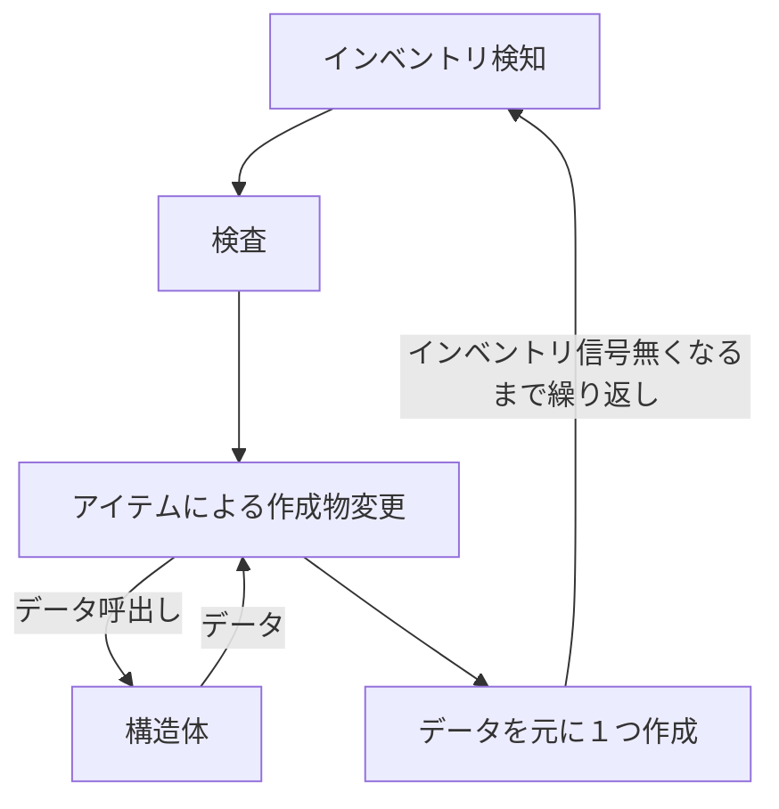
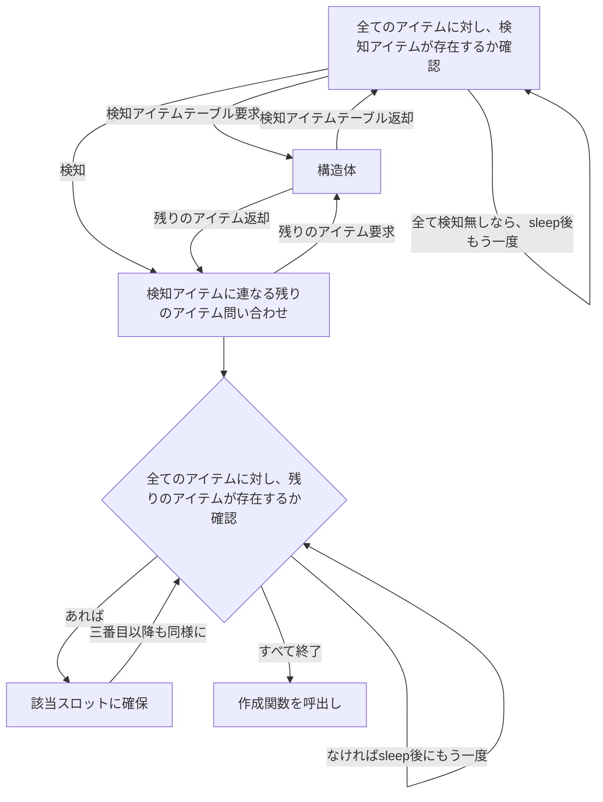
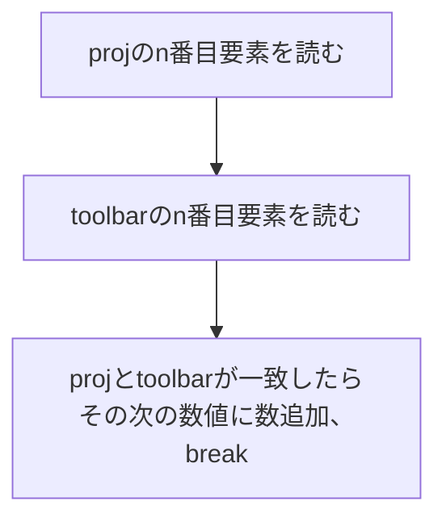

up:: [Linux](<../Linux.md>)

## test

[ポート開放できない？主な原因とトラブルシューティング  |  Novaの日記](https://novablog.work/why-port/#toc32)

windows
```
tnc 90.149.172.31 -port 25565
```

linux
```
nc -vz 90.149.172.31 25565
```

## 概観
[ポート開放とは何か？ | Minecraftサーバーを動かす知識](https://e-craft.io/beginner/port-open/)

グローバルIPアドレスでアクセスできる機器の対象をローカルIPアドレスに割り当てる。
つまり、ポートマッピングに複数の機器を設定するとどれに接続するか分からず止まる。

今回は

## DMZ
demilitarized zone。
ここに入れた機器への通信は全て通る。

## nmap --traceroute
ポート指定で経路を表記してくれるコマンド。
使用にはインストールが必要。

[【Windows】tracerouteをTCP/UDP ポート指定で 実行 \~nmap –tracerouteオプション\~  |  SEの道標](https://milestone-of-se.nesuke.com/knowhow/test-tool/windows-tcp-udp-traceroute/)

## Create
歯車でからくりを動かすMod。

自動線路引き。地下行きがむずい。
地下に敷くには壁を破壊しなければならない。その際、破壊した跡にレールを敷く必要がある。
レールを敷くにはDeployerを使うが、これはすぐ置いてくれるわけではなくからくりの速度に準じて設置速度が変わる。

線路は直下には敷けないため、階段掘りをしなければならない。

自動で壁を壊すには、ドリルやホイールに回転力を与えながら階段状に下ろしていくのがいい。

物を直線で移動させるなら
- Mechanical Stickey Piston
- Gantry Shaft
- Cart Assembler
- Train
らへん。その中で回転力となるとPistonが外れる。


shaftは斜め移動が難しい。二つ重ねることは出来るが、もう片方を動かすには一つ目をレッドストーンで止める必要がある。
一ブロック動くごとにレッドストーンパルスを送る方法と言えばレッドストーンブロックを使用した方法だが、横はともかく縦でパルスを送る方法が見当つかない。（からくり上同じ列には同じブロックしか並べられない）
パルス用の坂道を別に作ればいいか？

シャフト回転→
シャフト切れて止まる→
RSBからパルス得る→
シャフトパルス→
carrigeから動力を得て先のシャフトを配置→
（縦シャフト回転→
縦シャフト切れて止まる→
縦RSBからパルス得る→
縦シャフトパルス→
carrigeから動力を得て先の縦シャフトを配置）→
パルス用階段を通じて縦RSBの出力を入手し、横シャフトを再度動かす。
これならと思ったが、よく考えればレッドストーン強度問題がある。パルス階段を渡り切れない。ならばいっそ15ブロック分を一気に削りストーンとリピーターを一気に配置すればいいが、コストヤバそう。Redstone Linkでいける？

ごく当たり前だが、シャフトと重なるブロックがあるとシャフトを動かすことが出来なかった。これを克服するには、シャフトが動くたびにドリルを追加する上、何らかの方法でそれをくっつけなければならない。
chassisを使うにしても、数値をどこかで指定しなければ余計なブロックがくっつく。


Assemblerは有力だが、トロッコの速度によってからくりの速度が変わるのがきつい。
斜めに線路を引くため、壁を壊す→壊した場所に線路を置く、というサイクルを回す必要がある。しかしトロッコ速度が速いと壁を壊すより先に線路が置かれる、線路を置く速度が間に合わず線路が途切れるといった問題が出る。
トロッコの線路だと先に置かれても真っ直ぐになるだけだが、列車の線路だと斜めでなくなり繋がりが切れてしまうため大問題。途切れるのは言わずもがな。
トロッコ速度を一定にすれば問題ないが、そのためにcontroller railに換装するとコスト面とレッドストーンパルス問題が出る。


Train。Assemblerと同様の問題がある。
一定で走らせるのはスクロールホイールで可能だが、そもそも45度の坂道線路に接続するためには1ブロック下げと2ブロック隙間が無いといけない。
この隙間でドリルが線路を破壊したり、置かなくていい線路を置いたりする可能性はある。ただ回路が単純。
山なりなので問題ないっぽい。なので谷になる登りは引き続きトロッコに任せる。


カーブには線路含めで9x9必要。そもそも単純配置で何とかなるもんではないのでカーブは手動で配置。

create-server.tomlのmaxBlocksMovedで運べるブロックの最大数を決定できる。

## スナップショット
ブロックのregion、チェスト中身などのentitiesをworldeditで復元できる。

chunkyでロード。
`/chunky center 0 0`
`/chunky radius 10`
`/chunky start`

worldeditの設定にスナップショット先を書き込み。
ここではsnapshots。`File 'file' resolution error: Path is outside allowable root`が出たらallow-symbolic-linksをtrueに。
[World Edit Schematic Problems \| SpigotMC - High Performance Minecraft Software](https://www.spigotmc.org/threads/world-edit-schematic-problems.422114/)
```
minecraft/snapshots
├───2025-12-27-00-00-00.zip
│   └───main(ワールド名)
│       └───region
└───main(ワールド名)
    └───2025-12-27-00-00-00.zip
        └───main(ワールド名)
            └───region
```
日付は日付じゃないとたぶん動かない。
エンティティの復元も出来そう？
[Implement restoring biomes, entities, and extended world heights by dordsor21 · Pull Request #1316 · IntellectualSites/FastAsyncWorldEdit](https://github.com/IntellectualSites/FastAsyncWorldEdit/pull/1316/commits)

あとは`//wand`とか`//pos1`で場所設定して`/restore`。

## エンドが下りてくる
[Dimension Stack](https://qouteall.fun/immptl/wiki/Dimension-Stack.html#per-dimension-options)
これでエンドを空に接続。アルファを弄りつつ降下。
最終的にエンドラを排出し、咆哮から霧、ロードでエンド飛ばし。

[Advanced Backups - Minecraft Mods - CurseForge](https://www.curseforge.com/minecraft/mc-mods/advanced-backups)
[スナップショット](#スナップショット)
[FastAsyncWorldEdit \| SpigotMC - High Performance Minecraft Software](https://www.spigotmc.org/resources/fastasyncworldedit.13932/)
エンドはこれでめちゃくちゃ遠い場所にオーバーワールドのコピーとして作成する。
これだと卵が取れないので、最終日にエンド側のど真ん中に岩盤柱を作成しておく。

ネザーも上げていく以上、エンドにコピーするよりある一定以上をschematicにハメていくだけでいい気がするが。
でもschemだとファイル分割とかで面倒。エンドにコピーして最終日に一定より下を空気ペーストで削るほうが楽。

### 基本方針
スポーン場所1チャンクを石材で固める。
    敵の攻撃で破壊できないように、出入りはポータルのみ
    外のボスを倒すと石材の破壊耐性が解除
        一気に空が見え、エンドが空に現れる
    ここに入ったら透明化同様、敵に発見されなくなる状態になる
少しでも外に出ればハービンジャーなどのボスがプレイヤーを三回殺すまでONになる。
    三回殺したらデスポーンで元の位置に
    最初は岩盤で覆って4体のボスと、その後は世界巡りでエンドクリスタル持ちを狩る
    
    
山盛りゾンビはブラッドムーンだけ
攻撃をかわせるようにパルクール的なmodを
飯の重要性を何とか増したい、飽きなど
農業はpotとmysagでぶっ壊せ

世界巡りに意味
先々で機械が拾えればいいんだけど、あと弾
APEXのごとくルートを拾ってマシンづくり
余った機械はアンクラフト

世界巡りは美しく
ゲームでさえ家にこもりがちなので、綺麗な世界を歩き回りたいところ
綺麗だからこそエンドに飲まれる絶望感が出る


最終日はループするポータルが四方から迫る感じで

## opencomputer
luaスクリプトで色々

[[minecraft]]

compact machinesのprojectorでエンパを作る

インベントリ検知
アイテムによる作成物変更
構造体からデータ採る





```psuedo

-- 作成

-- エンパ材料
-- 実際は構造体から受け取る
local projdata = {
                    {
                        {"obsidian","obsidian","obsidian"},
                        {"obsidian","obsidian","obsidian"},
                        {"obsidian","obsidian","obsidian"}
                    },
                    {
                        {"obsidian","obsidian","obsidian"},
                        {"obsidian","redblock","obsidian"},
                        {"obsidian","obsidian","obsidian"}
                    },
                    {
                        {"obsidian","obsidian","obsidian"},
                        {"obsidian","obsidian","obsidian"},
                        {"obsidian","obsidian","obsidian"}
                    }
                }

local dropitem = "redstone"

-- プロジェクターサイズ
-- 立方体しかないはずなので楽
local projsize = 3

-- 高さサイズ
local heightsize = table.maxtn(projdata)

local sub = projsize - heightsize

if sub <= 0
    return
end

-- プロジェクター都合上一つ周りに物はおけない
-- チャージャーはその外にあるのでそこまで移動
right 2
for i1,v1 in projdata do
    local rowsize = table.maxn(v1)
    for i2,v2 in v1 do
        local colsize = table.maxn(v2)
        for i3,v3 in v2 do
            -- 設置
            place v3
            -- もし現在値が右端なら、左へ戻り次の行へ
            if i3 >= colsize
                left colsize-1
                -- 最終行以外で一つ下へ
                if i1 >= rowsize
                    south 1
                end
            else
                right
            end
        end
    end 
    -- 最終行なら元の位置へ、一つ上昇
    if i1 >= rowsize
        north rowsize-1
        up
end

-- proj3, height2みたいなときにprojectorの外まで出る
if sub <= 0
    up sub
end

dropdown dropitem
left 2
down projsize

```


一次元をmodでやったらどうだ
無いとこにnilを詰める方針ならそれでいいが

{"","",""...}ってやるより{{"iron"},{"red"}}のが記述少なくていいだろ
んでも{{full},{真ん中だけ}}みたいなのを見た覚えがある、ゾンビのやつ
無いとこnilで詰めたほうが早いか

projsizeで作成サイズを絞る
nilならその必要性すらなさそう
全体サイズが8,27...で比較してmod数値も割り出せる

```psuedo
-- 作成

-- エンパ材料
-- 実際は構造体から受け取る
-- nilの可能性がある場合、1,8,27...と3乗の要素持ちしか通さないことにする
local projdata = {
                    "obsidian","obsidian","obsidian",
                    "obsidian","obsidian","obsidian",
                    "obsidian","obsidian","obsidian",
                    
                    "obsidian","obsidian","obsidian",
                    "obsidian","redblock","obsidian",
                    "obsidian","obsidian","obsidian",
                    
                    "obsidian","obsidian","obsidian",
                    "obsidian","obsidian","obsidian",
                    "obsidian","obsidian","obsidian",
                }

local dropitem = "redstone"

-- プロジェクターサイズ
-- 立方体しかないはずなので楽
local projsize = 3

-- サイズ
local size = table.maxtn(projdata)

-- ここでやってるけど、本来は構造体に含むべきだと思う
local edgesize
local facesize
for i,v in range(5) do
    if size == i^3
        edgesize = i
        facesize = i^2
    end

if size % edgesize != 0
    error("mismatch size %", size)
    return
end

local sub = projsize - edgesize

if sub <= 0
    return
end

-- プロジェクター都合上一つ周りに物はおけない
-- チャージャーはその外にあるのでそこまで移動
right 2
for i1,v1 in projdata do
    if v1 ~= nil
        -- 設置
        place v1
    end
    -- 右端なら、左へ戻る
    if i1 % edgesize == 0
        left edgesize-1
        -- 最終行なら最初の行に戻って上へ
        if i1 % facesize == 0
            north edgesize-1
            up 1
        end
        -- 最終行でないなら次の行へ
        else
            south 1
        end
    end
    -- 右端でないなら、次のブロックへ
    else
        right
    end
end

-- proj3, height2みたいなときにprojectorの外まで出る
if sub >= 0
    up sub
end

dropdown dropitem
left 2
down projsize

```


placeは単純にカーソル合わせたものを置く機能しかない
インベントリのどこにそれがあって、どうやってカーソル置くかをサポートしてない

黒曜石を元に検知してるので、インベントリ1が黒曜石、2がレッドブロック、3がレッドストーンパウダーのはず
構造体からこれももらっておきたい

```psuedo
local itemlist = {"obsidian:26","redblock:1”,"redstone:1"}
```

:で分けて、物体名と数をそれぞれ処理

あっ、外部チェストの確認できなさそう？
ロボット自体に物入れる仕組みっぽい。……なら64以上黒曜石を入れられたら、使っていった黒曜石の位置がずれていくのでは？
suckで出来そう。controllerのsuckfromslotなら自由にスロット選べるはず。



アイテムが見つかった時点でチェストは回し直すのだから、アイテム->チェストスロットの順で回すほうがいい
いや、detectでは見つかった時点で終了してほしいが、receipeだと見つかってもそのまま回してほしい。
というか物を指定してチェスト回す方式だと、チェスト内に別々に同じアイテムあったら両方吸い出してしまう。


```pseudo
-- 検査及び変更、ツールバー作成

-- 本来は構造体
local detectitems = {"obsidian:26","ironblock:1"}
local receipeitems = {{"redblock:1”,"redstone:1"},{redstone:2"}}

local chestsize = getinventorysize(sides.front)

-- テーブルを回し、チェストを回し、チェスト内でアイテムを確認し、名前が一致するなら取り出し
-- detectの時は問答無用で一番に取り出すのでモード指定
func getitemfromtable(table,chestsize,detectmode): detectitemid
    for i,v in table do
        name,num = split(v,":")
        for i2 in range chestsize
            local itemdata = getstackinslot(sides.front, i)
            if itemdata.name == name
                if itemdata.num ~= num 
                
                if detectmode
                    suckfromslot(1,num)
                    local detectitemid = i
                    return detectitemid
                else
                    suckfromslot(i+1,num)
                    break
            end
        end
    end
end

local detectitemid = getitemfromtable(detectitems,chestsize)

if detectitemid == nil
    -- スリープして検知に戻る
else
    getitemfromtable(receipeitems[detectitemid],chestsize)
    
end  
```


アイテムがあったところでチェストに残りのアイテムも入っている可能性は保証されないし、そもそもレシピのアイテムがあるかも怪しい。
つまりテーブルのアイテムとツールバーのアイテムが一致しない可能性が高い。

アイテムと数値、両方が揃わないと一致とみなさないことにする。
レシピの一部だけ存在する場合、inventorychangeが起きるまで放置したいが外部インベントリにはさすがにシグナルないだろ。

一致したスロットの数値だけスタックしといて、レシピ全部が揃ったと分かったら一気に吸出し。
そうでなければどのスロット数値が足りないかだけエラー出力。再び全体が呼び出されるまで待ち。
吸出しが失敗したら全部返却してどのスロット数値で失敗したかエラー出力。全体呼び出されるまで待ち。

まって。`obsidian:2,obsidian:22,obsidian:9`とかで配置されてた時にまとめて吸い出せない。
設定で26個スロットから吸い出す以上、こうなることは予想がつく。といってインベントリのソート関数はない。何かしらで26個ずつ黒曜石を、とやろうにも他にも数値違いで黒曜石を使う用事はある。
1スロットに入るアイテムが馬鹿多ければ問題ない。もういっそグリッドから読むか。そもそも読めるか分からんが。

グリッド読めなかった。
もう仕方ない、作りたいアイテムごとにチェストとクラフターを分けて一定アイテム数だけ取り出すようにする。
黒曜石と黒曜石で被るのもダメなので、同じ部屋に別々にチェストを置くことになる。
いちいち場所探すのもあれなのでwaypointとチェストをセット。
クラフター-チェスト-フィルター-チェスト-waypoint。これだけでめちゃくちゃ部屋を占有する。9x9だが中央5x5は使えない、壁際に並べて何種類か。

これ以上は止めよう。waypoint無し、フィルタリングチェストまで。フィルタリングを別ロボットに任せれば楽だろうが、一応menrilも確認。レシピ通りが全部そろった時だけ同じ個数フィルタリングチェストに入れる。フィルタリングチェストが一つでも入ってたらやらない。

2,22,9でも一旦名前一致で取り出してループ最後で揃ってなかったら戻して、とかやろうにもな。それでインベントリにゴミが溜まったら、即刻取り出さないと動かなくなる。でもメンリル依存するよりシンプルか。


| /      | ツールバーあり      | ツールバーなし      |
| ------ | ------------ | ------------ |
| チェストあり | 差分数取り出し      | 定数取り出し       |
| チェストなし | 全数取り出し、ループ継続 | 全数取り出し、ループ継続 |　

チェストになく、ツールバーにある場合
チェスト分ではみ出る可能性、足りない可能性が出る
足りてるかは吸出し後に調べるので、はみ出ないようにすればいい
でも足りてなくて出そうとしたらエラーしそうなので、はみ出るか足りてないかだけif

足りてない
じゃあ全数出せばいいか


```pseudo
-- 検査及び変更、ツールバー作成

-- 本来は構造体
local detectitems = {"obsidian:26","ironblock:1"}
local receipeitems = {{"redblock:1”,"redstone:1"},{redstone:2"}}

local chestsize = getinventorysize(sides.front)

-- テーブルを回し、チェストを回し、チェスト内でアイテムを確認し、名前が一致するなら取り出し
-- detectの時は問答無用で一番に取り出すのでモード指定
func getitemfromtable(table,chestsize,detectmode): detectitemid
    for i,v in table do
        name,num = split(v,":")
        for i2 in range chestsize
            local itemdata = getstackinslot(sides.front, i)
            if itemdata.name == name
                if detectmode
                        -- チェスト内に使用数以上ある
                        if getchestslot(i2).num > num
                                -- ツールバーに既にいくつかある
                                if getrobotslot(1).num > 0
                                        suckfromslot(1,num-getrobotslot(1).num)
                                else
                                        suckfromslot(1,num)
                        -- チェスト分ない
                        else
                                -- ツールバーに既にいくつかある
                                if getrobotslot(1).num > 0
                                        -- 仮に全部吸い出しても使用数以下なら
                                        if getrobotslot(1).num + getchestslot(i2).num < num
                                                -- 全部吸い出す
                                                suckfromslot(1,getchestslot(i2).num)
                                        -- 全部だとはみ出るなら、使用数からロボット持ち分だけ引いた数出す
                                        -- チェストが支払えるかどうかは、はみ出るとわかってればヘーキ
                                        else
                                                suckfromslot(1,num-getrobotslot(1).num)
                                else
                                        suckfromslot(1,getchestslot(i2).num)
                    local detectitemid = i
                    
                    break
                    
                else
                    suckfromslot(i+1,num)
                    break
                end
                -- スロットを読み込み、数が揃ってればOK
                -- 揃ってなければ全部返却とエラー
                if detectmode
                        
                return detectitemid
            endreturn detectitemid
        end
    end
end

local detectitemid = getitemfromtable(detectitems,chestsize)

if detectitemid == nil
    -- スリープして検知に戻る
else
    getitemfromtable(receipeitems[detectitemid],chestsize)
    
end  
```

いや駄目だ。複雑すぎる。
事前に必要数だけ分ける部分を関数に分けたほうがいい、けど必要数に分けられるならそのまま出しゃよくない。
少し拾う、少し拾うを繰り返してるのが悪い。やっぱメンリルでいっか。いいか？

64以上がある以上、適当なソートだと結局数は必要。
ディテクトモードに関しては、テーブルに対して一個目の素材が揃ってたら通すで簡略化できる。

アダプターとかトランスポーザーでグリッドも読めそうな感じがあるが、それでも素材が足りない可能性はある


```pseudo
-- 検査及び変更、ツールバー作成

-- 本来は構造体

local toolbarlist = {{"obsidian:26","redblock:1”,"redstone:1"},{ironbrock:1,redstone:2"}}

local chestsize = getinventorysize(sides.front)

-- テーブルを回し、チェストを回し、チェスト内でアイテムを確認し、名前が一致するなら取り出し
-- インデックスを返さないと、あとでレシピも取り出すんだから
func getitemfromtable(toolbarlist,chestsize)
    local toolbarlistindex = 0
    for i,v in toolbarlist do
            local clearnum = 0
            for i2,v2 in v do
                local robotslotnum = getrobotslot(i2).num
                name,num = split(v,":")
                for i3 in range chestsize
                    
                    local chestslotdata = getstackinslot(sides.front, i3)
                    if chestslotdata.name == name
                                -- チェスト内に使用数以上ある
                                if chestslotdata.num > num
                                        -- ツールバーに既にいくつかある
                                        if robotslotnum > 0
                                                -- 使用数からツールバー分を引いた数出す
                                                suckfromslot(1,num-robotslotnum)
                                        -- ツールバーにない
                                        else
                                                -- 使用数出す
                                                suckfromslot(1,num)
                                -- チェスト内に使用数以下しかない
                                else
                                        -- ツールバーに既にいくつかある
                                        if robotslotnum > 0
                                                -- 仮に全部吸い出しても使用数以下なら
                                                if robotslotnum + chestslotdata.num < num
                                                        -- 全部吸い出す
                                                        suckfromslot(1,chestslotdata.num)
                                                -- 全部だとはみ出るなら、使用数からロボット持ち分だけ引いた数出す
                                                -- チェストが支払えるかどうかは、はみ出るとわかってればヘーキ
                                                else
                                                        suckfromslot(1,num-robotslotnum)
                                        else
                                                suckfromslot(1,chestslotdata.num)
                    -- スロットを読み込み、数が揃ってればチェストループ抜け
                    if robotslotnum == num
                            clearnum = clearnum + 1
                            break
                -- ツールバーループ
                -- 全部揃ってブレイクした場合と、チェストを探したけどなかった場合がある
                -- これを数値揃ってるかで判定
                -- 揃ってればツールバーの次へ
                if robotslotnum ~= num
                        -- なければリスト分全部ドロップしてブレイク、ツールバーリストの次へ
                        for i4=1,i2,1
                                dropfromslot(i4)
                        clearnum = 0
                        break
                end
        -- ツールバー数と揃った判定数が揃ってるか判定
        if #v == clearnum 
                toolbarlistindex = i
                return  toolbarlistindex
    end
    if clearnum  <= 0
            return result("no founded receipe.")
    else 
            return result("failed initialize toolbarlistindex.")
end

local toolbarlistindex = getitemfromtable(toolbarlist,chestsize)
if type(toolbarlistindex) == string
        print(toolbarlistindex)
        return error
local toolbar = toolbarlist[toolbarlistindex]
return toolbar


```


このテーブル通りにツールバーに配置されたとして、
```psuedo
local toolbarlist = {"obsidian:26","redblock:1”,"redstone:1"}
```

place時にはこれと比較して配置していくことになる
```psuedo
local projdata = {
                    "obsidian","obsidian","obsidian",
                    "obsidian","obsidian","obsidian",
                    "obsidian","obsidian","obsidian",
                    
                    "obsidian","obsidian","obsidian",
                    "obsidian","redblock","obsidian",
                    "obsidian","obsidian","obsidian",
                    
                    "obsidian","obsidian","obsidian",
                    "obsidian","obsidian","obsidian",
                    "obsidian","obsidian","obsidian",
                }
```

使用するアイテムの種類数は当然異なり、ツールバーに配置されるものを決め打ちは難しい
いやそうか？toolbaritemsをそのままツールバーに反映するように書いたから、この順のまま取り出せばよくないか。
だとしてもredblockが何番スロットなのかは必要か。

```psuedo
-- 作成ヘルパー
func getslotnumfromtable(toolbaritems,itemname):slotnum
    for i,v in toolbaritems do
        name,num = split(v,":")
        if name == itemname
            local slotnum = i
            return slotnum
        end
    end
end
```

後は構造体とインベントリ検知
インベントリ検知は後でいいから、構造体
luaにstructはないっぽいので、全部テーブルで

基本はこれ
これにdropitem,toolbaritems,detectitemを追加する
```psuedo
local projdata = {
                    "obsidian","obsidian","obsidian",
                    "obsidian","obsidian","obsidian",
                    "obsidian","obsidian","obsidian",
                    
                    "obsidian","obsidian","obsidian",
                    "obsidian","redblock","obsidian",
                    "obsidian","obsidian","obsidian",
                    
                    "obsidian","obsidian","obsidian",
                    "obsidian","obsidian","obsidian",
                    "obsidian","obsidian","obsidian",
                }
```
toolbaritemsがあれば、detectitemは最初切って残りをreceipeitemに当てるだけなので簡単
そしてその二つは検査と変更でしか使わないので、そこにtoolbaritemsからの変更関数を入れればいい

dropitemは流石にprojdataとは別枠で管理したい
toolbaritemは理論上projdataから作成できる
作成でも検査変更でもtoolbaritemsは使用するので事前に置いておきたい

あれ、dropitemを別枠にしたところでツールバーには出てきて。
作成ヘルパーはtoolbaritemsのアイテムしか読めないから、toolbaritemsに追加しないとダメだ。
わざわざprojdataから切り出すのも面倒なので、dropitem別枠自体はいい
ただtoolbaritems作成関数にprojdataとdropitemが必要なだけ

toolbaritemsは一回こんなん作ったほうがいいか
実際のを作ると一つずつ増やせない、連想配列のキーは64という最大数が決まっている以上同じキーが出る可能性は普通にあり無理
```psuedo
local temptollbar = {"obsidian",26,"redblock",1,"redstone",1}
```

luaのテーブルに便利な関数は大してない
全部自分で実装

```psuedo
-- 構造体
-- エンパ

local projdata = {
                    "obsidian","obsidian","obsidian",
                    "obsidian","obsidian","obsidian",
                    "obsidian","obsidian","obsidian",
                    
                    "obsidian","obsidian","obsidian",
                    "obsidian","redblock","obsidian",
                    "obsidian","obsidian","obsidian",
                    
                    "obsidian","obsidian","obsidian",
                    "obsidian","obsidian","obsidian",
                    "obsidian","obsidian","obsidian",
                }

local dropitem = "redstone"

local detectitem = "obsidian"

-- detectitemはtoolbaritemsの一番最初にする、作成してから最後に入れ替え
-- この関数は別ファイルに移したほうがよさそう
func maketoolbaritems(projdata,dropitem):toolbaritems
    local temptoolbar = {}
    local table.insert(projdata,dropitem)
    for i,v in projdata
        for i2,v2 in temptoolbar
            if v2 == v
                temptoolbar[i2+1] = temptoolbar[i2+1] + 1
            end
        end
        table.insert(temptoolbar,v)
        table.inert(temptoolbar,1) 
    end
    
    local toolbaritems = {}
    for i = 1, #temptoolbar, 2
        table.insert(toolbaritems,concat(
                        temptoolbar[i],":",temptoolbar[i+1]
                    ))
        if temptoolbar[i] == detectitem
            table.insert(toolbaritems,0,toolbaritems[-1])
            table.remove(toolbaritems)
        end
    end
    return toolbaritems
end 

local toolbaritems = maketoolbaritems(projdata,dropitem)

-- 分かりやすさ優先、連想配列
-- 物によっては余計なもんが付いてくるが、allitemdata.projdataみたいな感じで呼べると考えたら
local enderparldata = {projdata:projdata,dropitem:dropitem,toolbaritems:toolbaritems}

-- 最後のデータを返すように、それぞれの作成で別の構造体ファイルを用意
-- 何かの関数で全ての構造体を読み込んだテーブルとか用意しておけばいいかな

```

```psuedo
-- 検査変更ヘルパー
func makedetectitems(alldata):detectitems
    local detectitems = {}
    for i,v in alldata
        table.insert(detectitems,v.toolbaritems[1])
    end
    return detectitems
end
```

このツールバーアイテム関数、いつでもvと1がinsertされてしまう。



後はインベントリ検知
チェストにコンパレータくっつければ一つ入った時に1を出力するはず
これでロボット自体を起動できれば早いんだが、起動し続けるcomputerからnetwork介して起こすなどになる。
それは面倒なのでos.sleepで何とかするのが流石に一番早いだろ、networkやったとこでcomputer分の電力消費するだろうし

[Signals \[OpenComputers\]](https://ocdoc.cil.li/component:signals)

redstone_changedシグナルを出してくれるらしい

```lua
local event = require("event")
print("信号を待機中...")

-- レッドストーン信号（redstone_changed）が変わるまで一時停止
while true do
  local _, _, side, _, newValue = event.pull("redstone_changed")
  if newValue > 0 then
    print("信号検知！作業を開始します。")
    break
  end
end

-- ここに実行したい作業を書く
```

これでいけるなら、autorun.luaあたりにこれ書いて動かせるな

先にinternetでテスト
作成部だけ動かす

[Tutorial: The OpenPrograms Package Manager (OPPM) \[OpenComputers\]](https://ocdoc.cil.li/tutorial:program:oppm)
oppmなるマネージャを使うらしい
準備としてmasterブランチ持ちのgithubリポジトリを作成する、その前にluaを真面目にまとめる


壁削るためのやつ

inventory_changed(slot: number)でシグナルが出る、これを拾えばok

```psuedo

fn minewall(inventorysize)
    local swingging = true
    
    while swingging
        -- 現在値と最大値が出る
        local durability, _  =  robot.durability()
        
        -- 壊れるまで振る
        while durability
            robot.swing()
            durability = robot.durability()
        
        
         -- 耐久値があるものを選ぶ
        for i=1,inventorysize,1
            select(i)
            if robot.durability() ~= nil
                break()
            -- インベントリに使えるものがなくなった
            if i == inventorysize
                select(1)
                swingging = false
```

whileが足りない

```psuedo
local inventorysize = inventorysize()

while true do
local icslot = event.pull("inventory_changed")
if icslot == 0
    minewall(inventorysize())
end
```

このロボット壁削れねぇ。
壁削りはauto clickerに任す。


useとplace分けるために、構造体に追加
`local hasuse == false`

セレクタを追加してhasuse持ちだけ分けたい
ほぼ同じ関数なのだが、hasuseならその旨をprojdataに入れなきゃいけなくて。
`{"flintsteel/use"}`みたいなことになる。これを処理単位で分けるとなると、アイテムセレクト時に/含んでたら分ける。でその情報を外に出して、ってなる。じゃhasuseいらんな。

```psuedo
-- 作成ヘルパー
func getslotnumfromtable(toolbaritems,itemname):slotnum,ifuse
    for i,v in toolbaritems do
        name,num = split(v,":")
        if name == itemname
            local slotnum = i
            
            return slotnum
        end
    end
end
```

この関数を使うのはplaceの時だけ。
それは作成でしか使ってない。書き換えはそこだけ。

adapterにgridを隣接させ、ケーブルでつないでcomputerからcomponent.list()を調べると、block_refinedstorage_grid_0というのが見つかる。`for i,v in pairs(component.block_refinedstorage_grid_0) do print(i) end`でごり押せばメソッドを探せる。
これにextractItemメソッドがあり、({name="obsidian"},num,sides)みたいな感じで出せる。sidesはグリッドに隣接したストレージ。
流石にロボットに直接は出せないが、バニラチェストには出せるっぽい。

transposerも近場のインベントリと取引するAPIを提供するみたいだが

内部の名前が分からないので、getItems()をwebhook.siteに投げる。internet.request(url,content)。

minecraft以降の名前で充分。完全一致でないと出ない。

メモリが足りなくなったらcomputer.freeMemory()


makeとdatalistまではいけた
あとはadapterでgridから直接チェストに取り出す処理と、取り出したのをロボットに伝える処理、ロボットがチェストから取り出す処理
