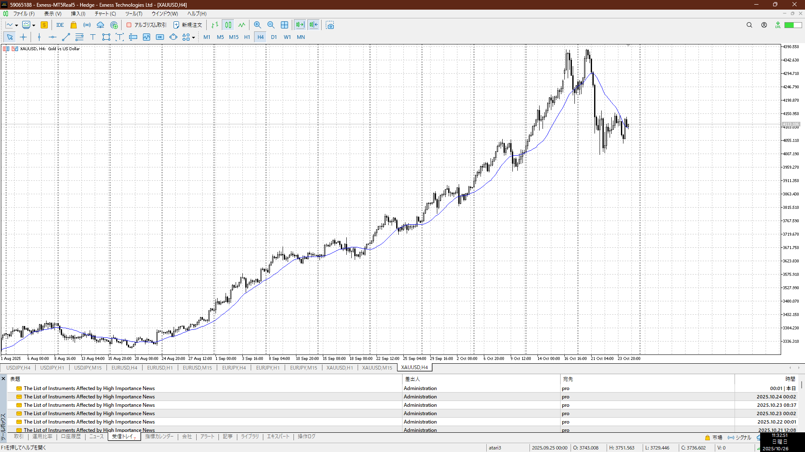
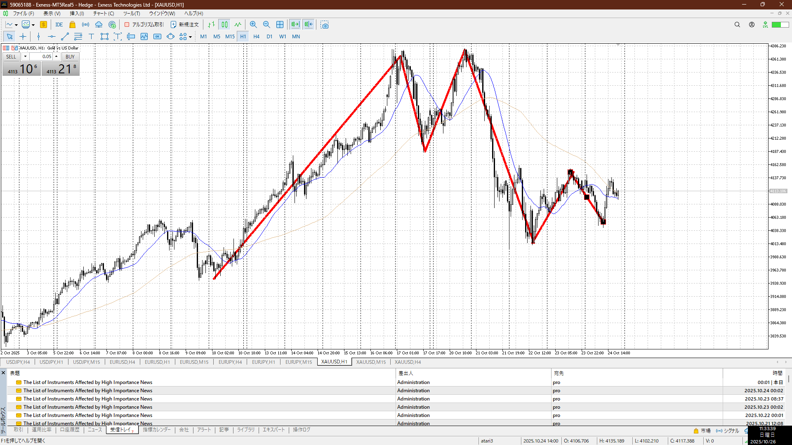
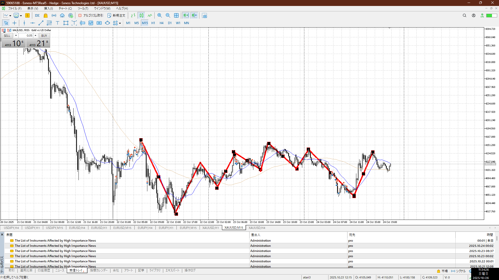
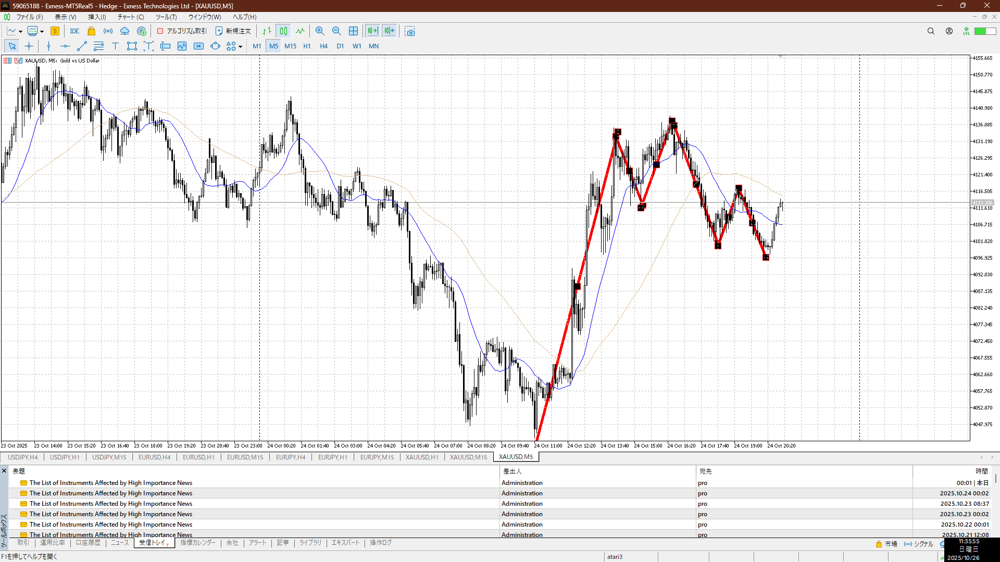

4h

＜ここに目線画像＞

1h

＜ここに目線画像＞

15m

＜ここに目線画像＞

5m

＜ここに目線画像＞

- [x] [my](obsidian://open?vault=Teino&file=FX/my)(見ないと増える)
- [x] 指標
- [x] 前日確認
- [ ] 使用足全ての目線確認
- [ ] 方向決定
- [ ] 両視点整理

木曜3:30FOMC

ゆっくり登ってたやつがガクンと落ちたが、1h安値を更新するに至らず
指標で上に曲がる
上と言いたいが、それも15m上を割るほどではない

今はネックを下に割って下がり調子
一旦直近は様子見、近くにダブルボトムネックが出来そうなのでこれを抜いたら買いが優勢になる
指標勢いも併せて買い

買い
5mネック抜き戻り

売り
1h高値
