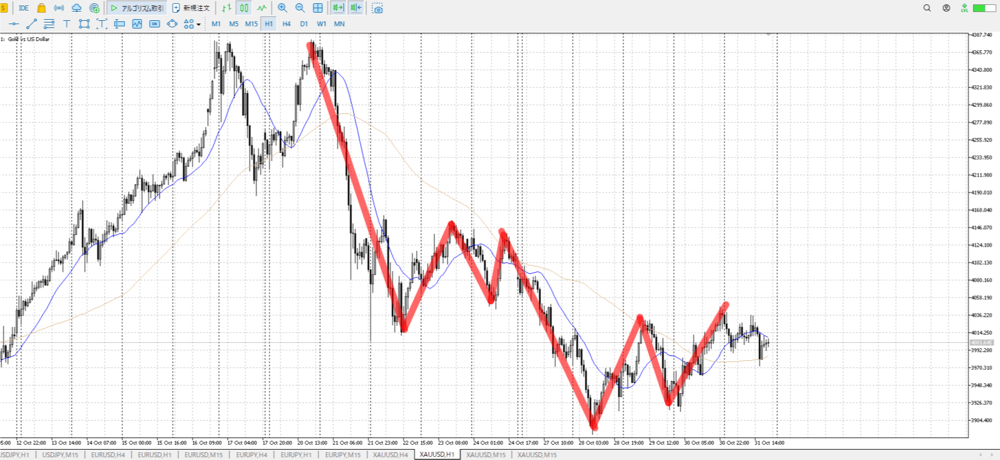
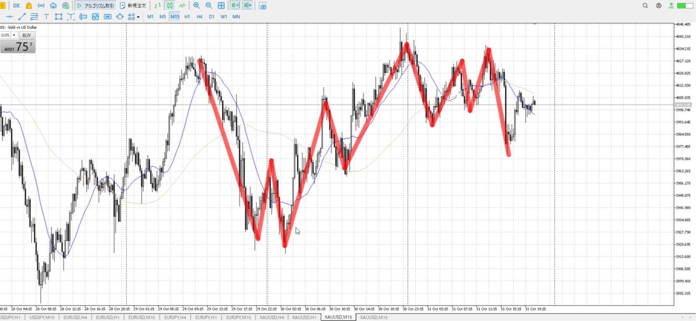
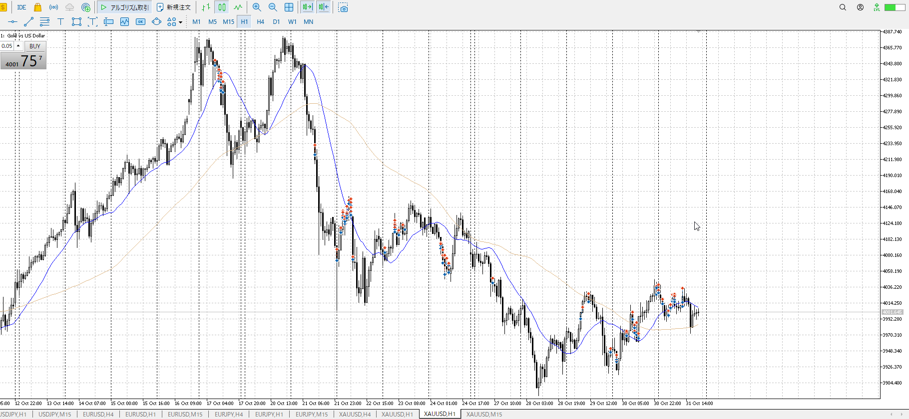

- [ ] 練習したか

4h

＜ここに目線画像＞

1h

＜ここに目線画像＞

15m

＜ここに目線画像＞

5m

＜ここに目線画像＞

平均描く

- [x] [my](obsidian://open?vault=Teino&file=FX/my)(見ないと増える)
- [ ] 指標
- [ ] 前日確認
- [ ] 使用足全ての目線確認
- [ ] 方向決定
- [ ] 両視点整理

1hのネックを割りたいが、何度も跳ね返されている
直近は15mネックを割って下に落ちているが、早めに戻ってネックに下接触中
直近は下髭が出ているので上がりたいところ

売りになるかと思いきや、下に行かない感じが出ている
もう一度1hネックを試しそう、この先は実際を見ないと分からない

買い
15m安値

売り
1hネック

足流れ的にどっちが強い
全体としては売りだが、一旦買いを試してから見たい

そもそも1hでめっちゃくちゃ止められてる
なので売りほぼ一択であることを抜けるまで留意

