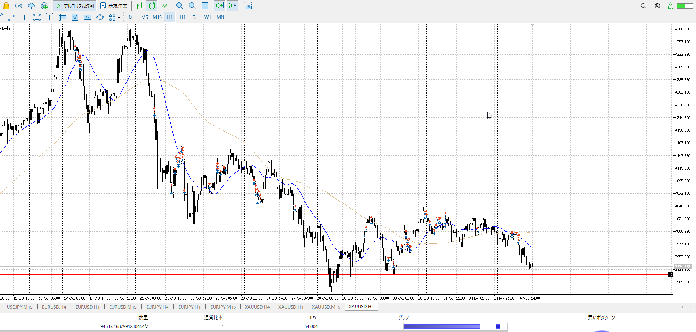
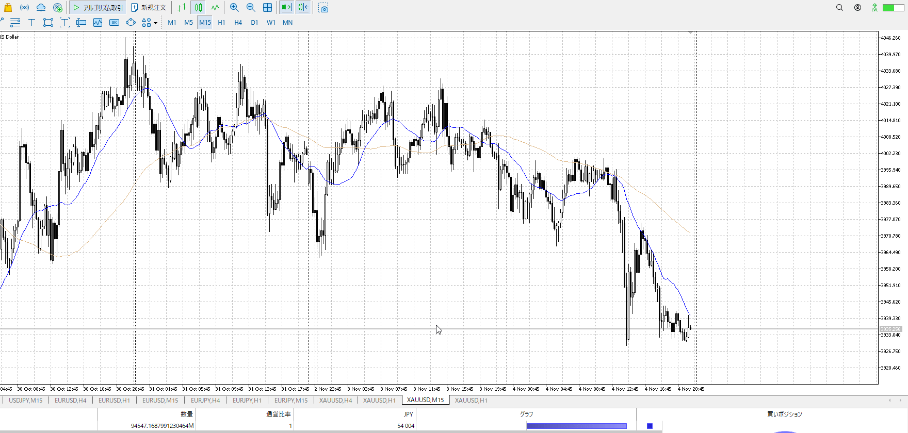
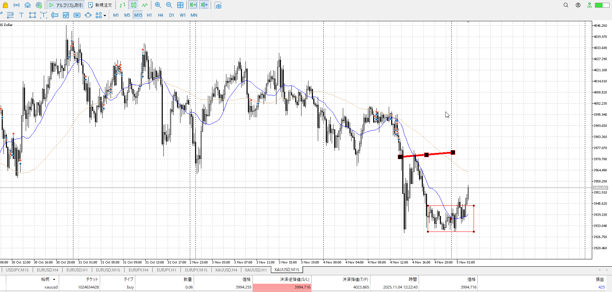
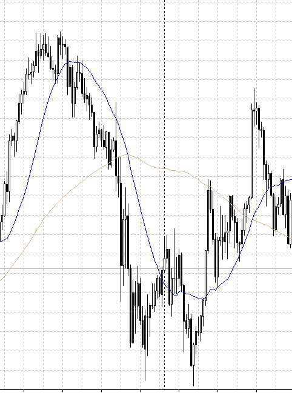
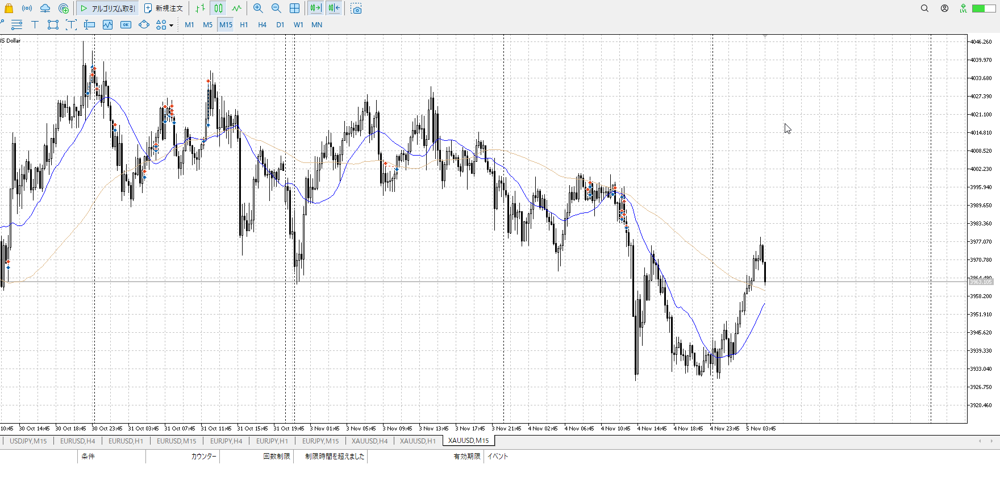
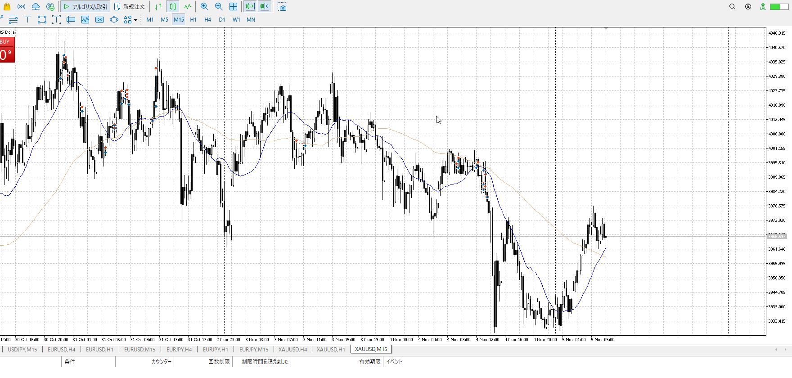
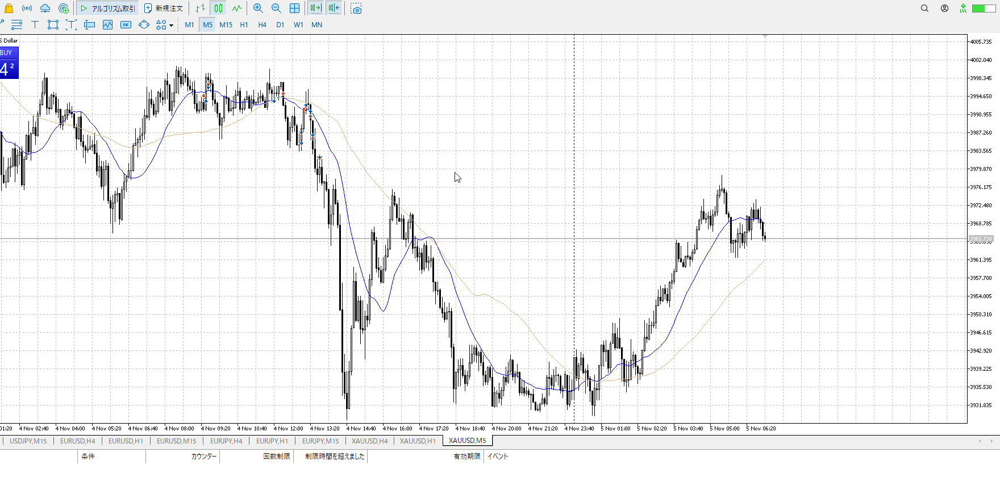
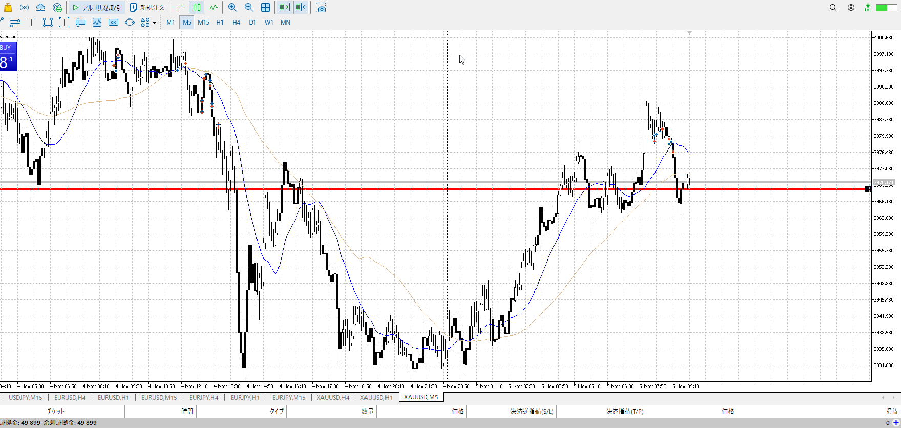

- [ ] 練習したか

4h

＜ここに目線画像＞

1h

＜ここに目線画像＞

15m

＜ここに目線画像＞

5m

＜ここに目線画像＞

平均描く

- [x] [my](obsidian://open?vault=Teino&file=FX/my)(見ないと増える)
- [x] 指標
- [ ] 前日確認
- [ ] 使用足全ての目線確認
- [ ] 方向決定
- [ ] 両視点整理

1hレンジ下へ。
その下張り付きな感じになっている。

形は売りだが場所が買い。
買い待ちをしたいところだが、前日からの流れの売りを無視するのもできない。

売り止まりを待つ。抜けてから買い止まり。
正直1hの安値まできっちり落ちていく気はする。

買い
1h安値

売り
戻り

足流れ的にどっちが強い
売り

上を目指してるが、高値が遠い。
買うならもう一回下落ちてからの登りが欲しい。高値下げW。

前回安値から上がってきたときはこんな感じ。

買うなら1hAを下げてきてそれで下に行き、戻ってくるのが理想か？
途中が売り継続っぽくなるので買いたいなら注意。

売るならこの位置だったが、売りの損切が出ない。

そもそも全然戻せてない、平均に出てない物のへこんでいる部分すら超えてない
この時点でこれだけ上がっても全体売りなので売りたいが、損切が出ない。

15mでもツツミ、5mでも下髭。
上がりそうではあるんだが、場所が悪い。
上がってから押しを取りたい。下がってレンジから上抜け押しでもいい。

上昇が止まったのに気付くのが遅い
これと決めてから他の条件を排除している、不味い

