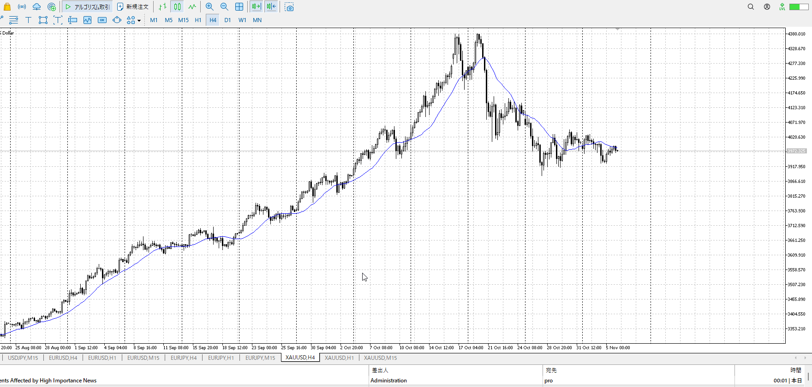
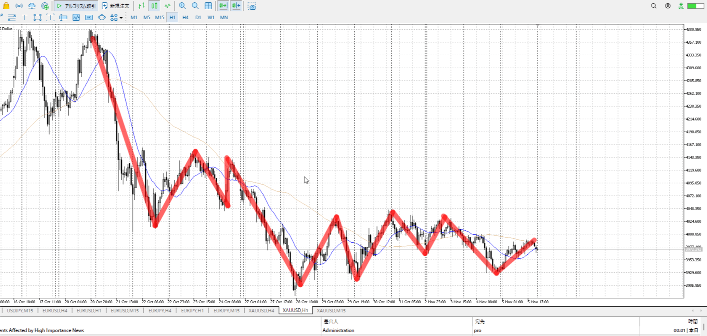
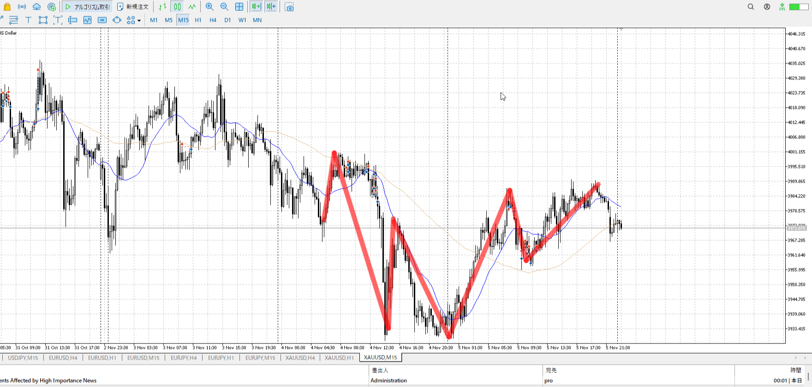
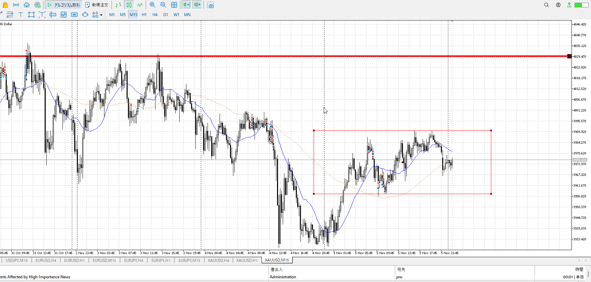
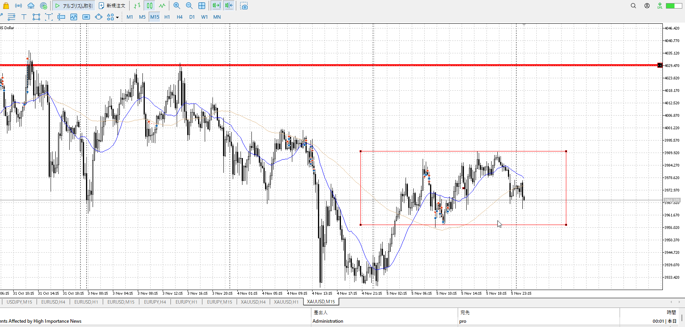
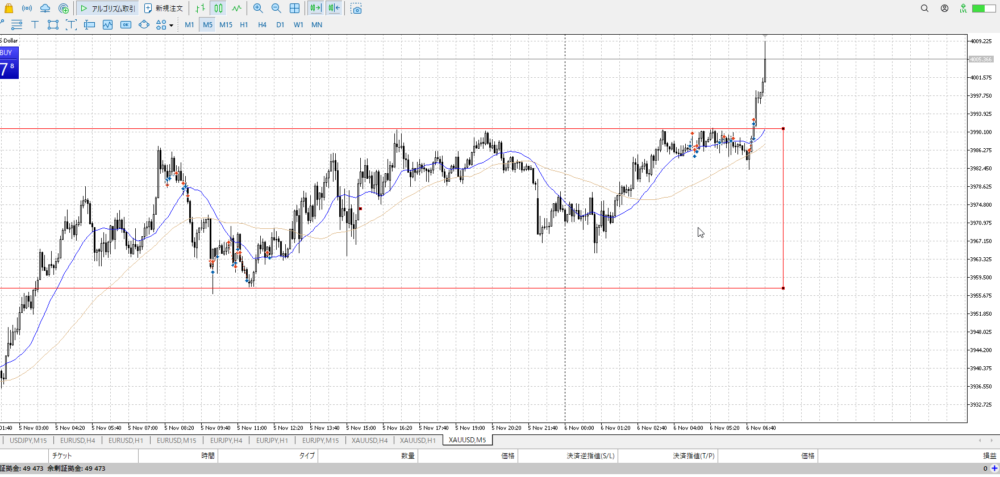

- [ ] 練習したか

4h

＜ここに目線画像＞

1h

＜ここに目線画像＞

15m

＜ここに目線画像＞

5m

＜ここに目線画像＞

平均描く

- [x] [my](obsidian://open?vault=Teino&file=FX/my)(見ないと増える)
- [x] 指標
- [ ] 前日確認
- [ ] 使用足全ての目線確認
- [ ] 方向決定
- [ ] 両視点整理

1hd15mu

やり口変わらず、1hのレンジ上下で取引
前日は半分まで上がってからレンジ、降下
全部1hレンジの真ん中で起きてるので手を出しづらい

1hは真ん中に抵抗帯がある
個々の成果大分上がろうとしているが、なかなかうまく上がらず
となると全体としては売りが優勢と言えるか

15m単体でレンジ
全体として売りが優勢なら、15mもそうなってほしいのでこのレンジを下に割ってほしいが
レンジとして上から売られている、この点からもきちんと売り優勢っぽさ

が、下髭で下降が止まる
ツツミではあるが。

15mの上から溜めて落ちてるのでトレンド的には下降か
とりあえず売り見で

買い
15mレンジ下、1hレンジ下

売り
15mレンジ上、1hレンジ上

足流れ的にどっちが強い
大きくは売り、なのでそれのとりやすい15m流れまで待ち

#flashcards/FX

?
強弱

売りが入るはずのところで下髭の変な奴
買い

流れとしても売れるところで売りがのんびりして下髭
急激な買いとなる

強弱

今はもっと慎重にやる時

今日はもうないも自分の勝手だ。
それは届いてないも自分の勝手だ。
それで失敗しても自分の勝手だ。
その勝手を直せるのは損だけじゃないか。
でも損でも直らなかったじゃないか。本当に嫌なことは何だよ。
少なくとも人が稼いだ金を使いたくないはおかしい、それを増やす話なんだから

