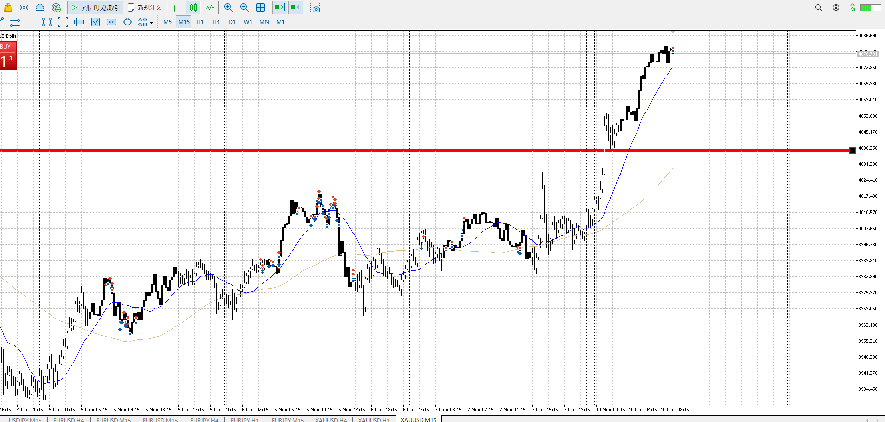
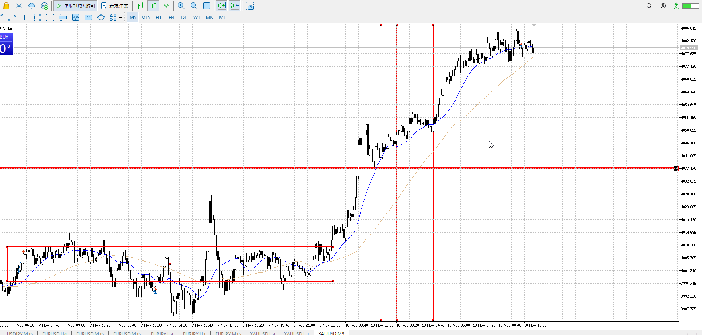
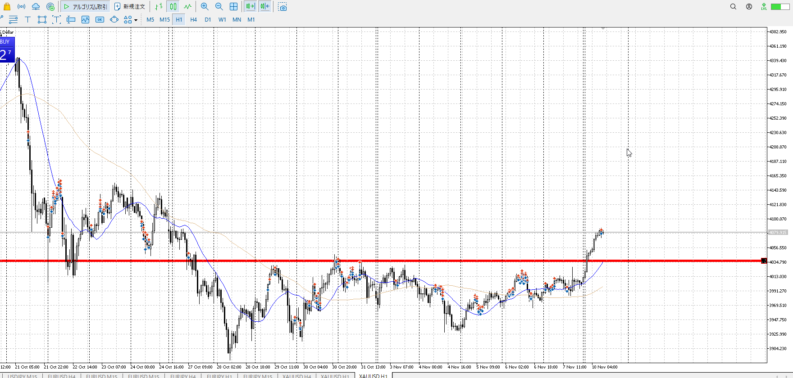

- [ ] 練習したか

4h

＜ここに目線画像＞

1h

＜ここに目線画像＞

15m

＜ここに目線画像＞

5m

＜ここに目線画像＞

平均描く

- [ ] [my](obsidian://open?vault=Teino&file=FX/my)(見ないと増える)
- [ ] 指標
- [ ] 前日確認
- [ ] 使用足全ての目線確認
- [ ] 方向決定
- [ ] 両視点整理

ガン上がりで買いたいのは分かるが。
15mの上髭泊りを無視しているのは、5mでエントリーすると息巻いているから
15mで見ていいとこのタイミングを5mで測る

抜いてすぐならともかく。

大きく買いで抜け。
このあとゆっくり落ちて押し目買いが絶対予想。

買い

売り

足流れ的にどっちが強い

