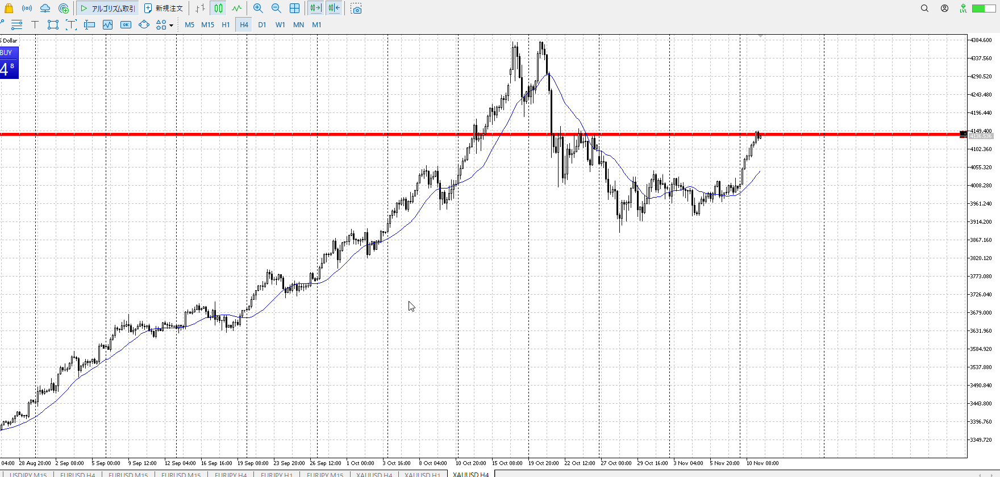
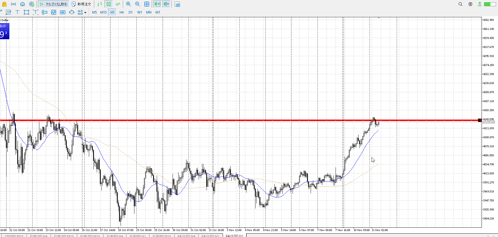
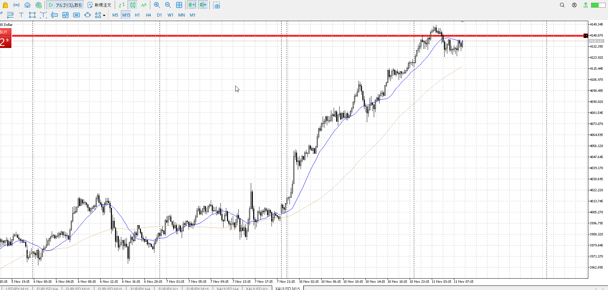

- [ ] 練習したか

4h

＜ここに目線画像＞

1h

＜ここに目線画像＞

15m

＜ここに目線画像＞

5m

＜ここに目線画像＞

平均描く

- [ ] [my](obsidian://open?vault=Teino&file=FX/my)(見ないと増える)
- [ ] 指標
- [ ] 前日確認
- [ ] 使用足全ての目線確認
- [ ] 方向決定
- [ ] 両視点整理

ぶち抜いて新しい天井へ

ここからは売りを考えたいが、全然平均も形状も売りではない
今しばらく買いだが、場所は売り場にいる

もしも上にぶち抜いたらさらに上の4h高値まで
流石にそれは押しを掴むことになるだろうし、今は売りトレンド形成待ち

買い

売り

足流れ的にどっちが強い

