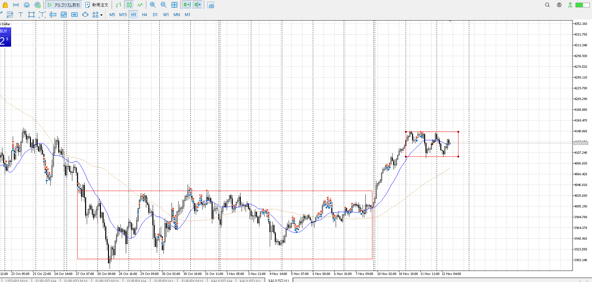
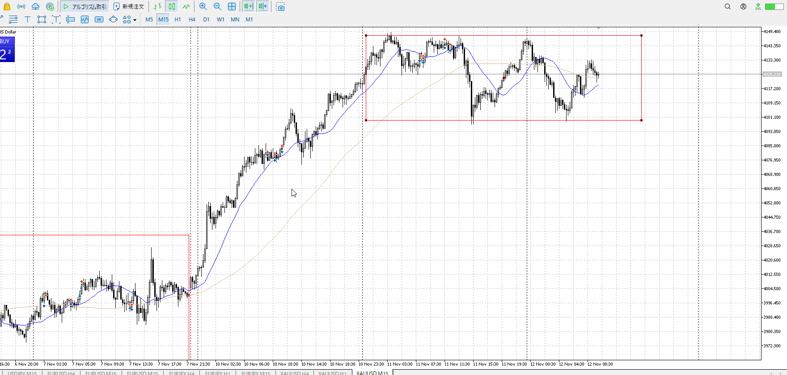
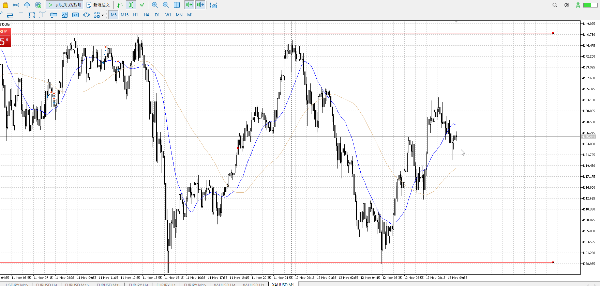
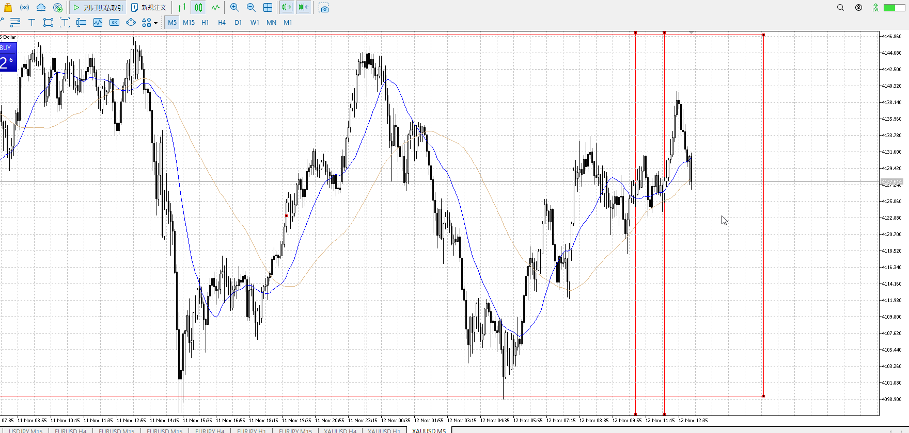
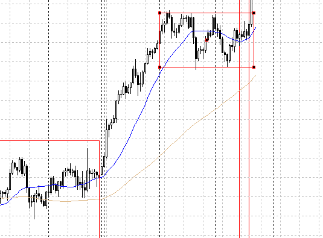
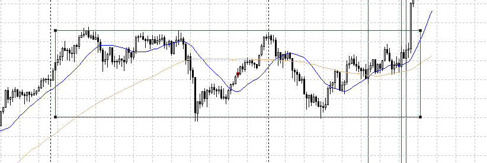
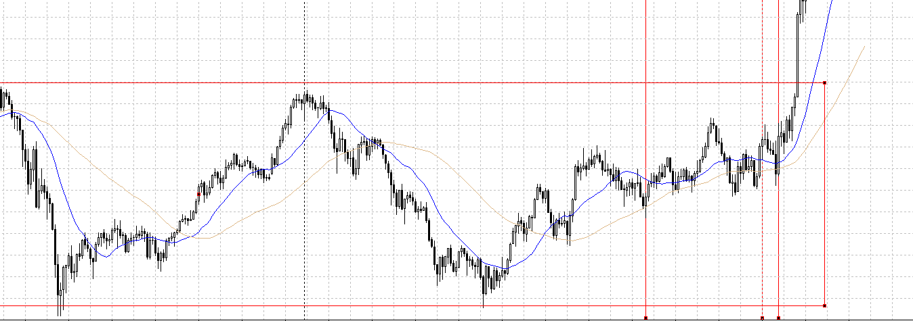

- [ ] 練習したか

4h

＜ここに目線画像＞

1h

＜ここに目線画像＞

15m

＜ここに目線画像＞

5m

＜ここに目線画像＞

平均描く

- [ ] [my](obsidian://open?vault=Teino&file=FX/my)(見ないと増える)
- [ ] 指標
- [ ] 前日確認
- [ ] 使用足全ての目線確認
- [ ] 方向決定
- [ ] 両視点整理

上の方でレンジ。買いが途切れてないので隙を見て買い。

だからこのへこみらへんは買いを試してしかるべきなのですが。
思ったよりこの買いを決意に準備が要る。しっかり書く。

こことかこことか、買えるはずなんだが。
買い向きで合ってて買いを試せるという思考。

#flashcards/FX

?
1つ目、全体買いで落ちてきて、振りを出してから落ち包みで戻る
2つ目、降下を裏切りネック割りの押し目　これは直近高値まで、さっきより振りの上昇が無いため
3つ目、下降に下髭で落ちず
<!--SR:!2025-11-16,3,250-->
+++
