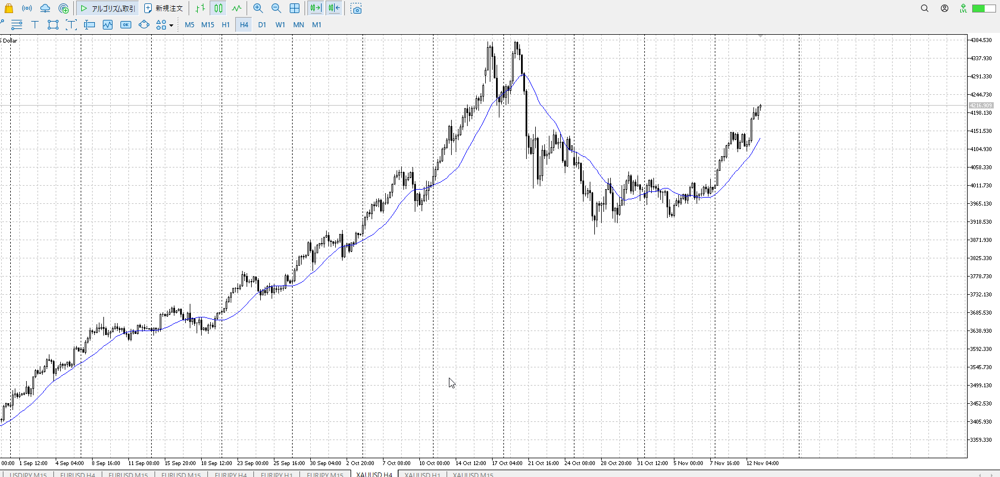
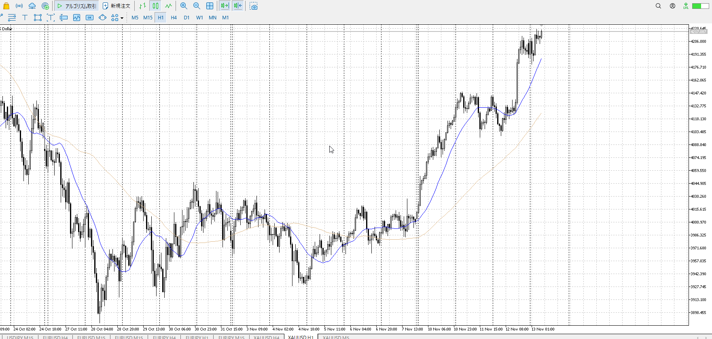
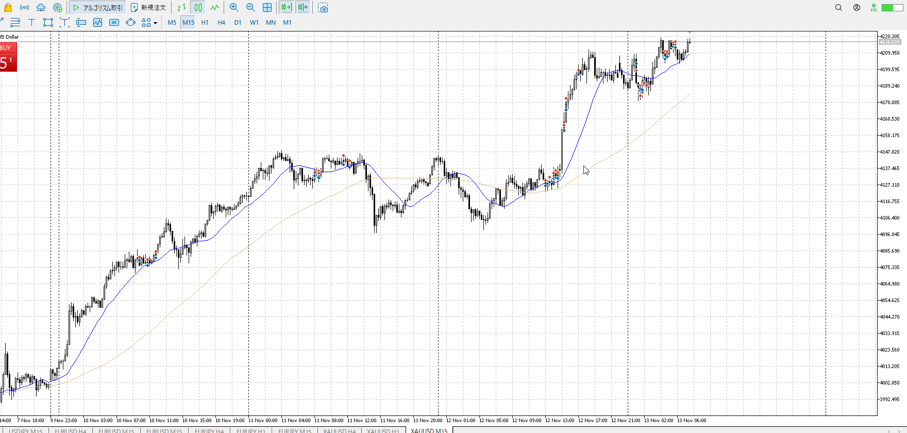
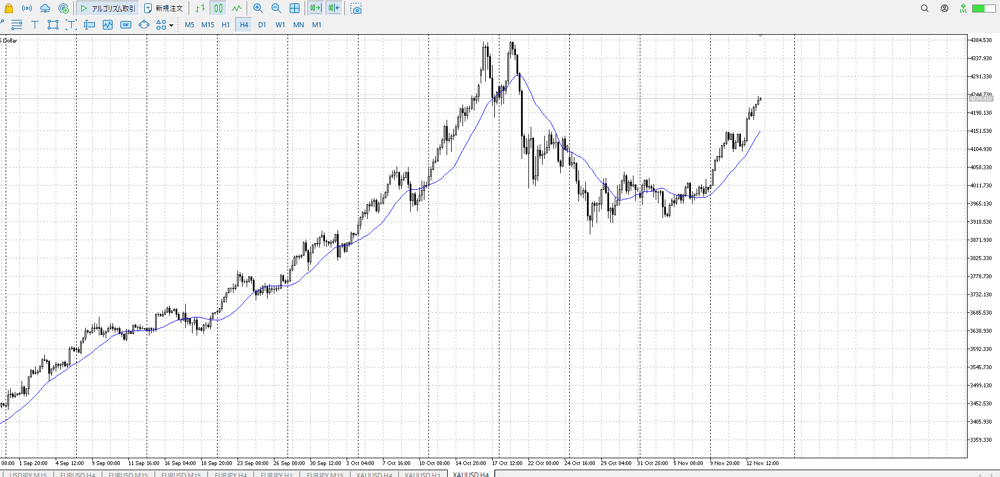
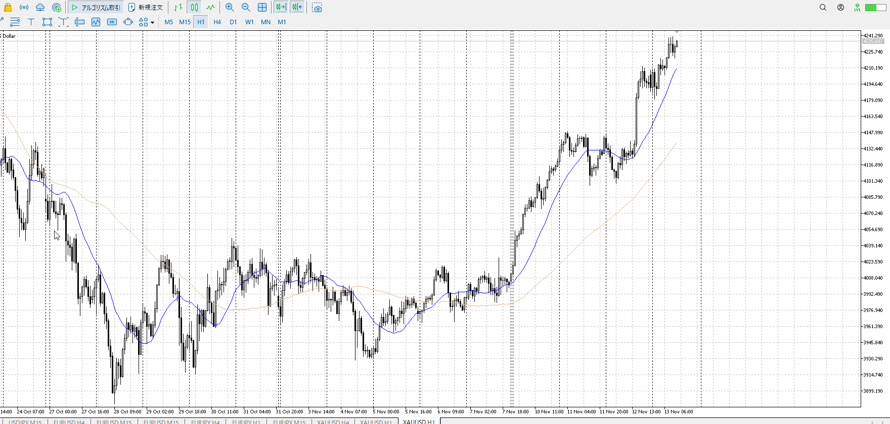
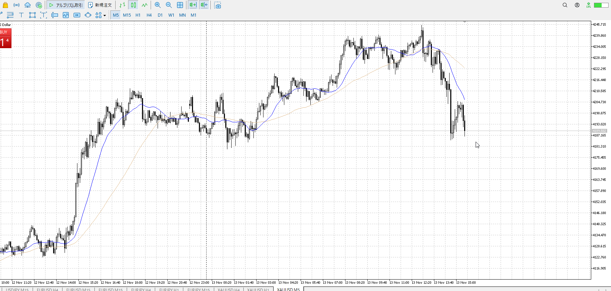

4h

＜ここに目線画像＞

1h

＜ここに目線画像＞

15m

＜ここに目線画像＞

5m

＜ここに目線画像＞

- [ ] [my](obsidian://open?vault=Teino&file=FX/my)(見ないと増える)
- [ ] 指標
- [ ] 前日確認
- [ ] 使用足全ての目線確認
- [ ] 方向決定
- [ ] 両視点整理

上がっている

下がったらひきつけて買い
触った足の確定でも買える

7:30から10:30CPIを警戒

ここから指標でどっち飛ぶか
1hがメインなので1hで考える

下に飛んだら下のレンジを抜けてないと目線が下にならない
上に飛ぶ場合は4h高値に注意、もちろん[ぶつかり](../FX/レンジ.md#ぶつかり)も気にする

いずれにしてもひきつけること
許容損切範囲まで

絶対売れた。
止まったのを見て短期売り。

