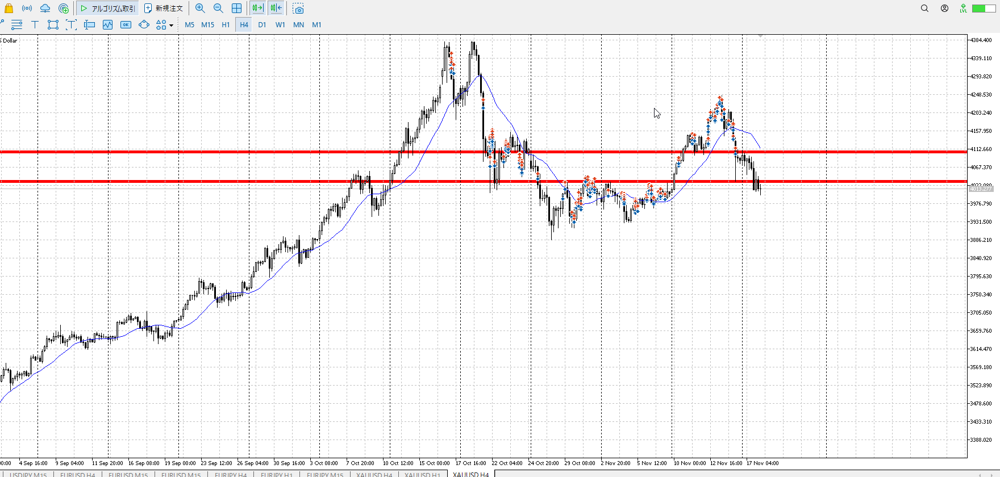
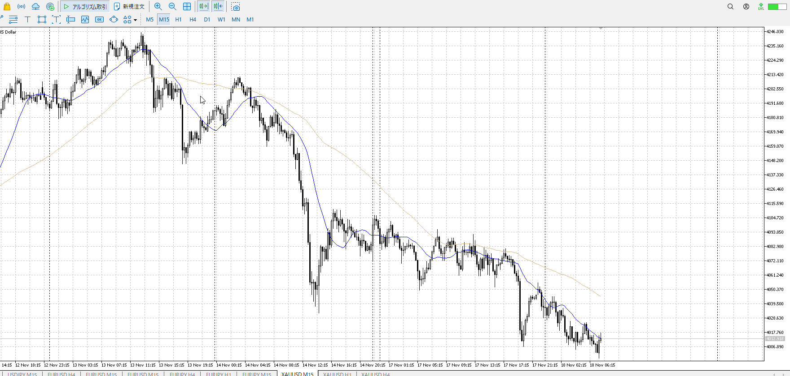
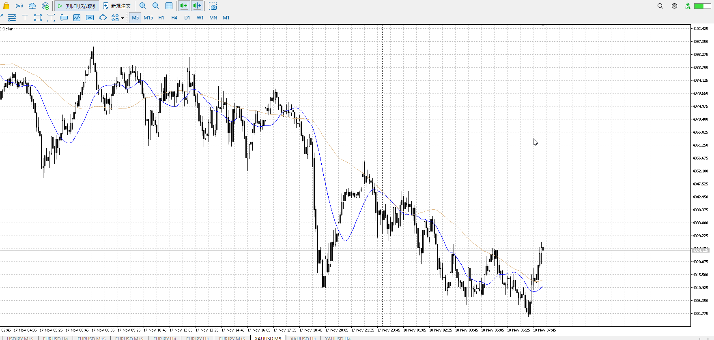
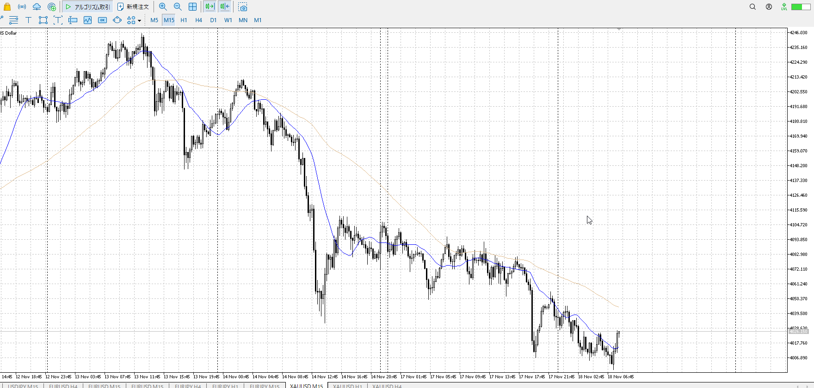
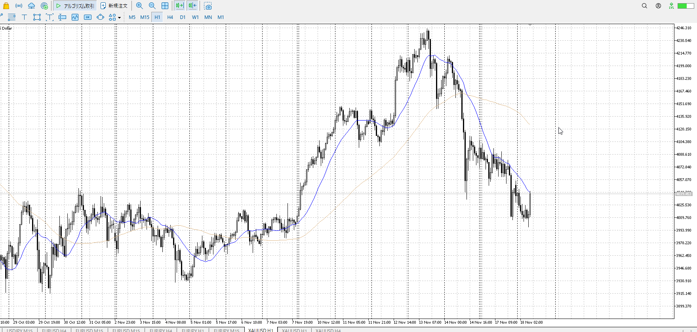
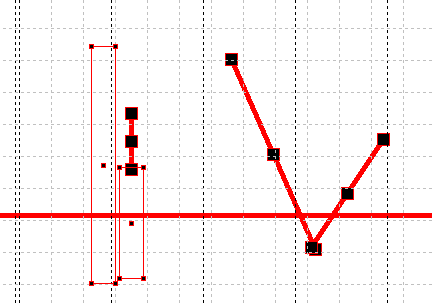
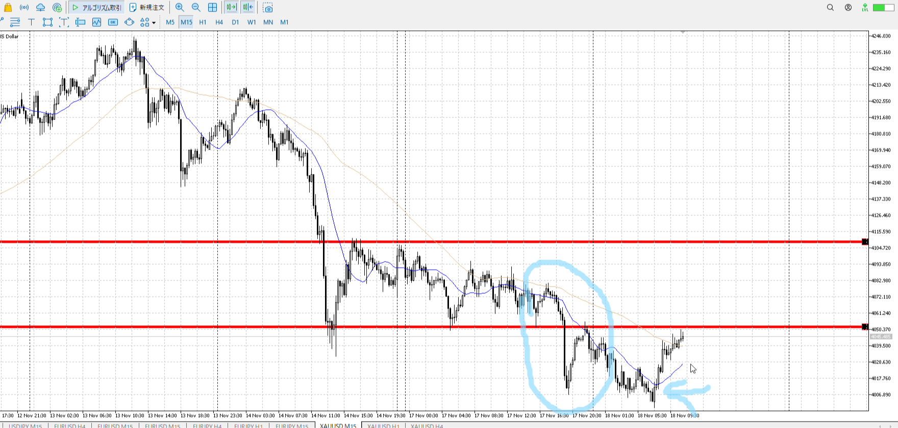
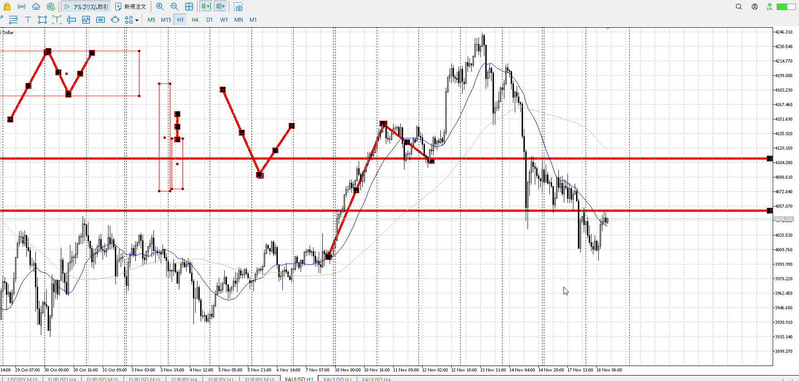
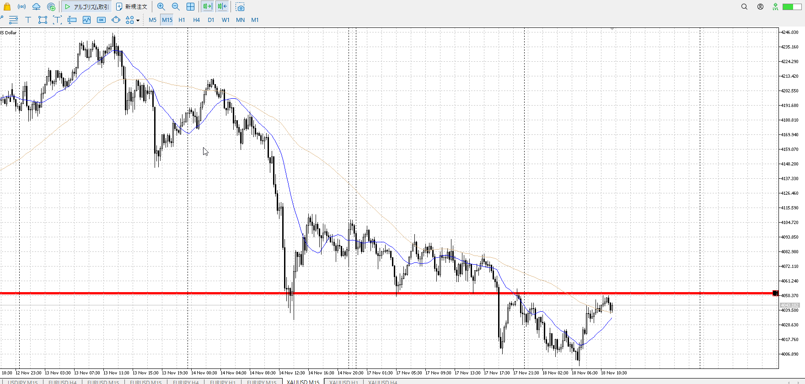
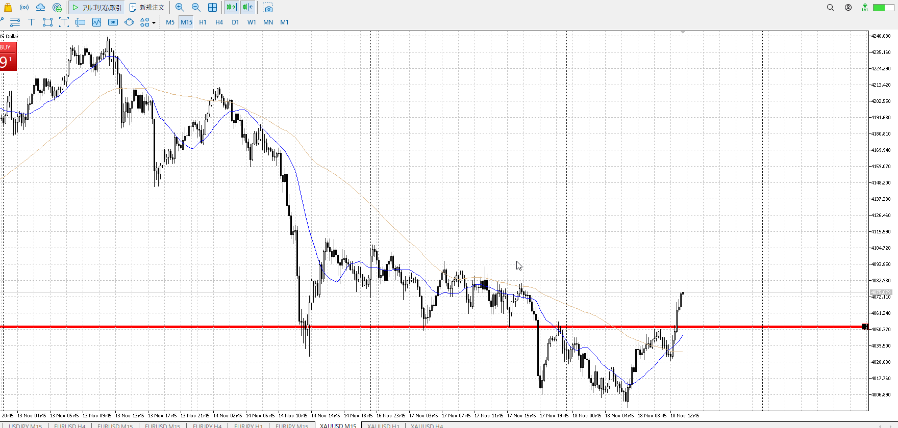

> [!check]
> - [ ] +1万 事前認識 **開始5分**
> - [ ] +1万 5枚

4h

＜ここに目線画像＞

1h

＜ここに目線画像＞

15m

＜ここに目線画像＞

5m

＜ここに目線画像＞

- [x] [my](obsidian://open?vault=Teino&file=FX/my)(見ないと増える)
- [x] 指標
- [x] 前日確認
- [ ] 使用足全ての目線確認
- [ ] 方向決定
- [ ] 両視点整理
- [ ] 場確認

ぶつかり
ひきつけ

udd
1h買い場中。

しかし買うにしてはレンジが出来ているわけでもなく、前の1hレンジで気になった部分を==抜いた急降下==がまだ意識されているように見える。
この急降下をレンジで止めたいところ。レンジすら出てないのに買うのは難しい。

もちろん買い場中なので売るのも厳しい。その場合は一回買い向きを切るくらいしないといけない。

15mでもレンジではなく単なる下降。5mでもレンジだけでプライスアクションが上髭塗れててやりにくい。できぬ。

> 「抜いた急降下」は平均的に5m相当。
> なので買える。利確は近くなる。

すると15mでも深押し買いがかなり現実的。
1本で直接上抜いたところを押し目買いしたかったが、直接ではない模様。

前見たな…

[my2025-11-16](<../FX/My_Test/my2025-11-16.md>)

100戻し損切から買うやつ。
15m買い場中で売り場までも結構距離があるので買えた？
->無理

この後は分からない。
えぐ上昇だけど1hレンジ下壁がある。買いの根拠は4hレンジ上。
1hレンジ下壁で跳ね返り、7またこの急上昇の位置で買われたらダブルボトムで買えそうだけど、それは先の話。

ここで跳ね返るとなれば15mレンジ内となる。そしたらその上抜けを買うか==下から5mとか見て買うか。==

一本の戻りはレンジ成立の押し目にならないか？
->より小さい足であればなる。そうでなければ平均線に埋もれる様な一本の一つ。

この青丸の下降があるのに青→の一本で買えるか？
->青丸の下降があるのに、止められたうえで下抜けを包みの買い一本が出たことが異常。唐突な一本でもなく、根拠は4h買い場。なので買いを試せる。

1hレンジ下止め。
1hレンジ。4hレンジ上と1hレンジ下。

売りを掴みたいが、平均がまだ追いついてないくらいに横幅が足りてない。保留。

下からではないが、5mの買いたかった高さに来て強め陽線。（5m）
なので買いを試せる。ここまで上がるのは想定外だけど。

