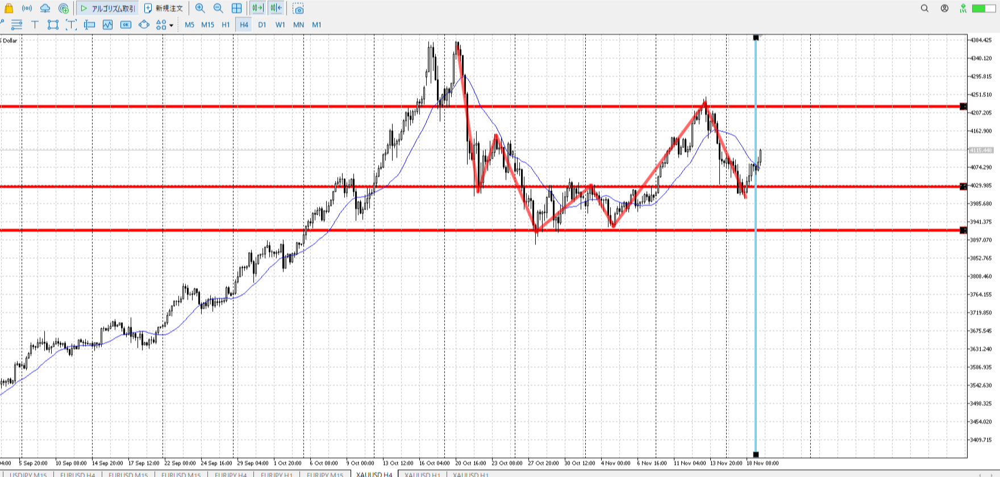
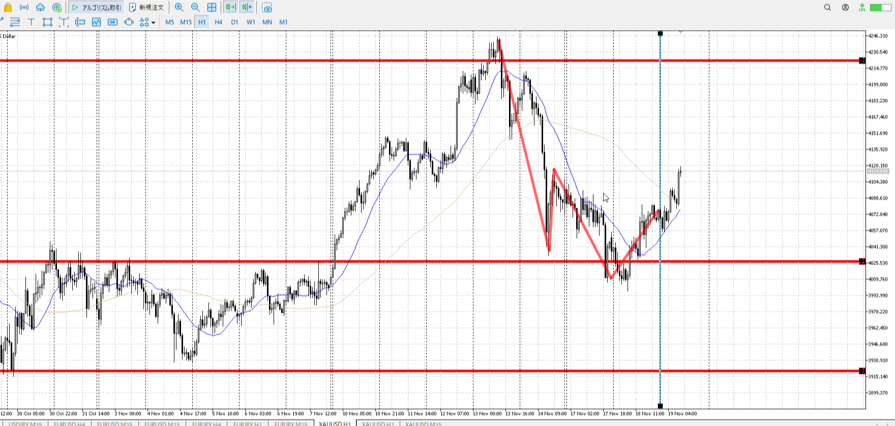
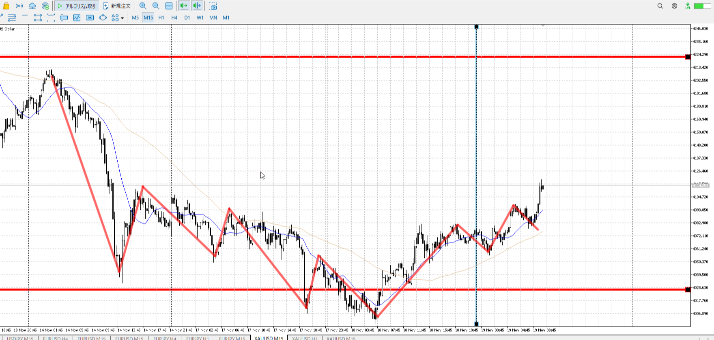
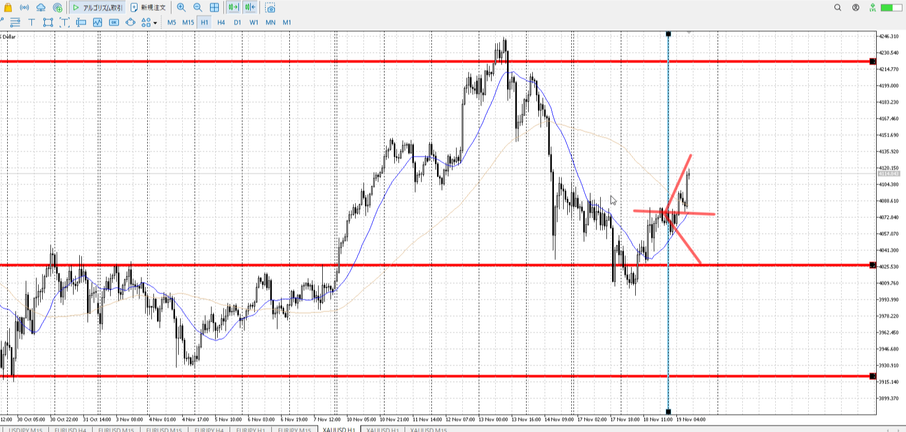
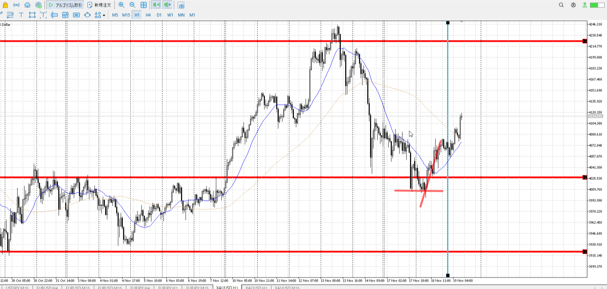
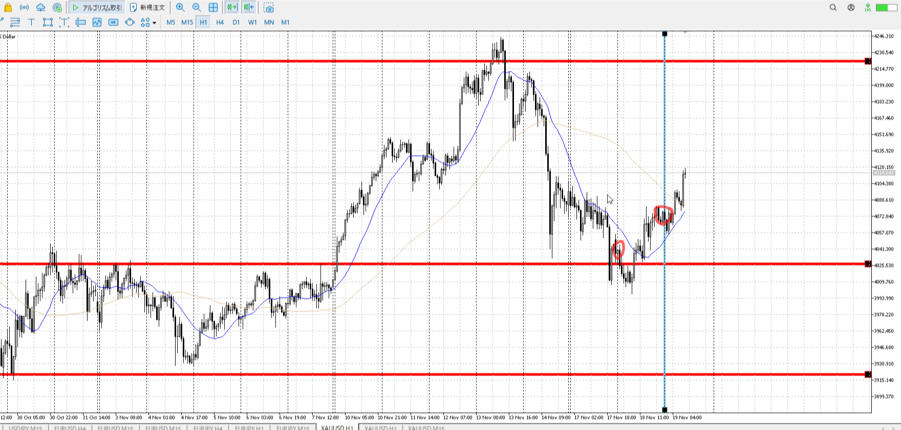
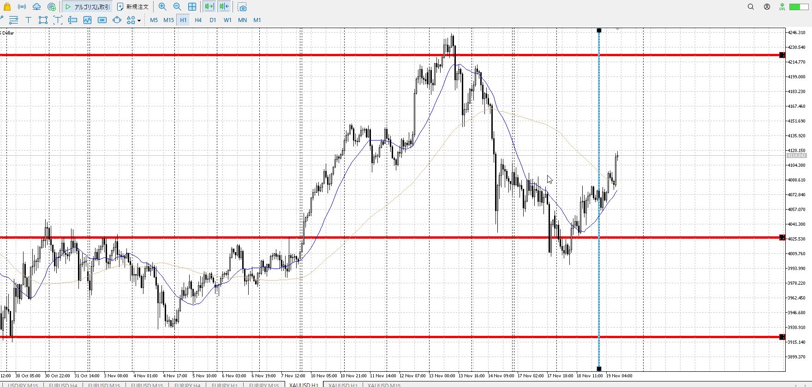

> [!check]
> - [ ] +1万 事前認識 **開始5分**
> - [ ] +1万 5枚

- [x] [my](obsidian://open?vault=Teino&file=FX/my)(見ないと増える)
- [x] 指標

4h

＜ここに目線画像＞

u

1h

＜ここに目線画像＞

d

15m

＜ここに目線画像＞
u

- [x] 使用足全ての目線確認

1hr上下

- [x] シナリオ
＜都度修正＞

1h下降に対する4hによる上昇

売りから4hで買われ上の方で終わり。
買い勢がまだ残っている

- [x] 日出日入

- [ ] 横幅比率

目線に従い、シナリオで上抜き流れまで待機
ちょっと下から買いの流れを作りだすのもあり得る