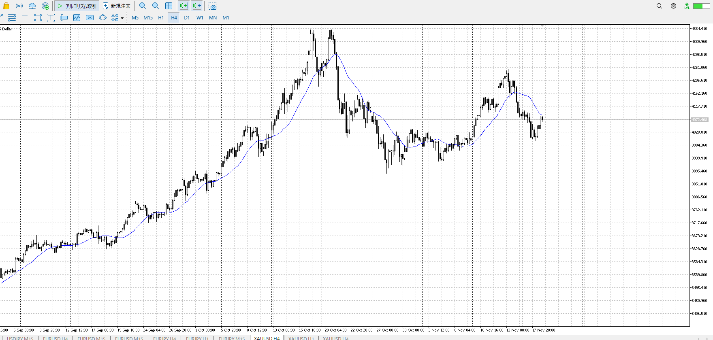
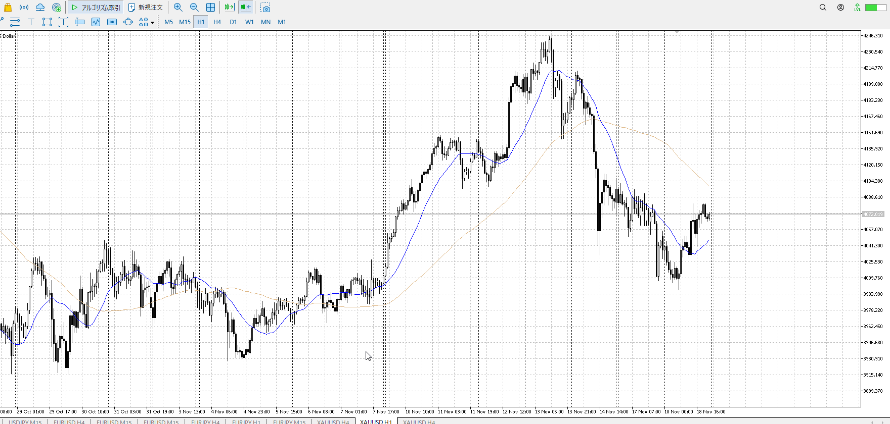
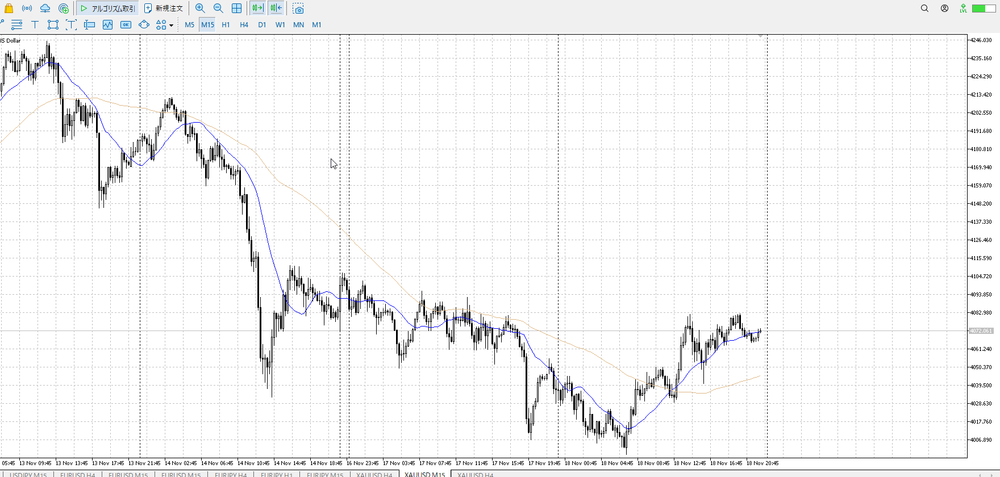
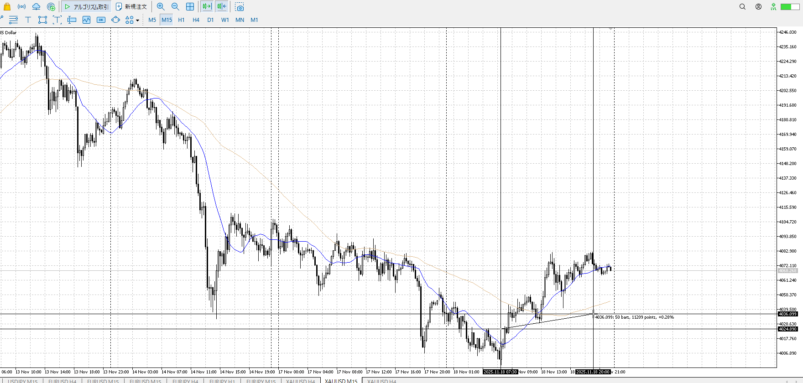

> [!check]
> - [ ] +1万 事前認識 **開始5分**
> - [ ] +1万 5枚

4h

＜ここに目線画像＞

1h

＜ここに目線画像＞

15m

＜ここに目線画像＞

5m

＜ここに目線画像＞

- [x] [my](obsidian://open?vault=Teino&file=FX/my)(見ないと増える)
- [x] 指標
- [ ] 前日確認
- [ ] 使用足全ての目線確認
- [ ] 方向決定
- [ ] 両視点整理
- [ ] 場確認

ぶつかり
ひきつけ
横幅

4hレンジ上買い場で買われる。1hレンジ上の売り場に早めに反応。前回の1hレンジは上が右肩下がりなのでいろんなところで反応するが、その中の一番低い奴が反応。
->15m目線更新が出来てない。dddのまま。

横幅を使い上がいないことを示し始めているので、売りたいところ。

だらだらだが上昇は50bar程度。
だらだらなら急激に売られるのもおかしくないが。

この中で1hで包みが出ている。

買い

売り

足流れ的にどっちが強い
