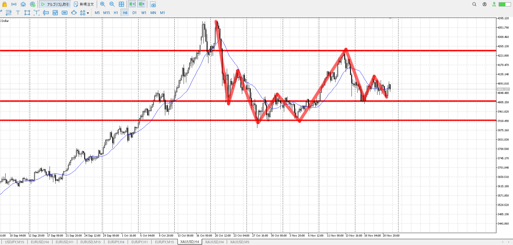
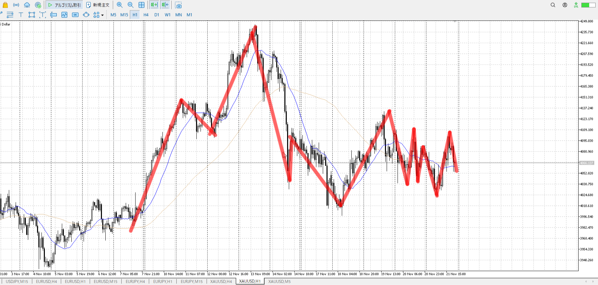
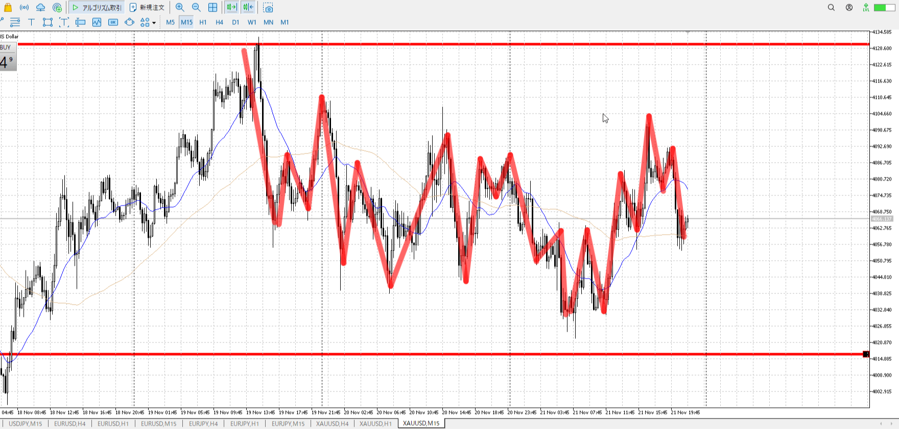
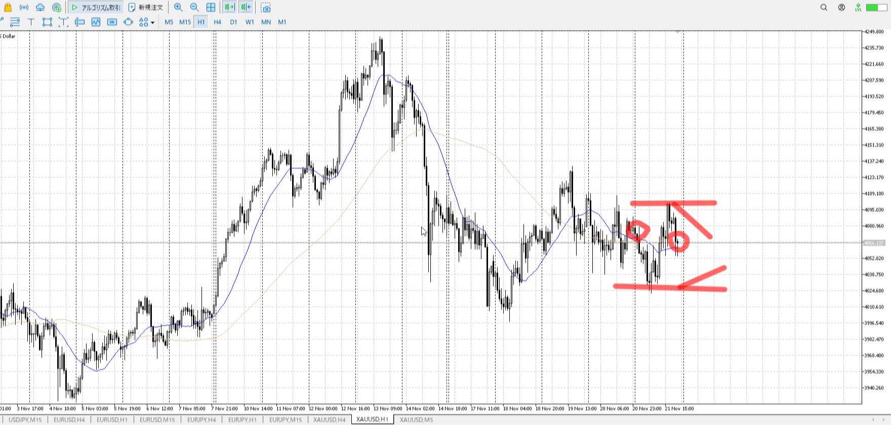
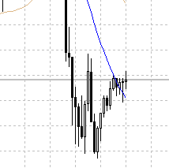

> [!note]
>- +1万 事前認識 **開始5分**

- [x] [my](obsidian://open?vault=Teino&file=FX/my)(見ないと増える)
- [x] 指標

4h

＜ここに目線画像＞

- [x] トレーディングレンジ

方向：u

1h

＜ここに目線画像＞

方向：u

15m

＜ここに目線画像＞

方向：u

全方向：uuu

- [x] 使用足全ての目線確認

＜ここにシナリオ画像＞

b:1h安値切り上げ、4hレンジ上
s:~~4h半値切り下げ？~~1h高値切り下げ

15m5mをuに変えたが、~~~謎の降下~~~金曜で上昇足りず。
それが止められている。

- [x] シナリオ
- [x] ぶつかり
- [x] 日出日入

目線・シナリオ・強弱・横幅・PA
目線uuu・ブルシナリオが明確なのに対して、ベアの根拠が~~分かりにくい。~~少な目。
下降は止められているし目線が変わったわけでもないので、横幅をあと3バーくらい取ってから上がる読みで下から買う手はある。

5mラスト。今から上がりますと言わんばかり。
下がらず抜け買いになりそう。

> [!check]
> - [x] +1万 事前認識 **開始5分**
> - [x] +1万 5枚

---

