> [!note]
>- +1万 事前認識 **開始5分**

- [x] [my](obsidian://open?vault=Teino&file=FX/my)(見ないと増える)
- [x] 指標
    - 差し込まれる可能性有り、毎日

4h
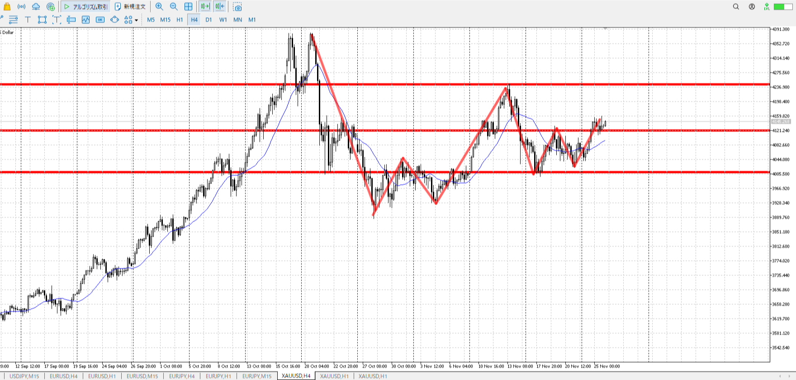
＜ここに目線画像＞

- [x] トレーディングレンジ

方向：u

1h
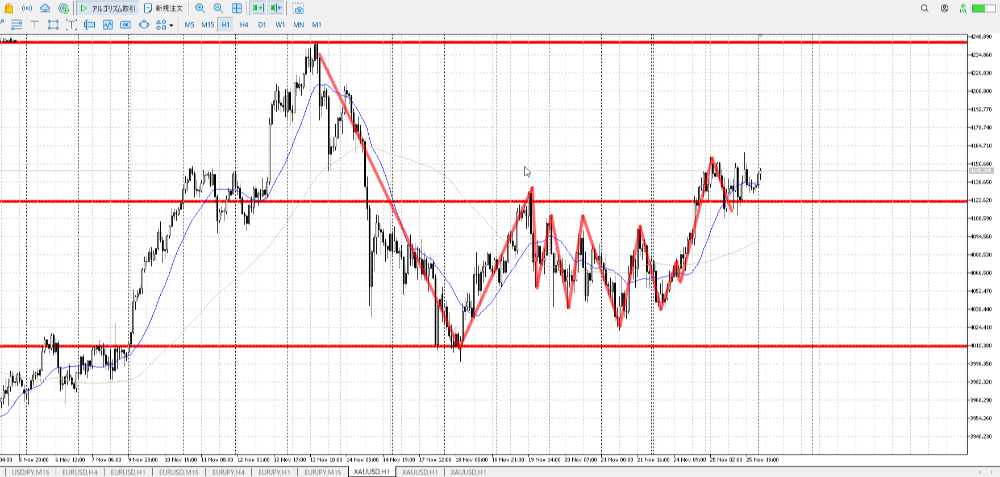
＜ここに目線画像＞

方向：u

15m
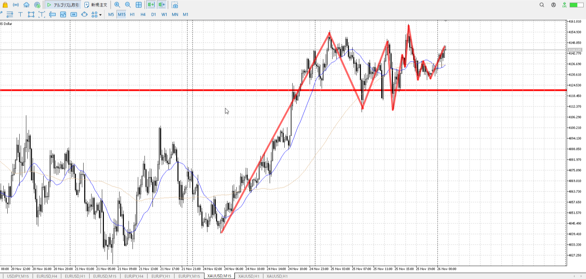
＜ここに目線画像＞

方向：u

全方向：uuu

- [x] 使用足全ての目線確認

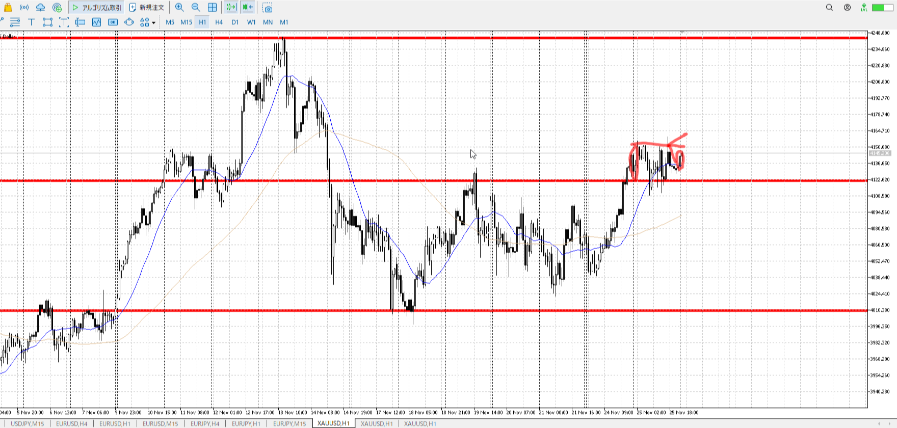
＜ここにシナリオ画像＞

b:1h前回高値、15m安値
s:4hネック？1h高値

上昇継続

- [x] シナリオ
- [x] ぶつかり
- [x] 日出日入

目線・シナリオ・強弱・横幅・PA・平均線方向・波
uuuに昨日から切り上げで止まりWを抜ける超上昇。
1hの平均としても下を向き始め調整は表された。あとはどこで買うか。
と言うとやっぱり朝の場所が一番ベストだった。この高さに返ってきて、PAで買いを待つ。
> [!check]
> - [x] +1万 事前認識 **開始5分**
> - [x] +1万 5枚枚

---

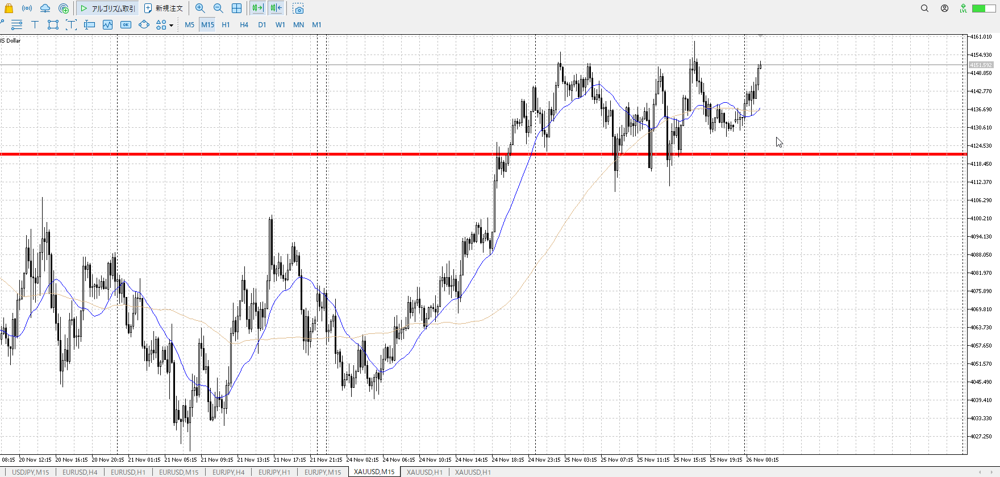

上抜いてから切り上げというベスト構成なので、戻ってこないんじゃないか。
その場合は抜きを狙いたい。

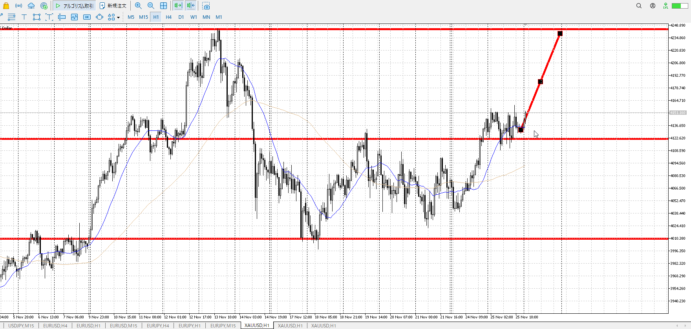

仮に抜けたら上まで届く想定。

上にたまる場合もある、これなら下降から一本、下固めて押し買い。

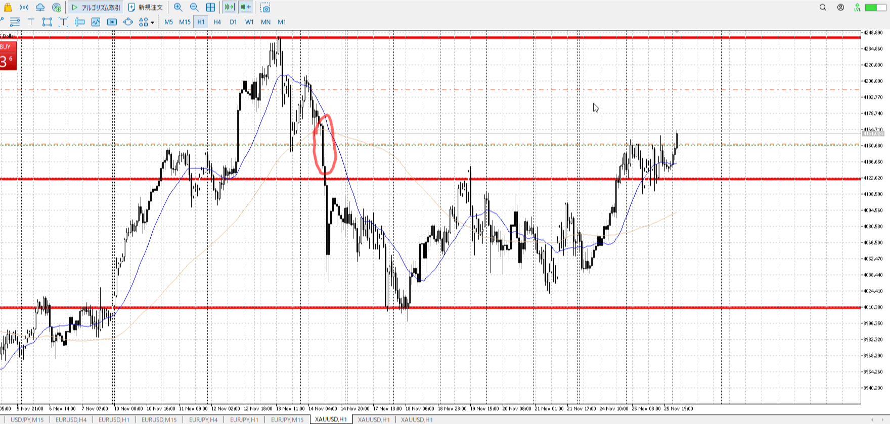

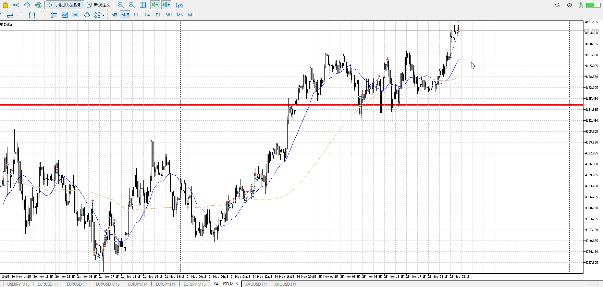

15mは確定するまで待って。

Tレンジの見極めが早くなれば上手い

T
1hが上がっていく3波
平均が下に曲がると調整早すぎ、逆に下への力が強くなる

理想は1hそのまま15mで買い場に下がること
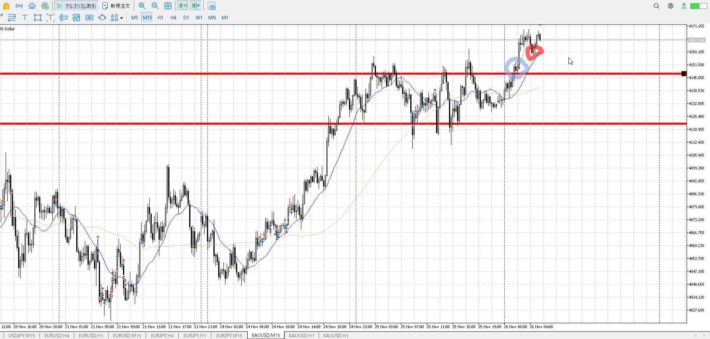

なので赤丸高さや、青丸高さに押しつつ平均が下に向いた後を狙う
赤丸は横軸での想定安値、青丸は縦軸での想定安値

T
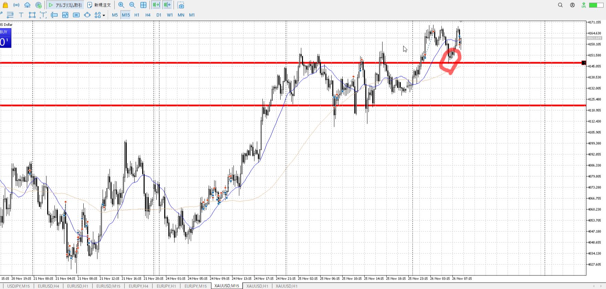

15mで赤丸場所で買いたかった
ここで触れた時に決め打ちする方法もあるが、それより確実なのは一つ足を落として分析すること

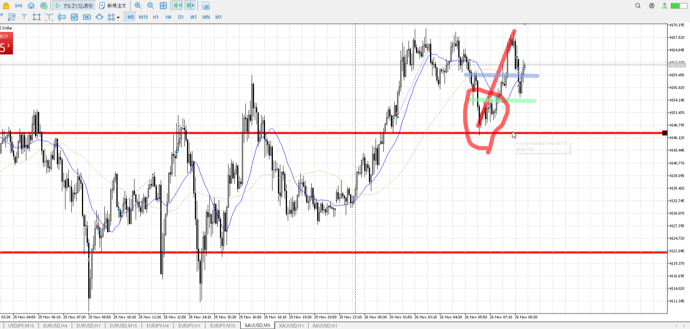

赤線一本なので赤丸の場所では買えない
青線のところで一回折れて緑のとこで押し目を買うのも抜けたので買えない

となると、青線の高さで確定したときに決め打ち（触れ確定後すぐ）で入る
もしくは緑戦の高さで確定したときに決め打ちで入るのみ

本当は15mのように一つ落として見たいが、今回はこれ以上落とせない
なら決め打ちのみ、待つとさっさと上がってしまう

---

> [!note]
>- +1万 事前認識 **開始5分**

- [ ] [my](obsidian://open?vault=Teino&file=FX/my)(見ないと増える)
- [ ] 指標
    - 差し込まれる可能性有り、毎日

4h

＜ここに目線画像＞

- [ ] トレーディングレンジ

方向：

1h

＜ここに目線画像＞

方向：

15m

＜ここに目線画像＞

方向：

全方向：

- [ ] 使用足全ての目線確認

＜ここにシナリオ画像＞

b:
s:

- [ ] シナリオ
- [ ] ぶつかり
- [ ] 日出日入

目線・シナリオ・強弱・横幅・PA・平均線方向・波

> [!check]
> - [ ] +1万 事前認識 **開始5分**
> - [ ] +1万 5枚

---

