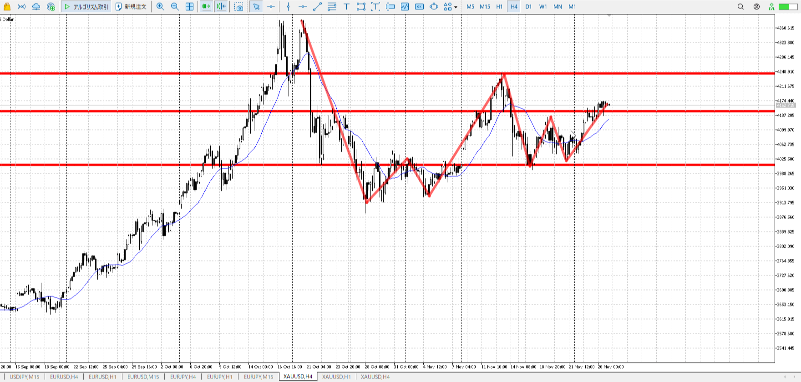
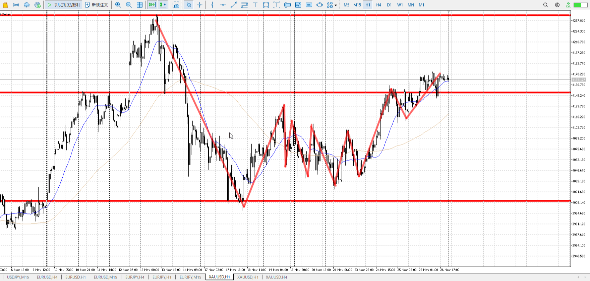
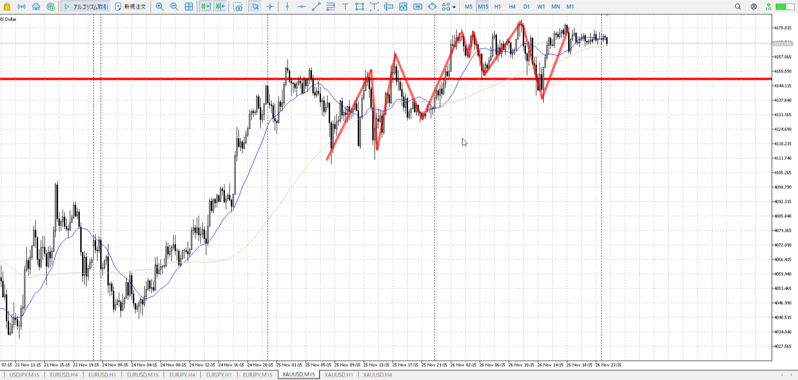
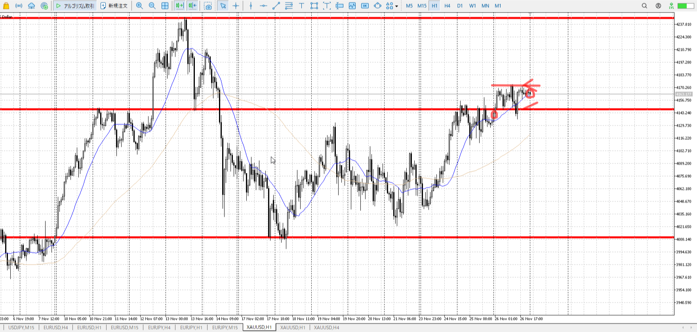

> [!note]
>- +1万 事前認識 **開始5分**

- [x] [my](obsidian://open?vault=Teino&file=FX/my)(見ないと増える)
- [x] 指標
    - 差し込まれる可能性有り、毎日

4h

＜ここに目線画像＞

- [x] トレーディングレンジ

方向：u

1h

＜ここに目線画像＞

方向：u

15m

＜ここに目線画像＞

方向：d

全方向：uud

- [x] 使用足全ての目線確認


＜ここにシナリオ画像＞

b:1h前回天井
s:1h天井

昨日から上昇し、止められつつ下げ否定しつつ上で終了

- [x] シナリオ
- [x] ぶつかり
- [x] 日出日入


目線・シナリオ・強弱・横幅・PA・平均線方向・波
uudながら100戻しが通り上続行。
1h下向きはじめを狙い、15mの小レンジと押しを待ちたい

> [!check]
> - [x] +1万 事前認識 **開始5分**
> - [x] +1万 5枚

---

OK!
Exchage Start.

---

```meta-bind-button
style: default
label: 明日分
actions:
  - type: "insertIntoNote"
    line: selfEnd+1
    value: "Temp/defFXEnvAnalysis.md"
    templater: true
  - type: "replaceSelf"
    replacement: ""
```
