> [!note]
>- +1万 事前認識 **開始5分**

- [ ] [my](obsidian://open?vault=Teino&file=FX/my)(見ないと増える)
- [ ] 指標
    - 差し込まれる可能性有り、毎日

4h
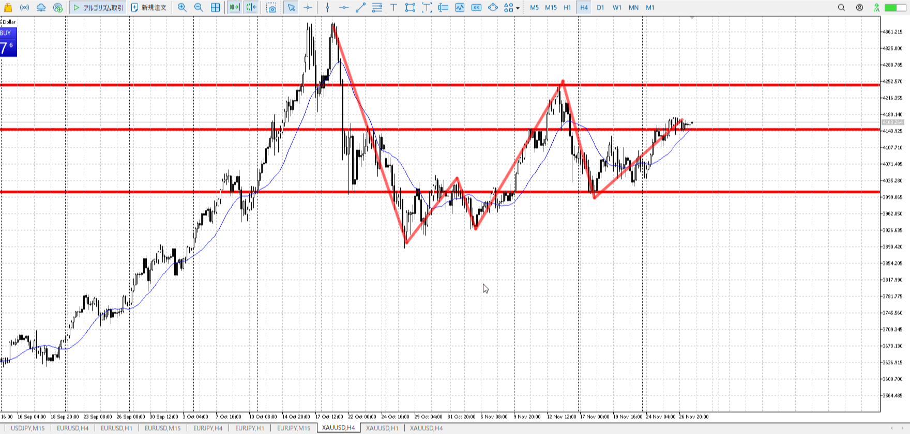
＜ここに目線画像＞

- [x] トレーディングレンジ

方向：u

1h
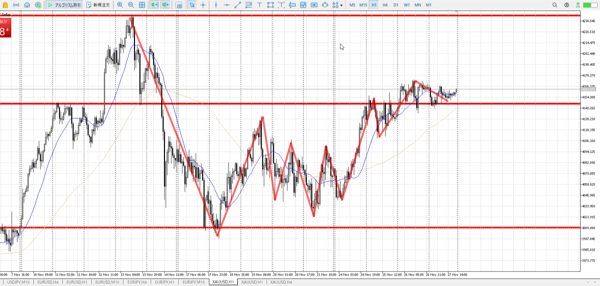
＜ここに目線画像＞

方向：u

15m
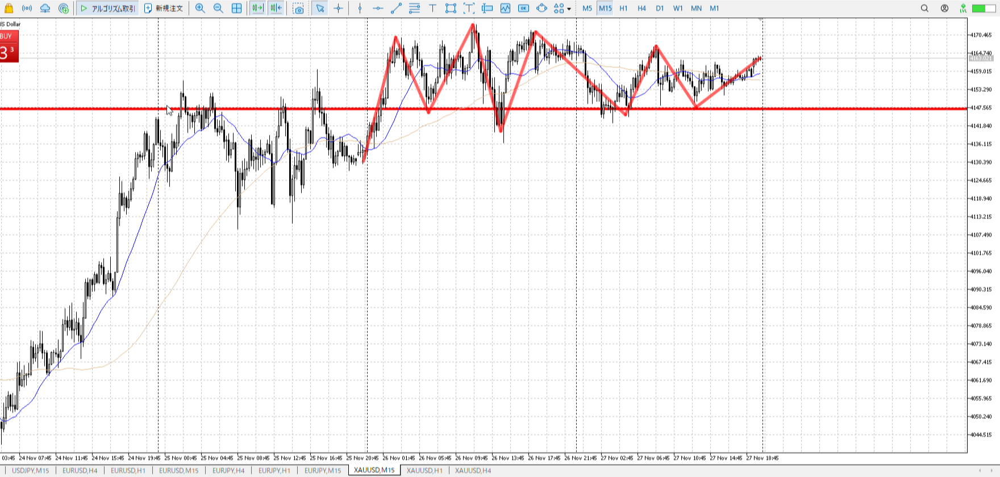
＜ここに目線画像＞

方向：u

全方向：uuu

- [x] 使用足全ての目線確認

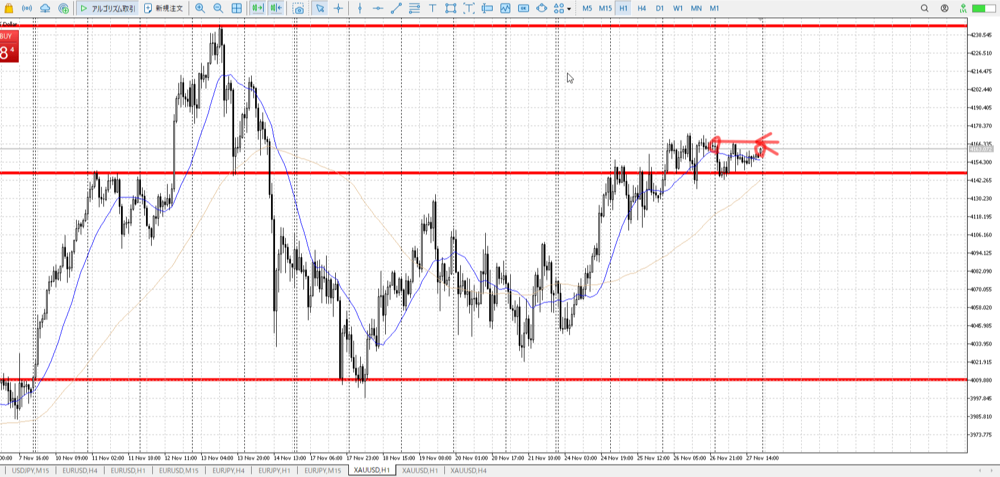
＜ここにシナリオ画像＞

b:15m安値
s:1h高値

下がったが耐え

- [x] シナリオ
- [x] ぶつかり
- [x] 日出日入


目線・シナリオ・強弱・横幅・PA・平均線方向・波
uuuで買い。1hが使えないレンジなので、15mで短期上まで買いがメイン。
下に引き付け5mで見分けて買う。

> [!check]
> - [x] +1万 事前認識 **開始5分**
> - [x] +1万 5枚

OK!
Exchage Start.

---

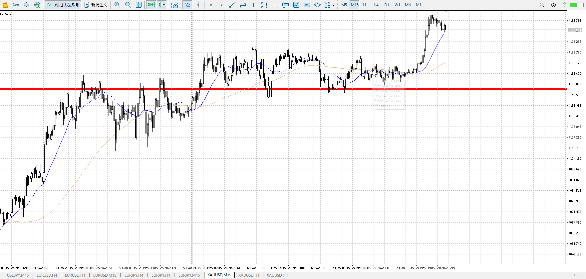
シナリオを描いたその少し後の話。

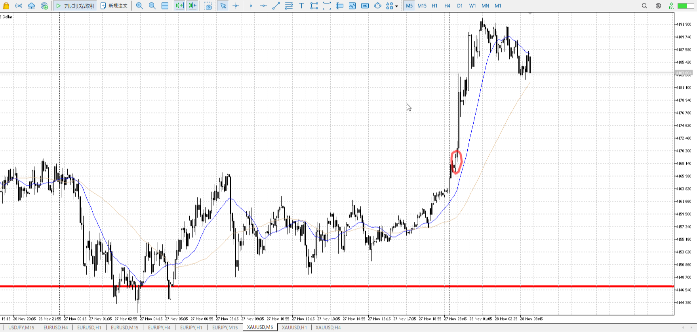

実際見ていたら、このあたりで買えたと思う。

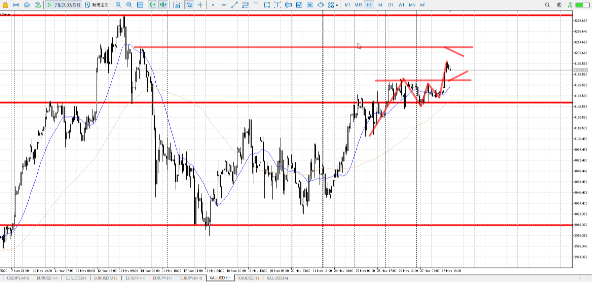
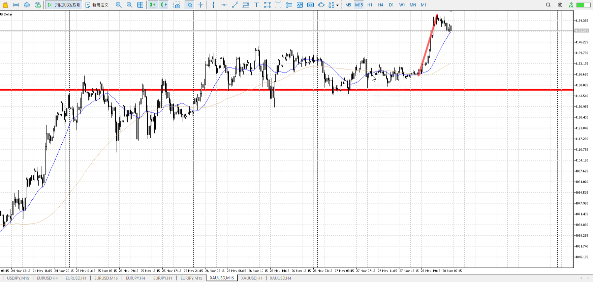
再度シナリオ

目線・シナリオ・強弱・横幅・PA・平均線方向・波
uuu。1hが調整入るまで待ち。
1hのレンジ上を底にする可能性はあるが分からない。そこが出るまでは買えない。

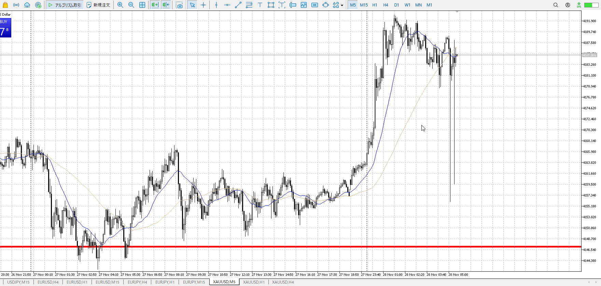

出てる。

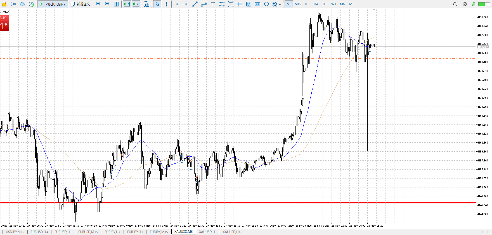

これは5m買い。
15mが付いてくるより早く、5mでしか上げられないので時間かかる。

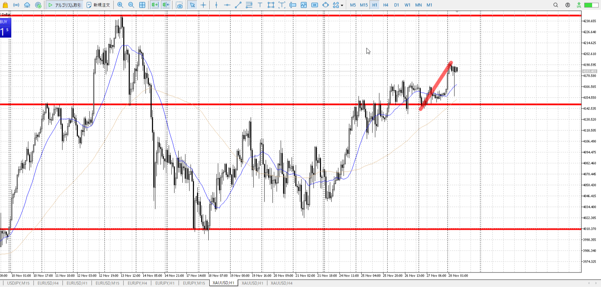
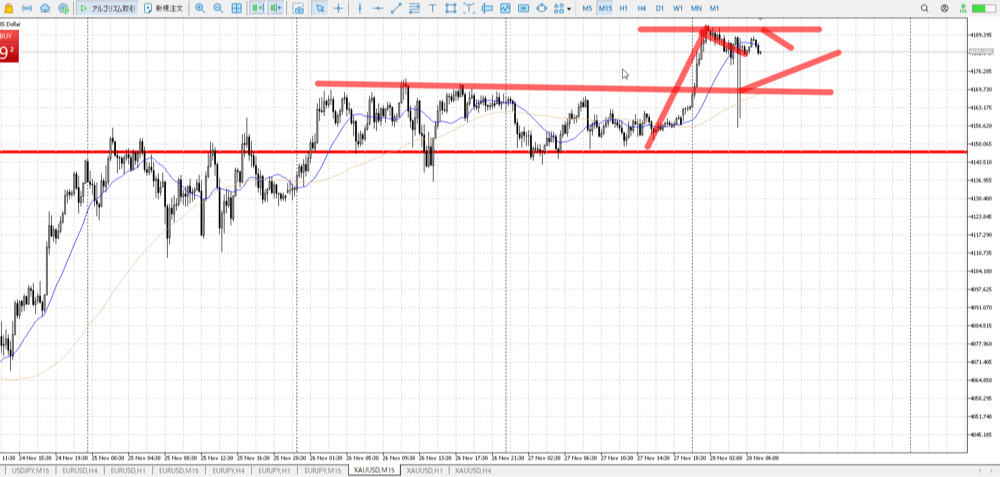
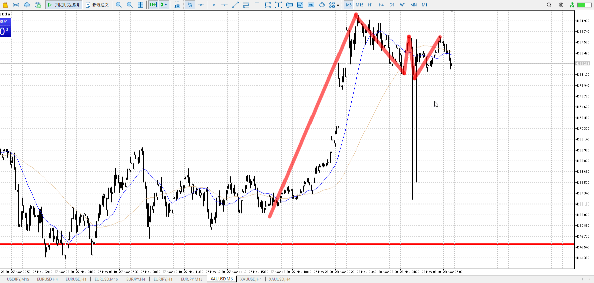

目線・シナリオ・強弱・横幅・PA・平均線方向・波
uuu。1hが調整入るまで待ち。
15mが調整入り始め。となると5mで下まで待って横幅待ちPAで入りたい。

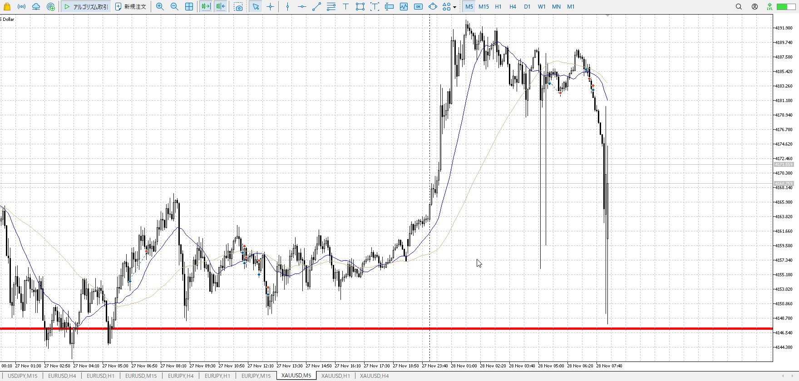

15mが追いつく前の速攻をしたかったが、うまくいかず。
三回目で惰性になってる気がしたので止めた。その後のシナリオ立て直しが上のやつ。

今回はシカゴの取引所が冷却問題で止まった。シカゴ・マーカンタイル取引所.
同時に取引が丸々止まった。買いの利確がその前に一気に入った形？

[2025-11-28-usdjpy](../FX/My_Test/2025-11-28-usdjpy.md)


---

- 1
    - まだあり得る範囲
    - ただ損切近すぎ
- 2
    - まだあり得る
    - しかし15mの平均の下に、一回上に触れてから来てる
    - ここを抜かれると終わり
- 3
    - きつい
    - 上に触れた後なので、一旦そこからの下降を消す下髭など欲しい


---

> [!note]
>- +1万 事前認識 **開始5分**

- [ ] [my](obsidian://open?vault=Teino&file=FX/my)(見ないと増える)
- [ ] 指標
    - 差し込まれる可能性有り、毎日

4h

＜ここに目線画像＞

- [x] トレーディングレンジ

方向：u

1h

＜ここに目線画像＞

方向：d

15m

＜ここに目線画像＞

方向：u

全方向：uuu

- [ ] 使用足全ての目線確認


＜ここにシナリオ画像＞

b:
s:

- [ ] シナリオ
- [ ] ぶつかり
- [ ] 日出日入


目線・シナリオ・強弱・横幅・PA・平均線方向・波


> [!check]
> - [ ] +1万 事前認識 **開始5分**
> - [ ] +1万 5枚

```meta-bind-button
style: default
label: Send
actions:
  - type: "replaceSelf"
    replacement: "OK!\nExchage Start.\n\n---"
```


---

- 1
- 2
- 3