> [!note]
>- +1万 事前認識 **開始5分**

- [x] [my](obsidian://open?vault=Teino&file=FX/my)(見ないと増える)
- [x] 指標
    - 差し込まれる可能性有り、毎日

4h
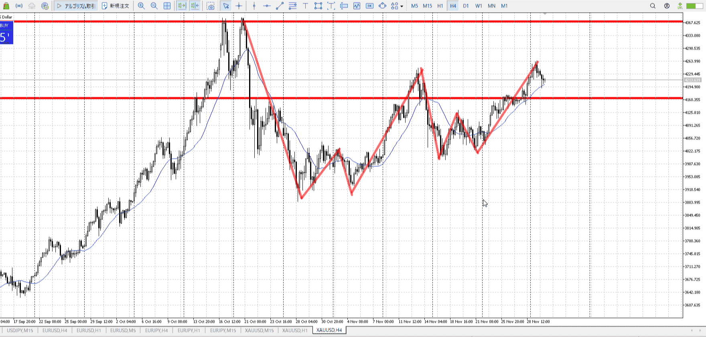
＜ここに目線画像＞

- [x] トレーディングレンジ

方向：u

1h
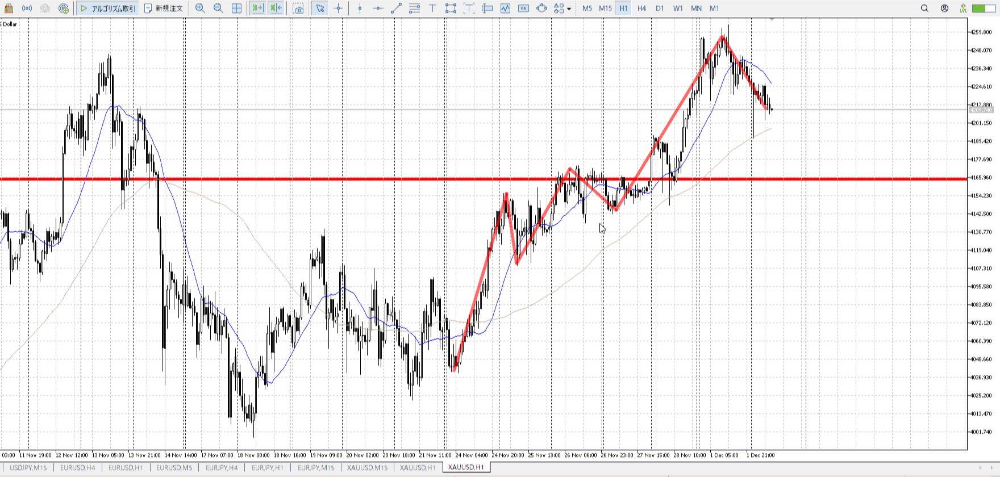
＜ここに目線画像＞

方向：u

15m
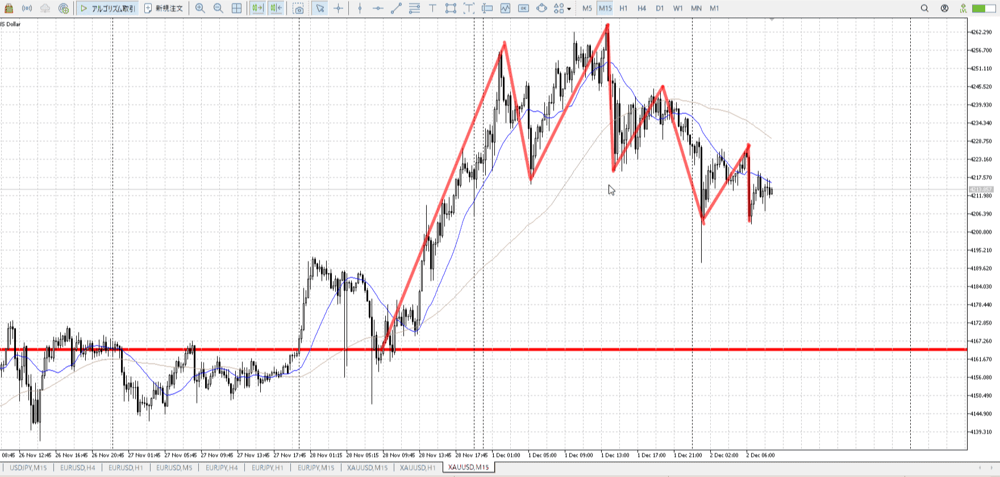
＜ここに目線画像＞

方向：d

全方向：uud

- [x] 使用足全ての目線確認

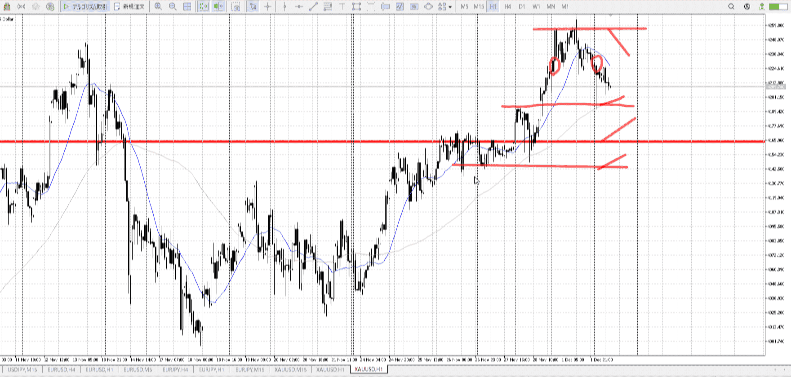
＜ここにシナリオ画像＞

b:1h安値
s:4h高値

4h高値で折れて同値

- [x] シナリオ
- [x] ぶつかり
- [x] 日出日入、週出週入


目線・シナリオ・強弱・調整・横幅・PA・平均線方向・波
1h調整中。この下から買いたい。
15mの底が分からない。底がわかるほど横幅を取ったらPA買い。

シナリオ上での買い場所を意識。
今は底が分からないので暫定だが、もし落ちたら使う。

> [!check]
> - [x] +1万 事前認識 **開始5分**
> - [x] +1万 5枚

OK!
Exchage Start.

---

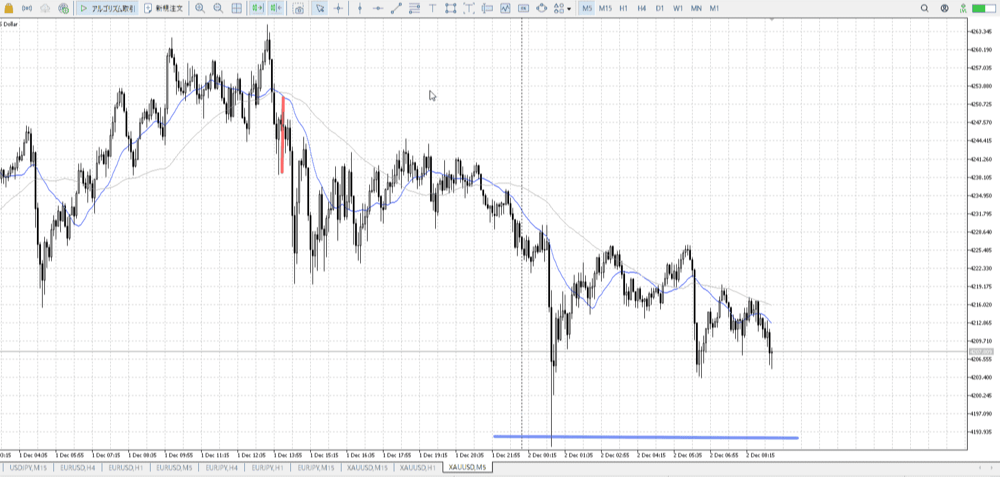

5m。
T赤線部分は一応順調だった買いが100戻しした。
そのあと下髭を出すも伸びず。売れる。

底は大きく出てるので、青線部分が有力。
実線なら現地店も使える。がダウ的に今は買えない。

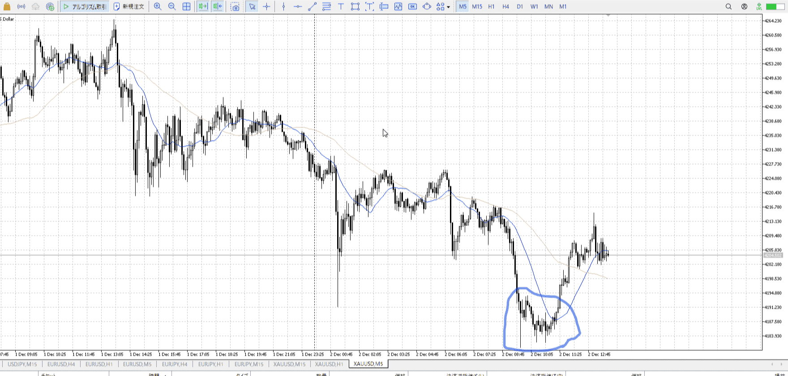

T
青丸部分、下が止まった印
ここで買える

15m平均から離れすぎ、戻る必要
止まりに平均に戻る力と合わせて上昇


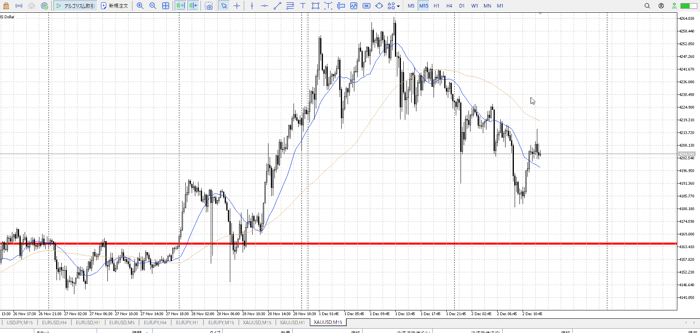

15m、上を試して大きな上髭
その後下で止められた？

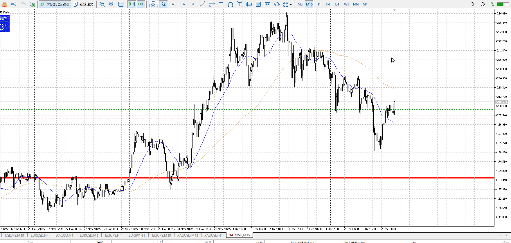

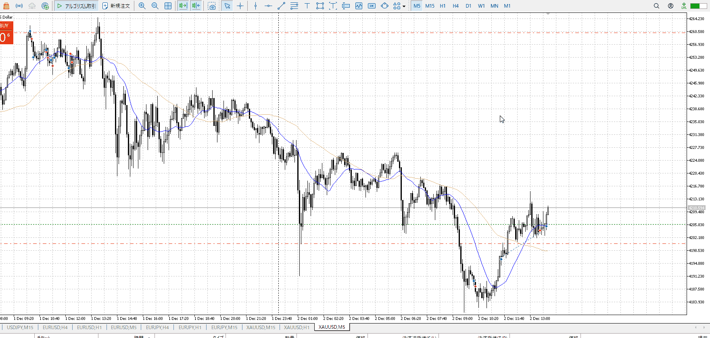
上髭三つに対して変な下髭足
上の否定かと思い買い

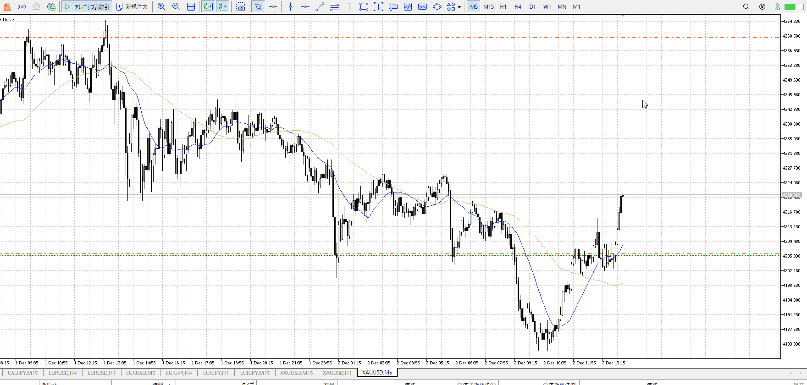
途中15mで二本上髭で止めたんだけど、下は破ってなかった
その後三本目の上髭出たけど、それなのに5mに即下髭付いた
怪しいと思って入り直した

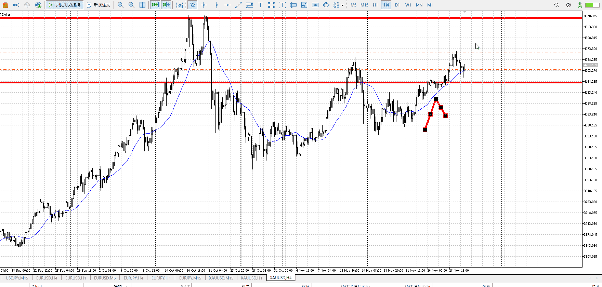

4hが合流したのか、やたら伸びる
押し目が無いのが逆に怖いんだけど、いつも通り切る

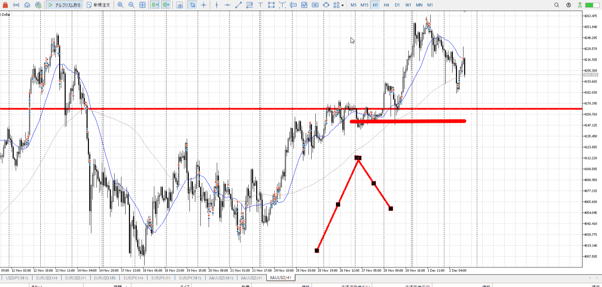

二本に匹敵するくらいのプライスアクションかと思って切ってる 一回底の参考値として見るべきだったか聞きたい

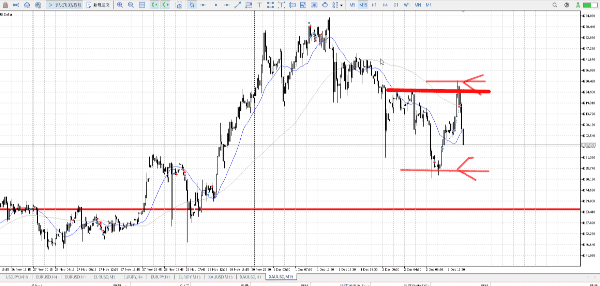

一旦落ち着いてシナリオはこう
4hも一旦下向きそう

1hの安値は距離がある
15mの高値は一瞬抜いたが落ちた、一瞬uuuだったが変に落ちてる

変わらず落ちたら買うが正解
この勢いを虫は出来ないので、再度15mが追いつきPA出してそれについてく。


---

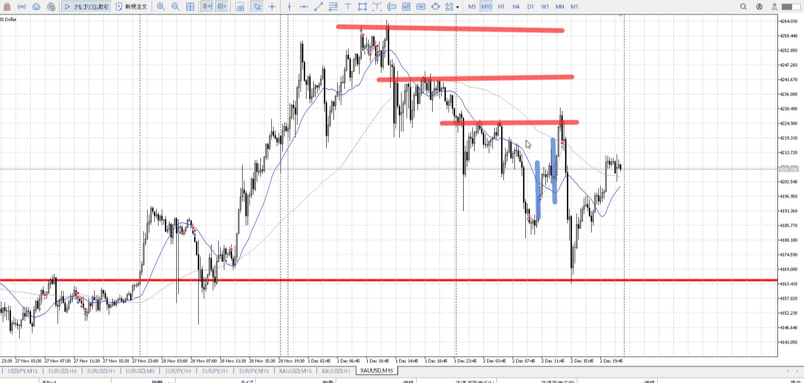

- 1
    - 下勢い止まりから、平均戻りと勢い買い
    - 予想した利確ポイントは赤線
        - Tそこで逆PAなら辞める、それまでは辞めない
        - [利確予想まで落ち耐え](../FX/利確損切.md#利確予想まで落ち耐え)
- 2
    - 第二、5mPA買い

---

```meta-bind-button
style: default
label: 明日分
actions:
  - type: "insertIntoNote"
    line: selfEnd+1
    value: "Temp/defFXEnvAnalysis.md"
    templater: true
  - type: "replaceSelf"
    replacement: ""
```
