> [!note]
>- +1万 事前認識 **開始5分**

- [x] [my](obsidian://open?vault=Teino&file=FX/my)(見ないと増える)
- [ ] 指標
    - 差し込まれる可能性有り、毎日

4h
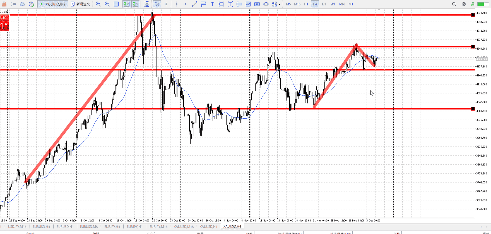
＜ここに目線画像＞

- [x] トレーディングレンジ

方向：u

1h
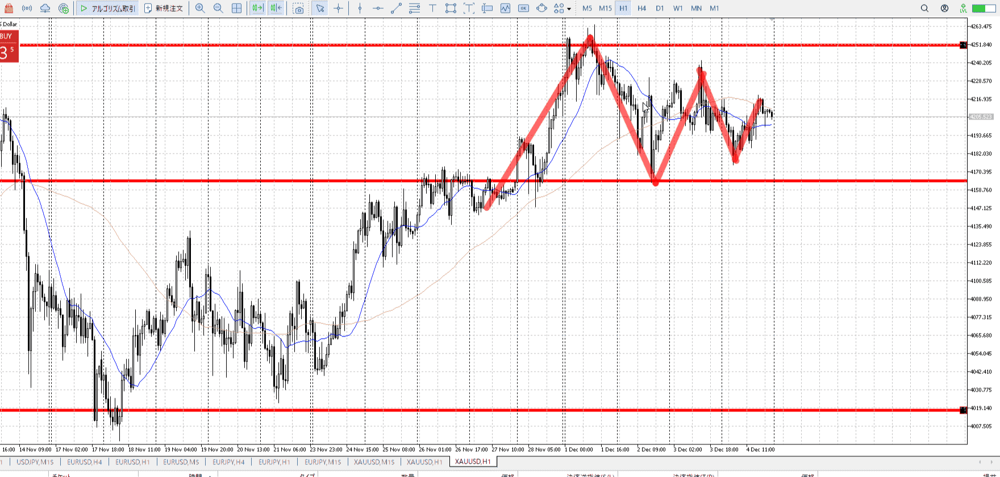
＜ここに目線画像＞

方向：u

15m
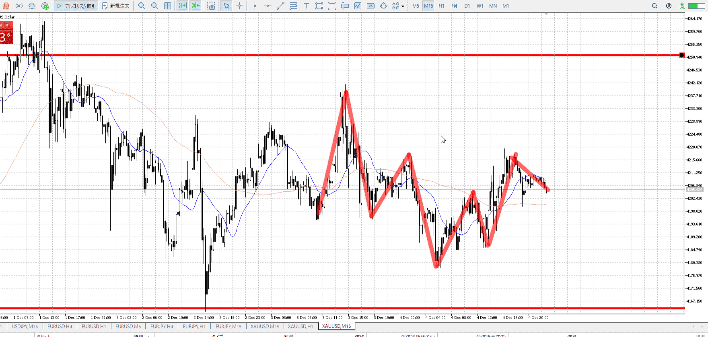
＜ここに目線画像＞

方向：u

全方向：uuu

- [x] 使用足全ての目線確認

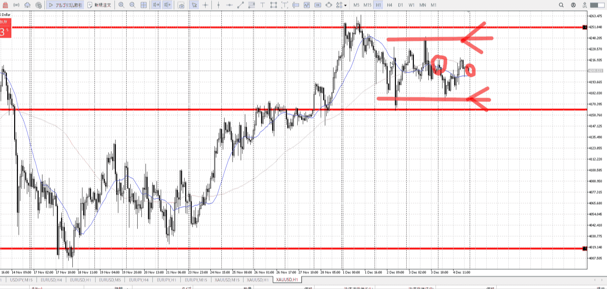
＜ここにシナリオ画像＞

b:1h底
s:1h天井

下がってから1h底で戻る。

- [x] 1hシナリオ
- [x] ぶつかり
- [x] 日出日入、週出週入


目線・シナリオ・強弱・調整・横幅・PA後・平均線方向・波・**ひきつけ**
1hが底と天井以外に有力な場所が無く、その間は15mに従いたい。
uuuではあるので買いたいところ。横幅取りつつ、天井行くまで15m下がり始め-5m横幅OKでPA買いたいとこ。1hから遠いのでひきつけ。

当然1hの支援があったほうが買いやすい。
底まで何もしない、シナリオ通りも手。

> [!check]
> - [x] +1万 事前認識 **開始5分**
> - [x] +1万 5枚

OK!
Exchage Start.

---
朝のはモニター端によるゴミミス

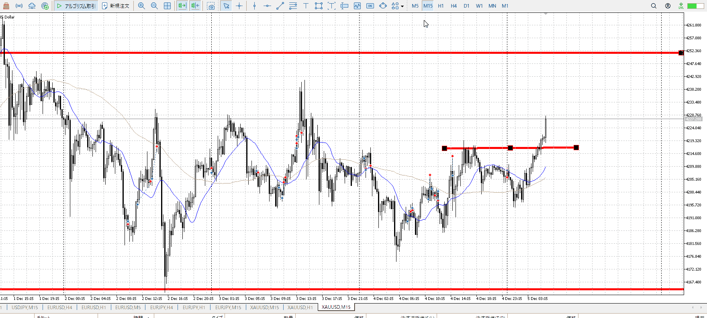

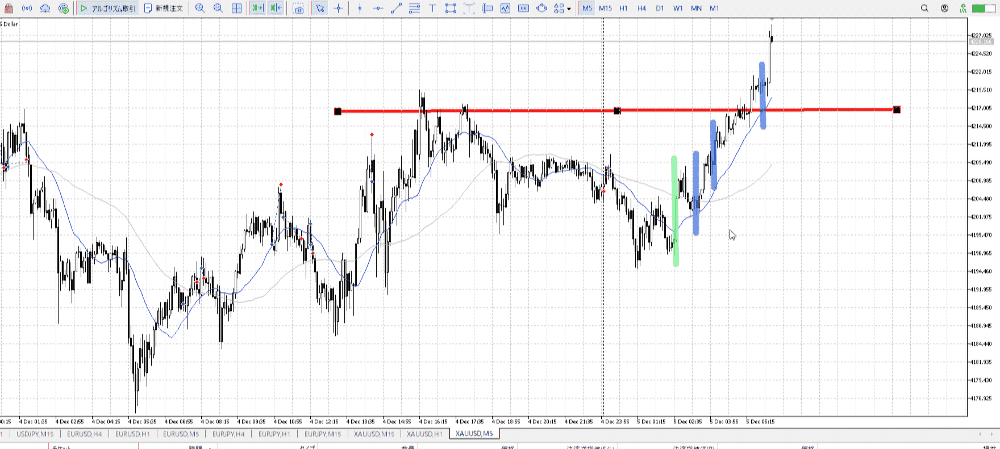

この三か所買えたか。
特に一か所目は5m,15m1hが揃う。ベスト。

15m緑線で、下まで下がらず包み。
この時点で買い転向だった。

2か所目はこの時点で5mに切り替えてればというとこ。

3か所目はちょい微妙。

~~ただ、1h的に高さが微妙。~~
~~なのでどこかで折れると思ってたんだけど。上がっていった。~~

全体で切り上げが起き、天井からの落ちが伸びず、さらに1h平均の上でもあり、15m5mも平均上。
買える。


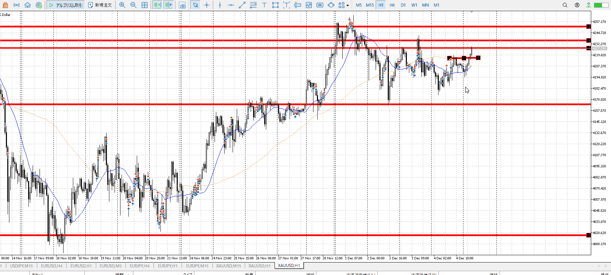

一応シナリオ的に、この1h高値で落ちるか抜けるか。

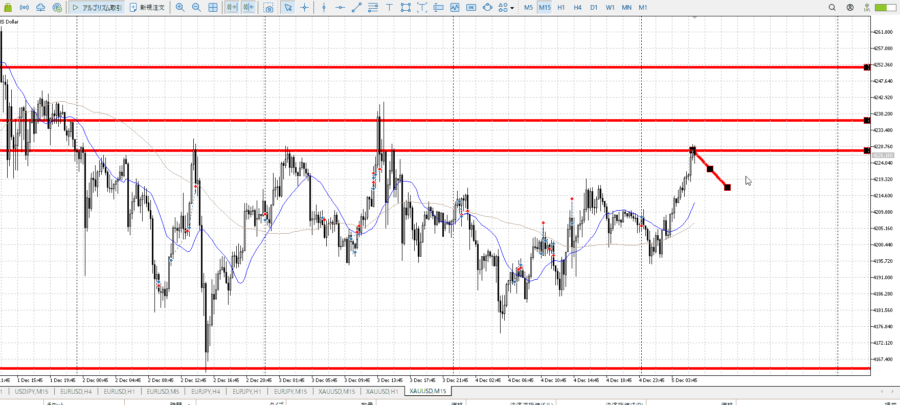

15mとしてはここで落ちて、15m高値から上がっていくシナリオ。
これなら一応入れる。


底まで何もしない、シナリオ通りは必要があったらの話。
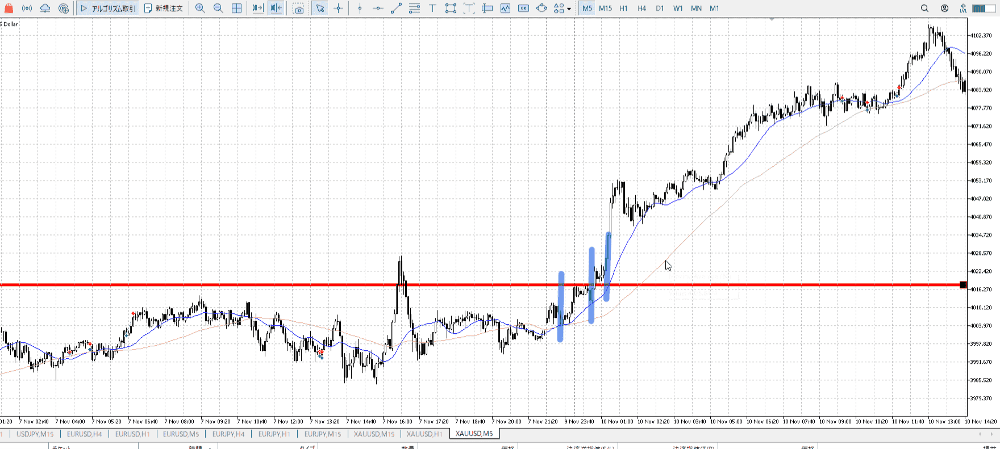
十日のこの激伸びも、1hは特に関与してない
平均線の上くらいか
溜めた分の解放、短期から一気に伸びていった
溜めた分は必ず使う

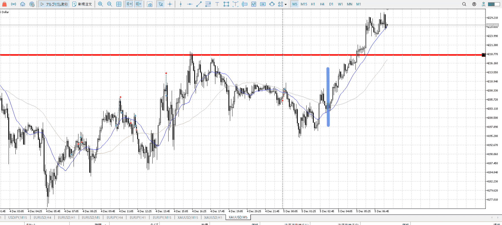

今回もこれは十分溜めてた
短期で入れる

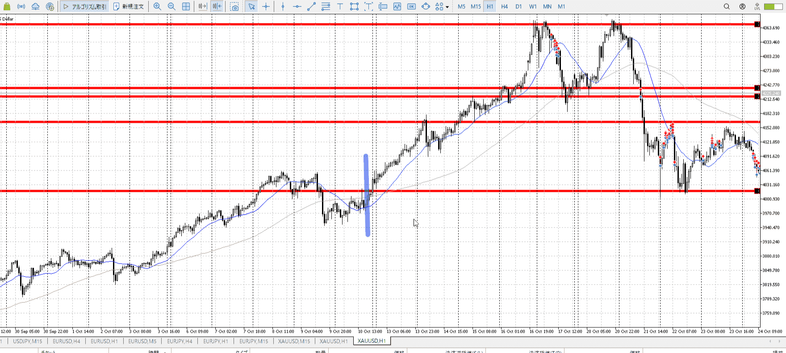

1hで溜めてというとこの10月10日がそう
両方ある

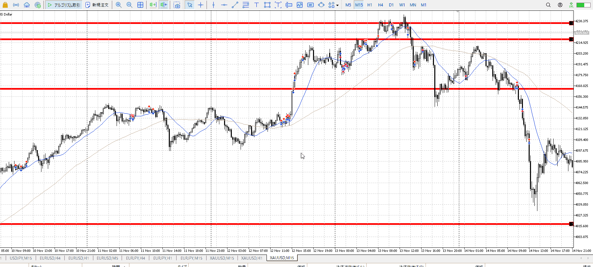

12月12日はこう
上昇からそのまま

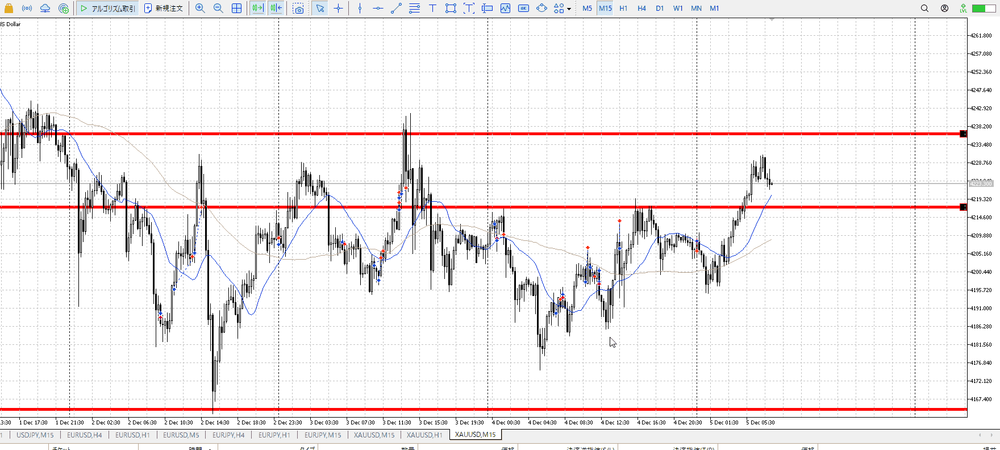

昨日は早めに切り上げを受けて、始値に戻されていた
それから上を抑えられているが、それにしては包がこのタイミングは早い
この辺で買いを試せる

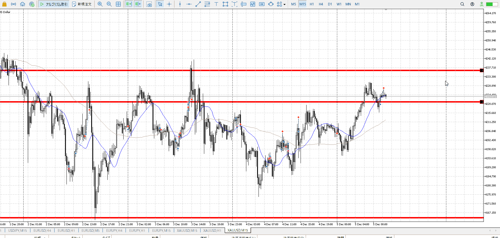

この後も上昇に対する押し目買い
上髭が出たので、これを否定できるPAまで待ち

---
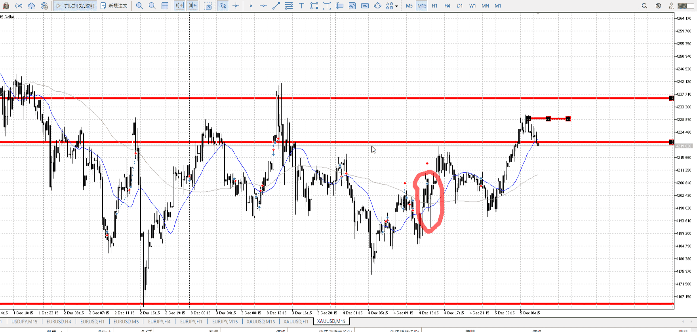
T
横はないが、下髭が大きく出てる
これで入れる

上ついた時点で下への力が出るはず
その割に下髭で抵抗している、買える

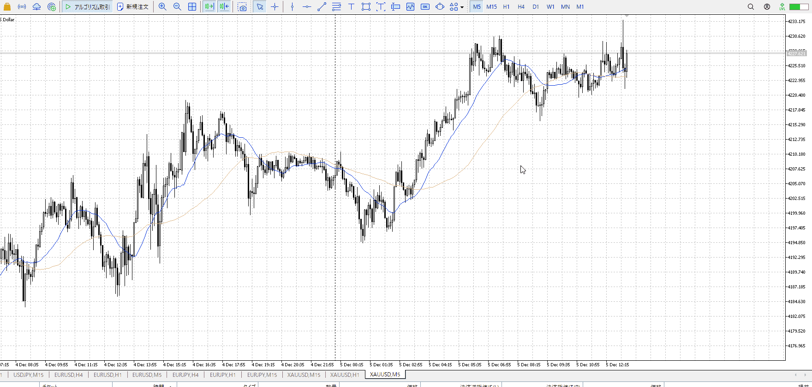

T
おなじやつ
買う認識があり、上からの攻勢が下髭で止められた
買う


![[../images/2025-12-05 2025-12-05 22.54.14.excalidraw]]
実際に買う部分の話

![[../images/2025-12-05 2025-12-05 22.55.20.excalidraw]]
横幅とって、PA出して、その押し

横幅とってPA出した後なら、**その高さは全部買い続行**
大きく落ちて来た後なら受け止めの下髭は必要だが、その後**再度上昇を見る必要はない**

よって青で示したローソクは必要無く、下髭時点で買える
これは落ちてきた奴がこのPA高さをぶち抜いたりした場合は流石に適用外

[二回目押し](../FX/エントリー.md#二回目押し)


- 1
    - 上記。二回目押し。
現状把握、利確予想まで落ち耐え

---


> [!note]
>- +1万 事前認識 **開始5分**

- [ ] [my](obsidian://open?vault=Teino&file=FX/my)(見ないと増える)
- [ ] 指標
    - 差し込まれる可能性有り、毎日

4h
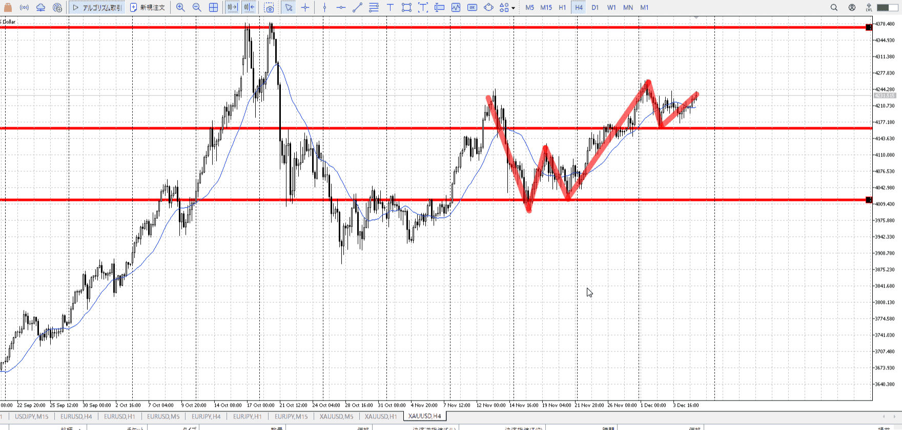
＜ここに目線画像＞

- [x] トレーディングレンジ

方向：u

1h
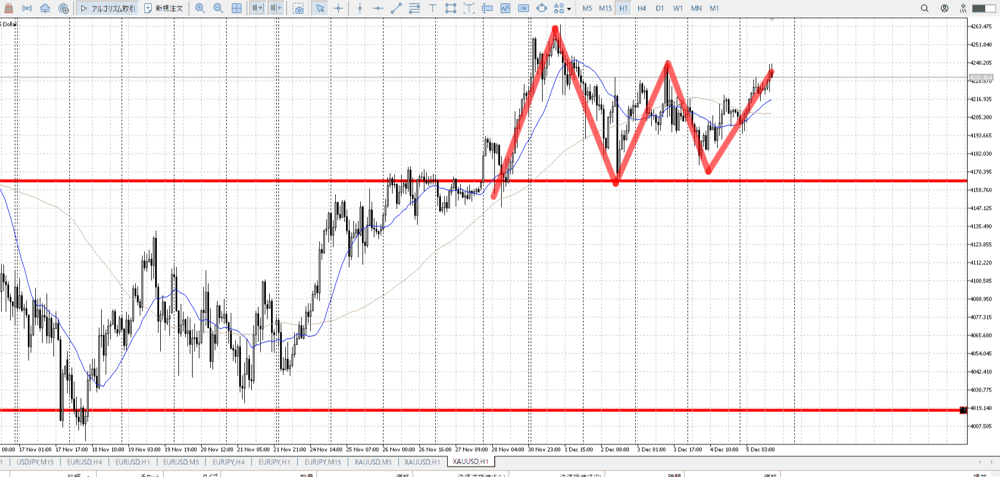
＜ここに目線画像＞

方向：u

15m
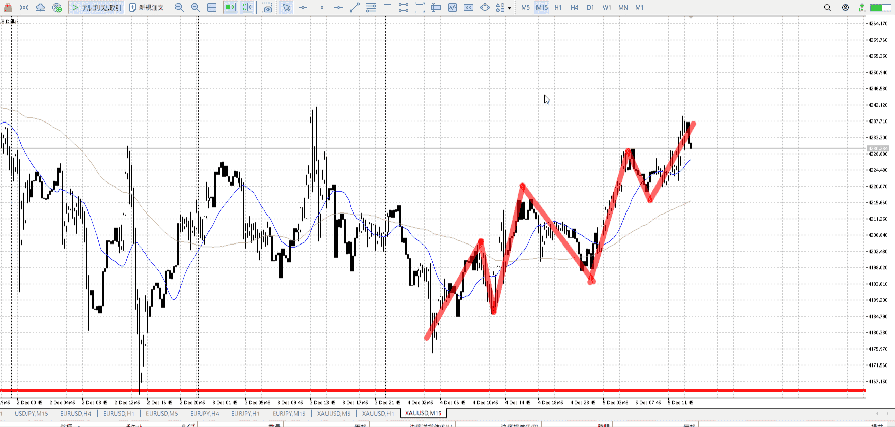
＜ここに目線画像＞

方向：u

全方向：uuu

- [x] 使用足全ての目線確認

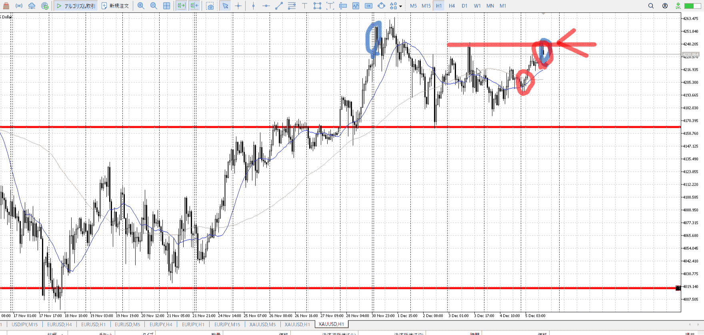
＜ここにシナリオ画像＞

b:1h安値
s:1h高値

週かけて調整

- [x] 1hシナリオ
- [x] ぶつかり
- [x] 日出日入、週出週入


目線・シナリオ・強弱・調整・横幅・PA後・平均線方向・波・**ひきつけ**
調整。
下来たら買いたいが、それよりuuuや前日上昇より短期で上抜きを狙うほうが早い。


> [!check]
> - [ ] +1万 事前認識 **開始5分**
> - [ ] +1万 5枚

```meta-bind-button
style: default
label: Send
actions:
  - type: "replaceSelf"
    replacement: "OK!\nExchage Start.\n\n---"
```


---

- 1
- 2
- 3

明日分は来週の方が分かりやすいか。