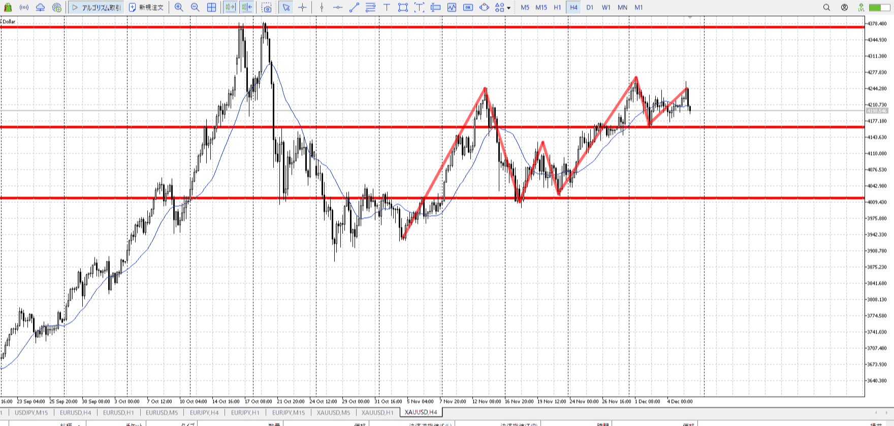
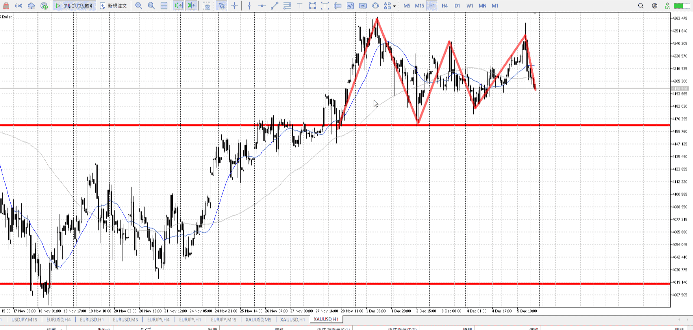
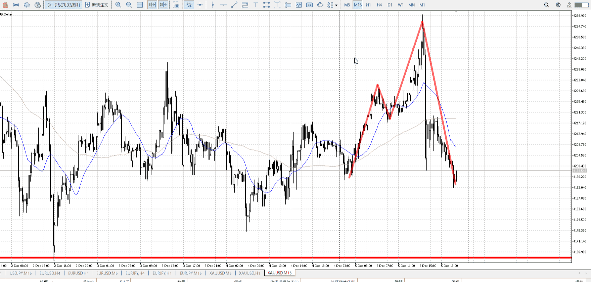
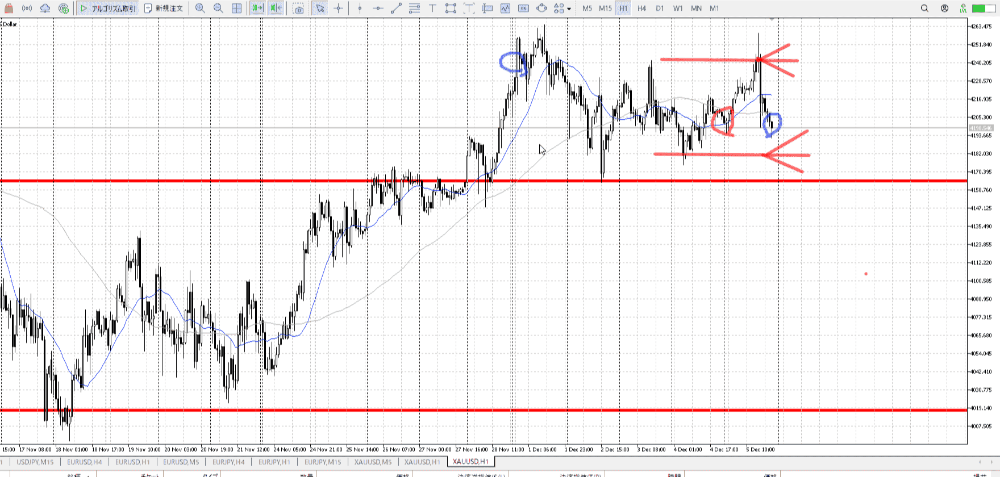

> [!note]
>- +1万 事前認識 **開始5分**

- [x] [my](obsidian://open?vault=Teino&file=FX/my)(見ないと増える)
- [x] 指標
    - 差し込まれる可能性有り、毎日

10日水曜28:00にFOMC
28:30にパウエル

4h

＜ここに目線画像＞

- [x] トレーディングレンジ

方向：u

1h

＜ここに目線画像＞

方向：uR

15m

＜ここに目線画像＞

方向：d

全方向：uuRd

- [x] 使用足全ての目線確認


＜ここにシナリオ画像＞

b:1h底切り上げ
s:1h天井

週は下降で終わり。
日は天井から一気に下がり同値。

- [x] 1hシナリオ
- [x] ぶつかり
- [x] 日出日入、週出週入


目線・シナリオ・強弱・調整・横幅・PA後・平均線方向・波・**ひきつけ**
週下降。調整をするにしても、一旦これを止める必要がある。
なので売りから調整などで始まるはず。

日が同値。上で満足している。
再び買いを出すには調整が必要。

> [!check]
> - [x] +1万 事前認識 **開始5分**
> - [x] +1万 5枚

OK!
Exchage Start.

---


T
昨日

青線が[二回目押し](エントリー.md#二回目押し)。買いは包み足時点でもう決めてる。
すぐに落ちるほうが確率低いので試すべき。

上からの下降は、小さくレンジ内に含まれる限り一般的
なので実体止まり下髭程度で止まると考える
流れとかuuuとかも含めて止まる。


緑線は何もない。落ちる理由が無いのでそのまま上がる読みで放っておける。

灰線は上に触れた後。前回の買い場などは上に触れた、目標地点に到達した時点で参考にしかならない。ここでもう一度買い場を作る必要がある。
そのための複数回下髭も全然出せてないので買いではない。緑が上がるのは落ちる理由がないから。灰は上に触れた後なので落ちる。


今日朝のテスター。
下降によりネックを割り、5mは下向きに。いったん上向きになる理由が欲しい。

それが緑。5mを全包みしている。これなら上向きとしてひきつけて買える。平均の上にも行ける。


15m。
青部分を見ると包むような足が出ているが、これでは足りない。

下向きトレンドを返すには、横幅とPAがいる。横幅の最小は二度目の下止め。


これは逆だけど。
そのうえでPAが出て返している。

5mの下トレンド、3本だけでは戻らない。
青や灰をこれらとして見るには、小さすぎる。下降に対する横幅を一度取ること。


---

- 1
- 2
- 3
現状把握、利確予想まで落ち耐え

---

```meta-bind-button
style: default
label: 明日分
actions:
  - type: "insertIntoNote"
    line: selfEnd+1
    value: "Temp/defFXEnvAnalysis.md"
    templater: true
  - type: "replaceSelf"
    replacement: ""
```
