> [!note]
>- +1万 事前認識 **開始5分**

- [x] [my](obsidian://open?vault=Teino&file=FX/my)(見ないと増える)
- [x] 指標
    - 差し込まれる可能性有り、毎日

4h
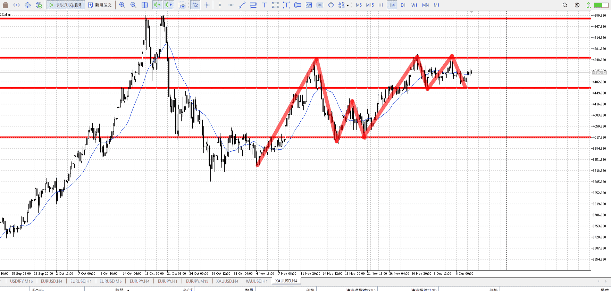
＜ここに目線画像＞

- [x] トレーディングレンジ

方向：u

1h
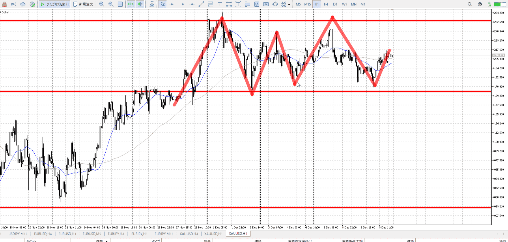
＜ここに目線画像＞

方向：uR

15m
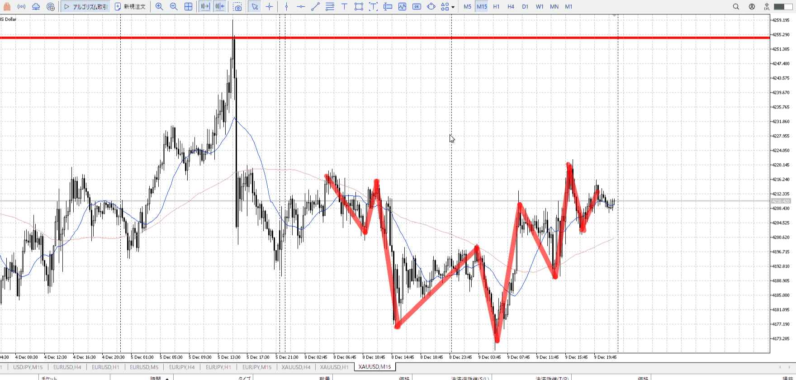
＜ここに目線画像＞

方向：u

全方向：uuRu

- [x] 使用足全ての目線確認

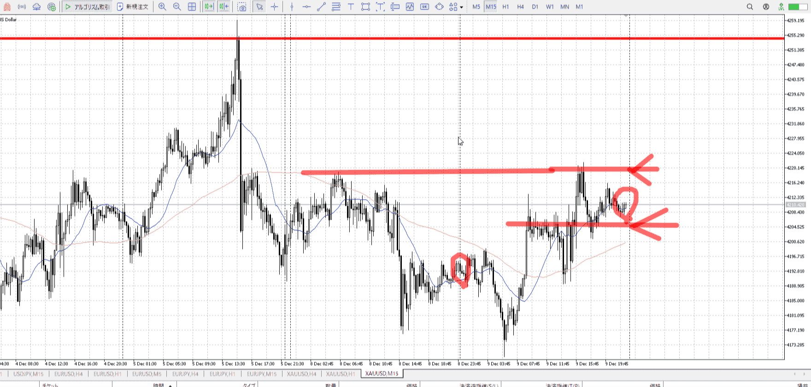
＜ここにシナリオ画像＞

1hレンジなので15m

b:15m前回安値
s:15m前回高値

1h底により上昇。

- [x] 1hシナリオ
- [x] ぶつかり
- [x] 日出日入、週出週入


目線・シナリオ・強弱・調整・横幅・PA後・平均線方向・波・**ひきつけ**
uuRu。買いたい。
前回の5mレンジを足掛かりに上りたい。下降に対する横幅は十分、15m下向きに5m横幅とPAを狙う場面。
5mの横幅、つまりレンジが分かりにくい。底も天井も切り下げ気味。


> [!check]
> - [x] +1万 事前認識 **開始5分**
> - [x] +1万 5枚

OK!
Exchage Start.

---

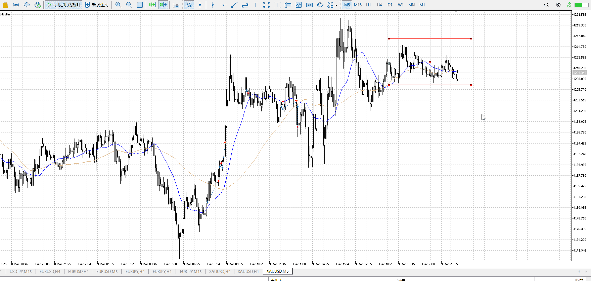

底が分かってきたので、こんな感じになるかと。
下から買うか、上抜き押し買うか。

小さい売り場を抜けばいい。

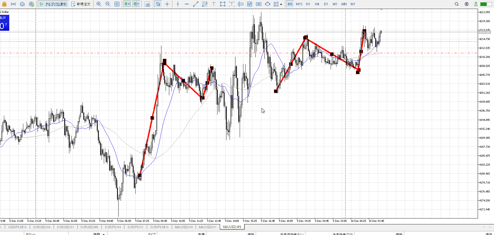

平均線による上下ベース
今回は直近高値を抜いているので、下がっても買える

T
昨日の上下は乗るの無理

朝の揉みも本来の高さより高い
ここで乗るのは早い、下で揉んでたらあり

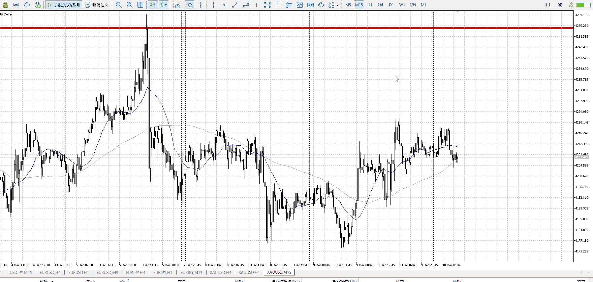

15m抜き書け
ここえ耐えてPA出す用ならありだが、それなら15m平均が追いつくくらい5mが耐えないといけない

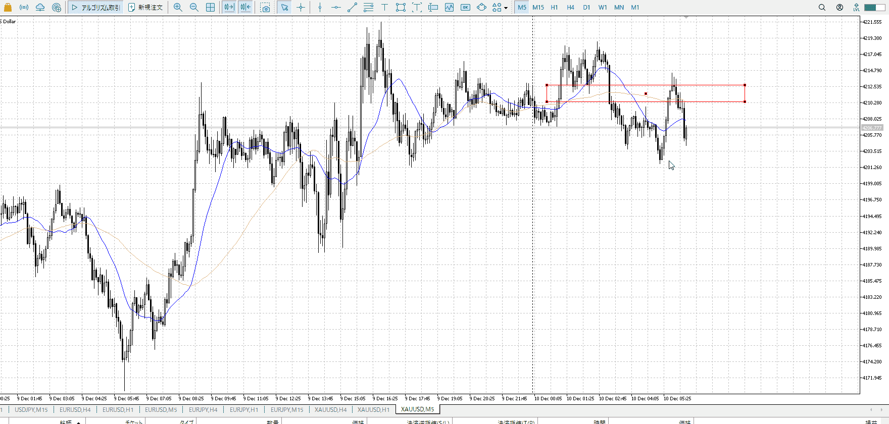

赤四角が売り場だが、ここで上がらなかったから売りますは直前の上昇を無視しているような。

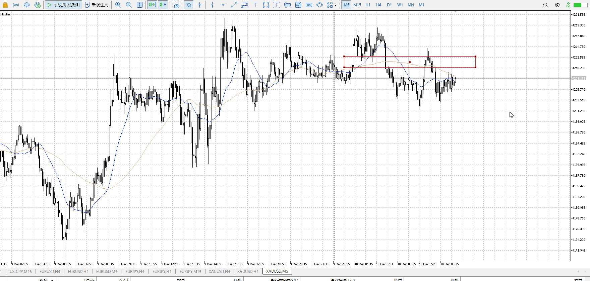

売り待ち。15m5m1hがそろいはじめ。
売りが刺しきれてないのが悩みどころ。

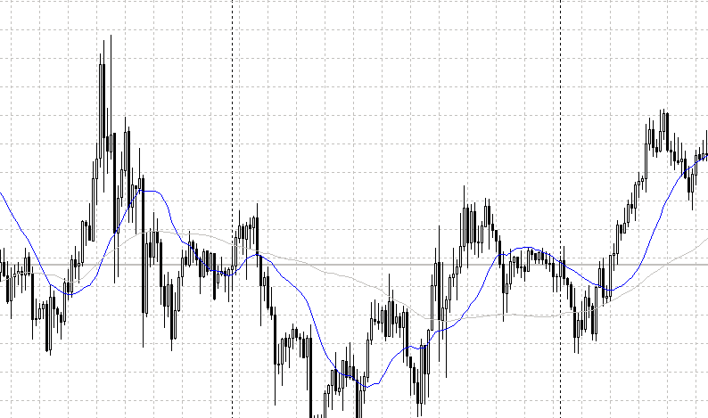

ここの上昇のようにやりたいが、

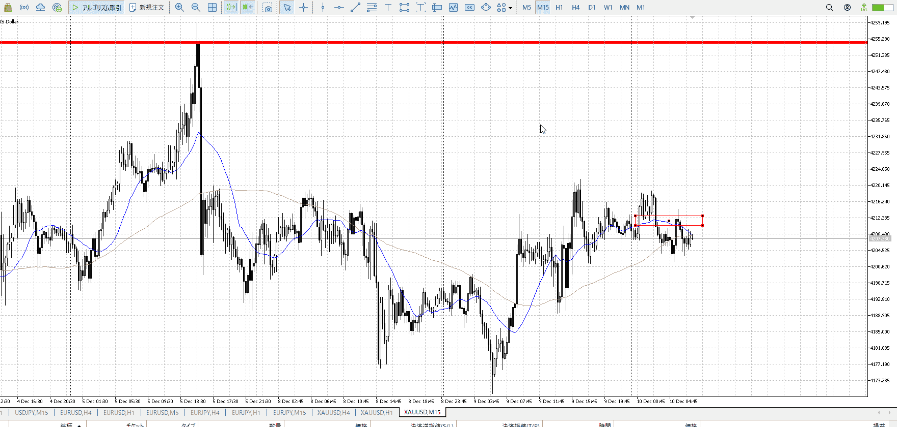

ここの15mはこの王に下髭も多く不完全。
売り場から伸びているが下に行く証拠がない。直前の下抜きとか、上昇否定とかない。

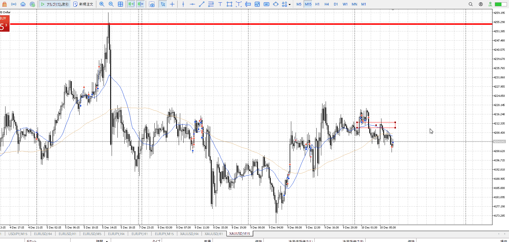

だから売らないが正解だったんじゃないかな。

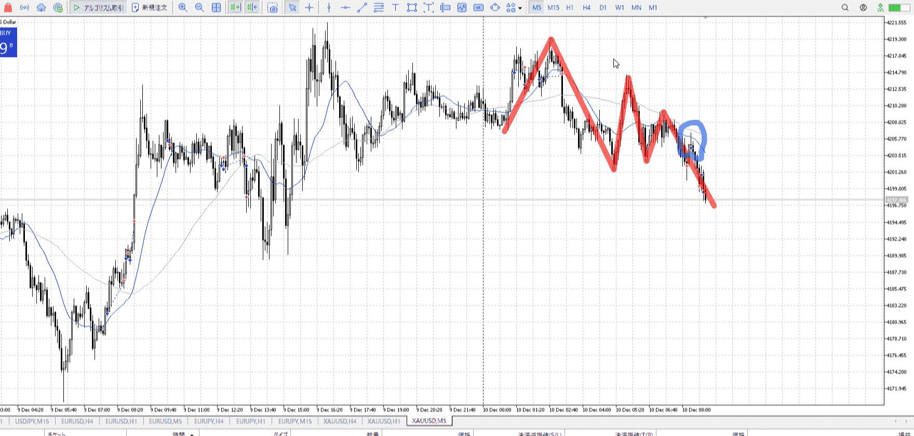

線引くとこう。売るのは売る。

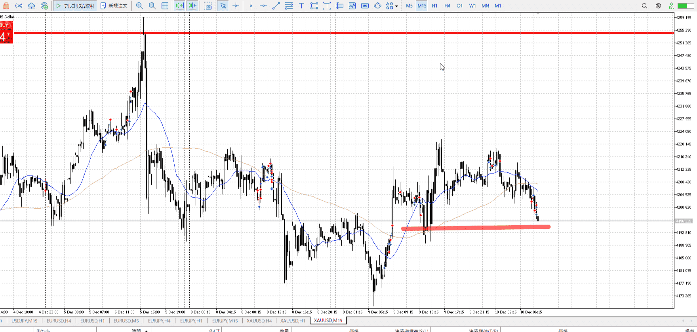

15mが下向き始めて、5mのちょっと上向けを売りたい。
となるとベストはやっぱりこの青丸点。そこから赤線まで売り。

ひきつけが足りない。思い切り抜くには証拠が足りない。
しっかりひきつけて売ればいけた。

というか、証拠が足りない->証拠出すまでしない。
具体的には上向きをミスったりとか、そもそも5m上昇から売りたかったとか、状況の把握が足りてない。
なんか分かりにくいなと思ったら、一度止めて状況把握。


レンジは上下抜きを前提に
中からは足を下げて


[シナリオ](../FX/シナリオ.md)

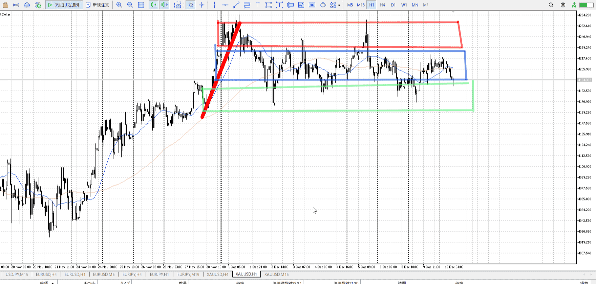

[[トレーディング・レンジ]]

---

- 1
- 2
- 3
現状把握、利確予想まで落ち耐え

---

```meta-bind-button
style: default
label: 明日分
actions:
  - type: "insertIntoNote"
    line: selfEnd+1
    value: "Temp/defFXEnvAnalysis.md"
    templater: true
  - type: "replaceSelf"
    replacement: ""
```
