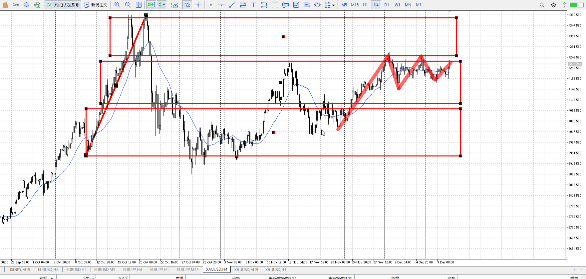
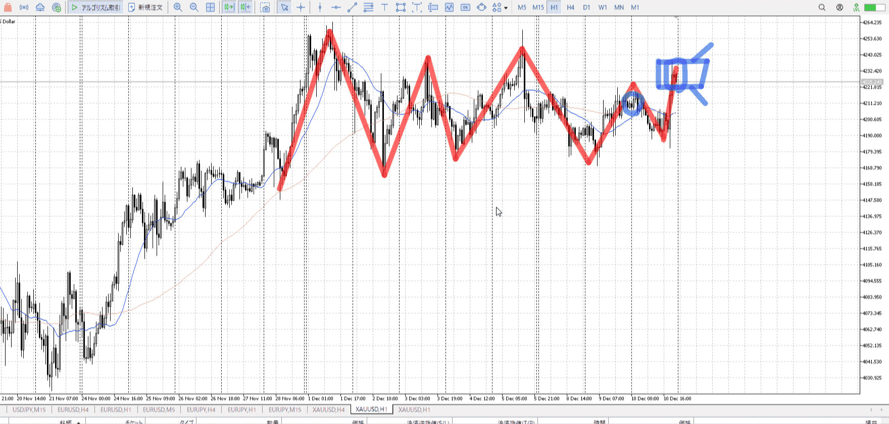
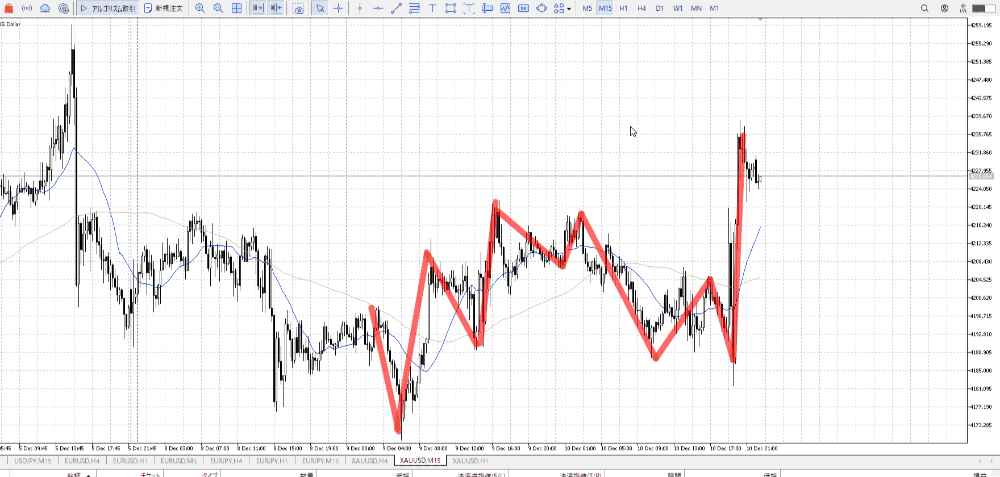
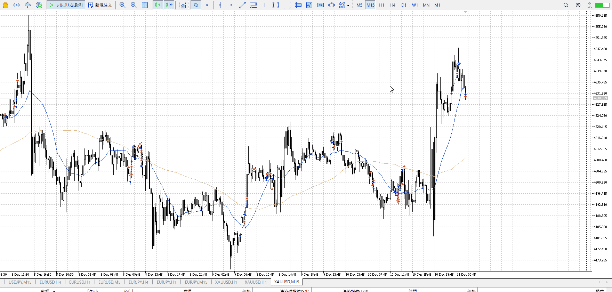

> [!note]
>- +1万 事前認識 **開始5分**

- [x] [my](obsidian://open?vault=Teino&file=FX/my)(見ないと増える)
- [x] 指標
    - 差し込まれる可能性有り、毎日

4h

＜ここに目線画像＞

- [x] トレーディングレンジ
    - c

方向：u

1h

＜ここに目線画像＞

方向：u

15m

＜ここに目線画像＞

方向：u

全方向：uuRu

- [x] 使用足全ての目線確認


＜ここにシナリオ画像＞

b:1hネック
s:1hレンジ天井

上昇終了

- [x] 1hシナリオ
- [x] ぶつかり
- [x] 日出日入、週出週入


目線・シナリオ・強弱・調整・横幅・PA後・平均線方向・波・**ひきつけ**
uuRu。昨日の上昇から買いたい。
1hに方向感があるので、15m追いつき待ちレンジ5mPAの基本。
横幅的には余裕で取れてるので普通に短期でも買えるか。

> [!check]
> - [ ] +1万 事前認識 **開始5分**
> - [ ] +1万 5枚

OK!
Exchage Start.

---



- 1
    - 良いがアサであるため止まり始めたら早め切り
- 2
- 3
    - 朝であるため早め切り
- 4
    - 直前を無視するな
    - というか買いたい場所で落ちたんだから、前と同じ


---

- 1
- 2
- 3
現状把握、利確予想まで落ち耐え

---

```meta-bind-button
style: default
label: 明日分
actions:
  - type: "insertIntoNote"
    line: selfEnd+1
    value: "Temp/defFXEnvAnalysis.md"
    templater: true
  - type: "replaceSelf"
    replacement: ""
```
