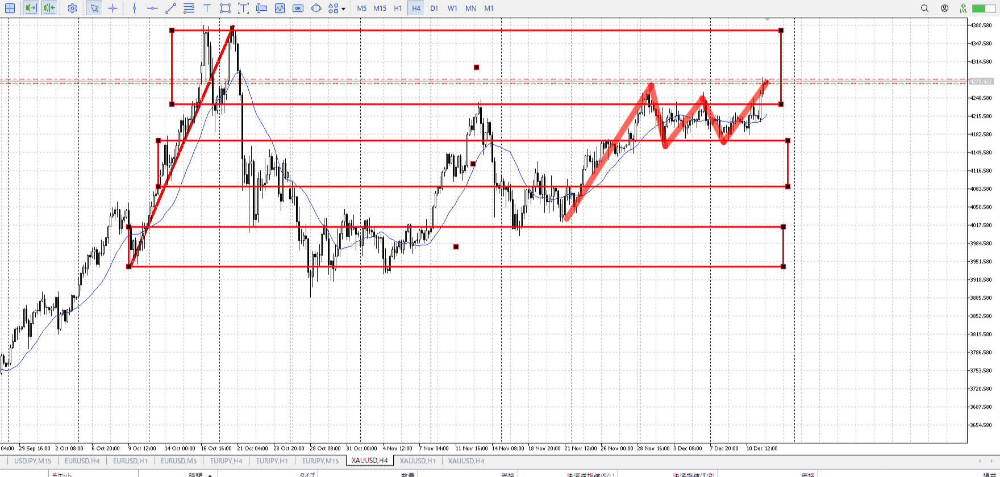
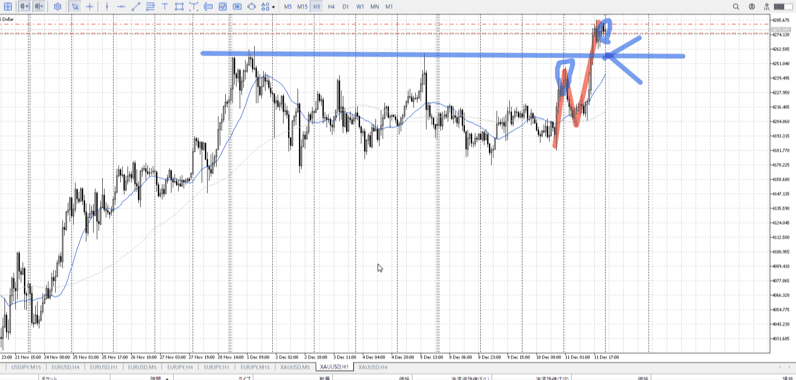
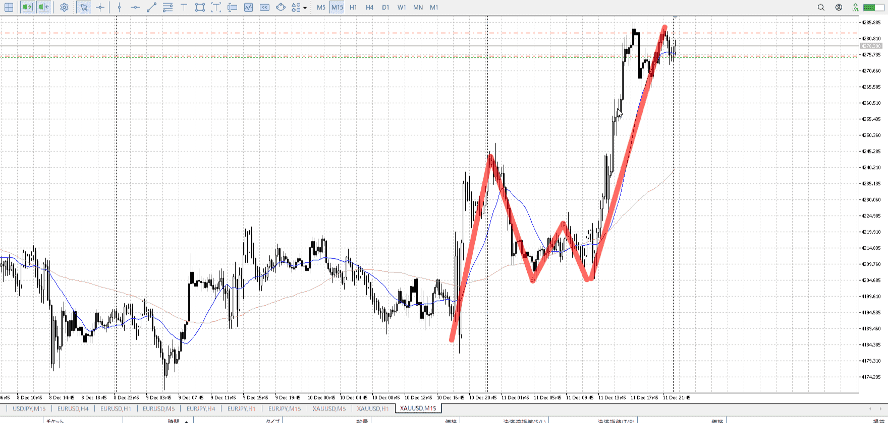
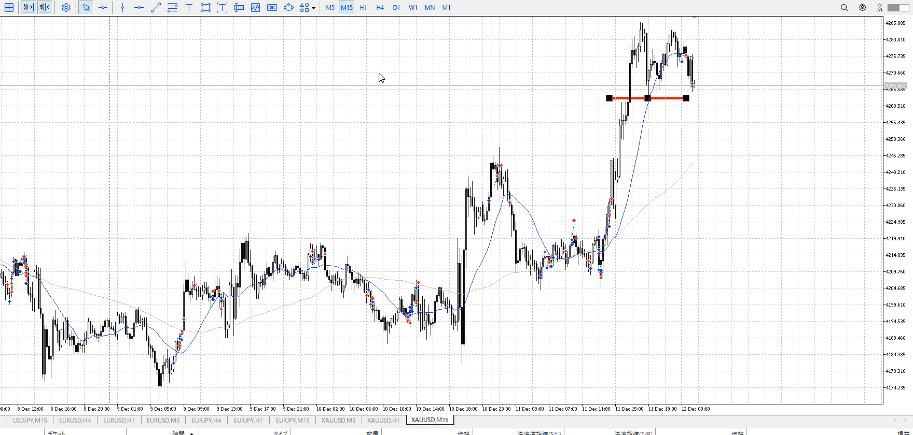

> [!note]
>- +1万 事前認識 **開始5分**

- [x] [my](obsidian://open?vault=Teino&file=FX/my)(見ないと増える)
- [x] 指標
    - 差し込まれる可能性有り、毎日

4h

＜ここに目線画像＞

- [x] トレーディングレンジ
    - u

方向：u

1h

＜ここに目線画像＞

方向：u

15m

＜ここに目線画像＞

方向：u

全方向：uuu

- [x] 使用足全ての目線確認


＜ここにシナリオ画像＞

b:1hレンジ前回天井
s:b抜け

上昇抜け。

- [x] 1hシナリオ
- [x] ぶつかり
- [x] 日出日入、週出週入


目線・シナリオ・強弱・調整・横幅・PA後・平均線方向・波・**ひきつけ**
買う。
15m横5mPAを忘れず。押しで。

> [!check]
> - [ ] +1万 事前認識 **開始5分**
> - [ ] +1万 5枚

OK!
Exchage Start.

---



5mはMだが15mはレンジ。
一旦ここで落ちずに何かしらダブルボトムなどほしい。


赤丸は平均が折れていない
灰丸で示した場所と同じく、これは押し目に数えない

青丸は平均折れ始め
ここで一回目に数える

なので緑丸で入れる
[レンジ内](../FX/エントリー.md#レンジ内)


---

- 1
- 2
- 3
現状把握、利確予想まで落ち耐え

---

```meta-bind-button
style: default
label: 明日分
actions:
  - type: "insertIntoNote"
    line: selfEnd+1
    value: "Temp/defFXEnvAnalysis.md"
    templater: true
  - type: "replaceSelf"
    replacement: ""
```
