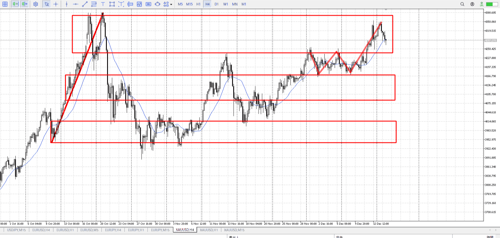
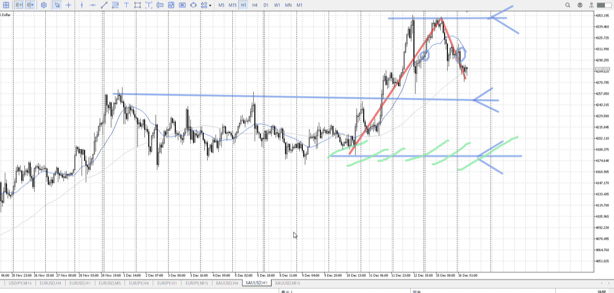
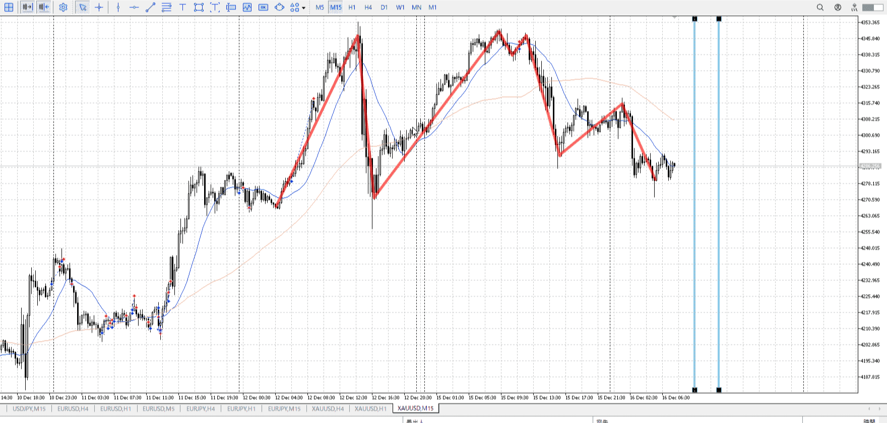
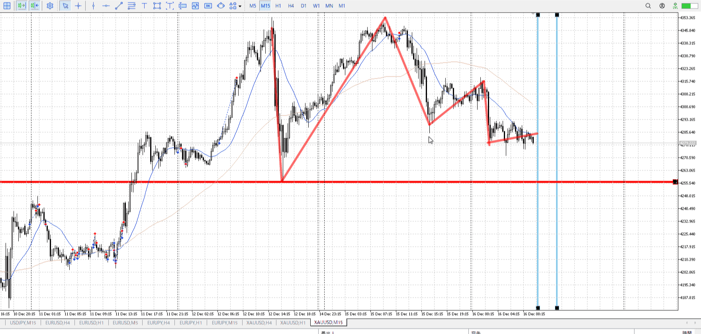
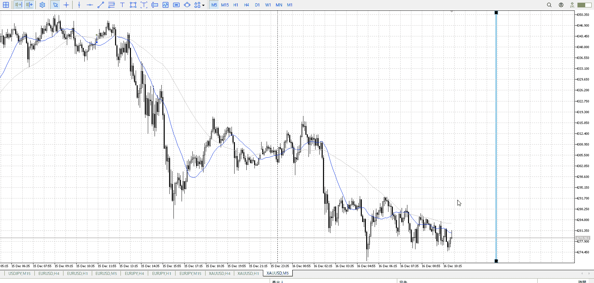
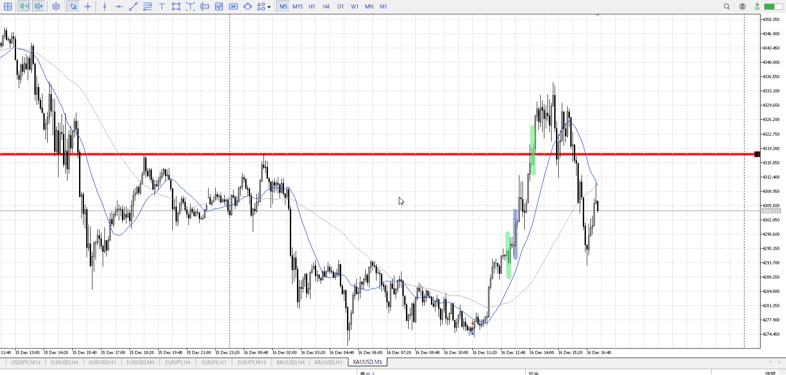
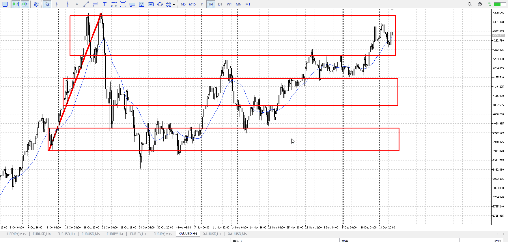
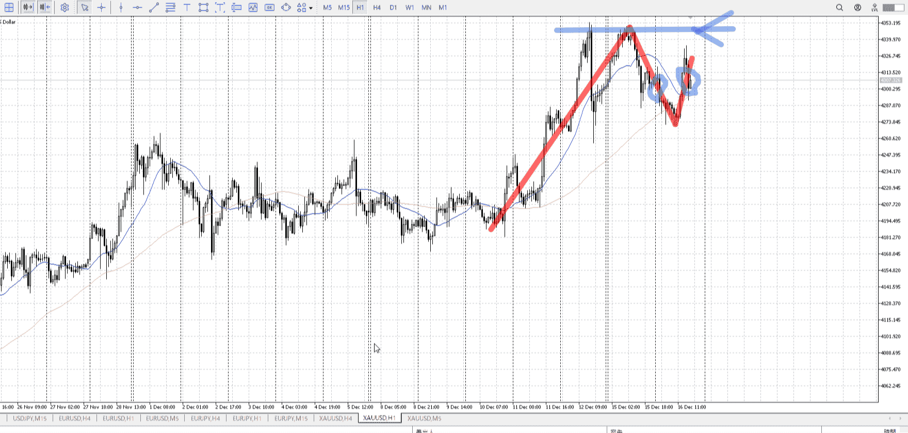
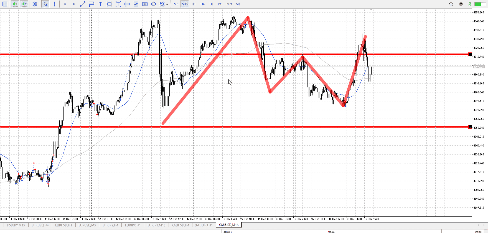

>     [!note]
>- +1万 事前認識 **開始5分**

- [x] [my](obsidian://open?vault=Teino&file=FX/my)(見ないと増える)
- [x] 指標
    - 差し込まれる可能性有り、毎日

22:30　雇用統計

4h

＜ここに目線画像＞

- [ ] トレーディングレンジ
    - u

方向：u

1h

＜ここに目線画像＞

方向：u

15m

＜ここに目線画像＞

方向：u

全方向：uuu

- [x] 使用足全ての目線確認


＜ここにシナリオ画像＞

b:1hレンジ上
s:1h高値

同値。

- [x] 1hシナリオ
- [x] ぶつかり
- [x] 日出日入、週出週入


目線・シナリオ・強弱・調整・横幅・PA後・平均線方向・波・**ひきつけ**
uuu。落ちた。
となると下から買おうがセオリー。この後15mでPA出たら押し目買い。
1hAも下向きなのでちょうどいい。15mAが上を向き始めたらそこで。

ただし雇用統計に注意。
今大きくは抜けないはず。

> [!check]
> - [x] +1万 事前認識 **開始5分**
> - [x] +1万 5枚

OK!
Exchage Start.

---


T
前回に対して鋭く上がらない。
切り下げも起きている。下がりの予兆。

また指標もあるので、ここでぐっと上がったり下がったりはしにくい
すると今できるのはレンジ下からの買いということに。



引きつけでも確定でいい。


今回狙うのは小さい中の話。指標前だし。
すると瞬発力。上髭が見えたらもう無理、切る。
[エントリー](../FX/エントリー.md)

---


青が指標。緑が入れるかもな場所。
一本目は有力だったが指標直前で見送り。二本目は抜きしかない。キツイ。


---


> [!note]
>- +1万 事前認識 **開始5分**

- [x] [my](obsidian://open?vault=Teino&file=FX/my)(見ないと増える)
- [x] 指標
    - 差し込まれる可能性有り、毎日

4h

＜ここに目線画像＞

- [x] トレーディングレンジ
    - u

方向：u

1h

＜ここに目線画像＞

方向：u

15m

＜ここに目線画像＞

方向：u

全方向：uuu

- [x] 使用足全ての目線確認


＜ここにシナリオ画像＞

b:1h安値
s:1h高値

上昇から下降同値

- [x] 1hシナリオ
- [x] ぶつかり
- [x] 日出日入、週出週入


目線・シナリオ・強弱・調整・横幅・PA後・平均線方向・波・**ひきつけ**
下降はしてるが何も割ってない。むしろ上を抜いたのでひきつけ買い。
変わらず下待ち。

> [!check]
> - [ ] +1万 事前認識 **開始5分**
> - [ ] +1万 5枚

```meta-bind-button
style: default
label: Send
actions:
  - type: "replaceSelf"
    replacement: "OK!\nExchage Start.\n\n---"
```


---

- 1
- 2
- 3
