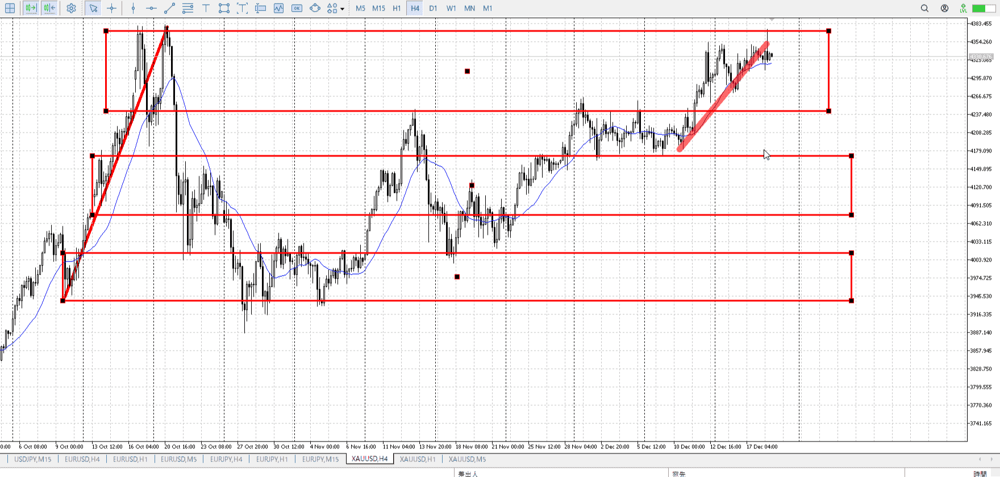
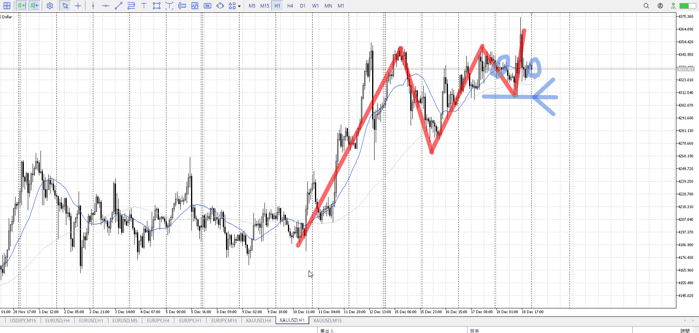
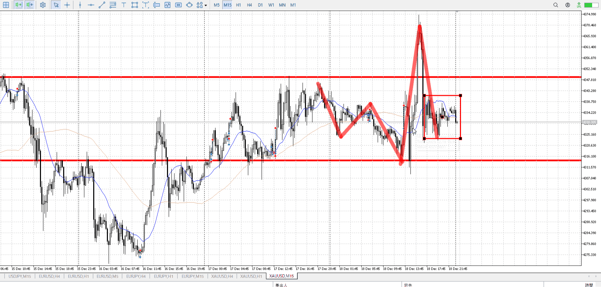
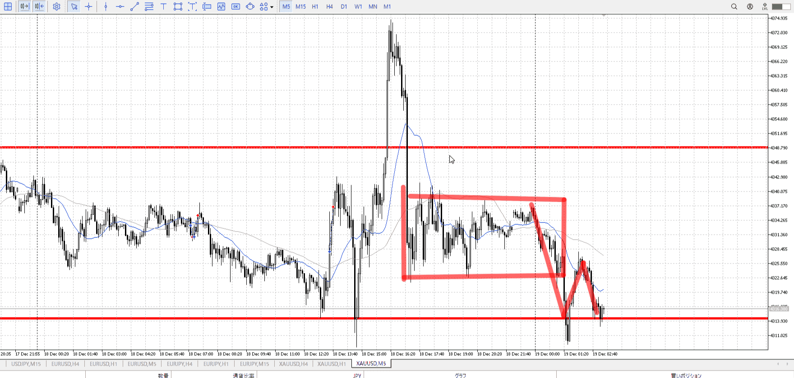
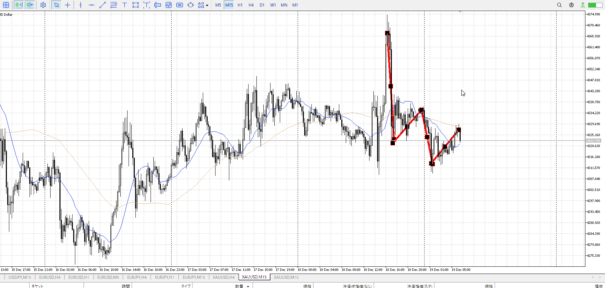
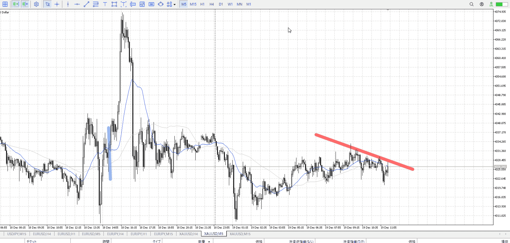

> [!note]
>- +1万 事前認識 **開始5分**

- [ ] [my](obsidian://open?vault=Teino&file=FX/my)(見ないと増える)
- [ ] 指標
    - 差し込まれる可能性有り、毎日

4h

＜ここに目線画像＞

- [x] トレーディングレンジ
    - u

方向：u

1h

＜ここに目線画像＞

方向：u

15m

＜ここに目線画像＞

方向：u

全方向：uuu

- [x] 使用足全ての目線確認


＜ここにシナリオ画像＞

1h安値地点を抜くか押すか

b:1h安値
s:4h高値

上昇したが4h高値で折れて同値

- [x] 1hシナリオ
- [x] ぶつかり
- [x] 日出日入、週出週入


目線・シナリオ・強弱・調整・横幅・PA後・平均線方向・波・**ひきつけ**
uuu。上を更新したため、1h安値を抜くと一気に売りになる状態に。
横幅は十分。まだ売る場面ではないが、売りに注意。
4h売りで下がったという明確な理由がある。切り上げて終わってるとはいえ、PA出るまでしっかり待つ。

> [!check]
> - [x] +1万 事前認識 **開始5分**
> - [x] +1万 5枚

OK!
Exchage Start.

---



一度下抜けてる　平均は追いついてない
実際売る場合って平均云々より早いはず。

ただ、買われた理由が1h安値と明確。
それならいきなり売れるかというとやっぱ難しいのでは。

前回この高さにいた時の上昇は鋭い。なのでレンジ下でもたつくのは不審。
それが理解できてればできたか。

**前回の高さの動きを確認**

1hAは下向き。15mは追いついてない。
本格的には15mが追いついてから。

T
4h、それ以上で落ちてる
その後の最初の売り場、持っておきたい

日の「大きく動いた」はトレンドがあるかどうか
その後にレンジが出るから動かなくなる、今回はレンジに引き戻ってるだけなのでこのままトレンドが再度出てもおかしくない



1hAしか見てなかったが、ローソク的に15m目線下。
それを否定する売り場抜きまで買いは不可



T
4h落ちてきてダラダラ上がりなので売れる
さらに切り下げを足して売り

ちなみに青線で買うことはできるが指標後で難しい
下から買われた（ここは無理）後、それを根拠に上まで


何を抜いていったのかがあいまいになりがち
その抜いた場所までしっかり持つことを意識していれば、逸ることはなくなるはず
[注意](../FX/エントリー.md#注意)


---

- 1
- 2
- 3
現状把握、利確予想まで落ち耐え

---

```meta-bind-button
style: default
label: 明日分
actions:
  - type: "insertIntoNote"
    line: selfEnd+1
    value: "Temp/defFXEnvAnalysis.md"
    templater: true
  - type: "replaceSelf"
    replacement: ""
```
