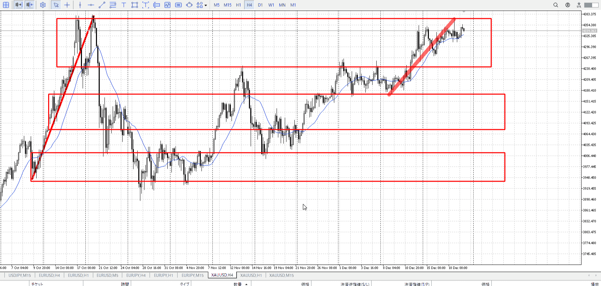
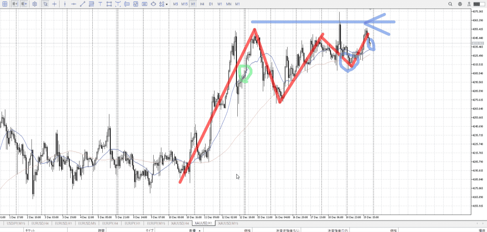
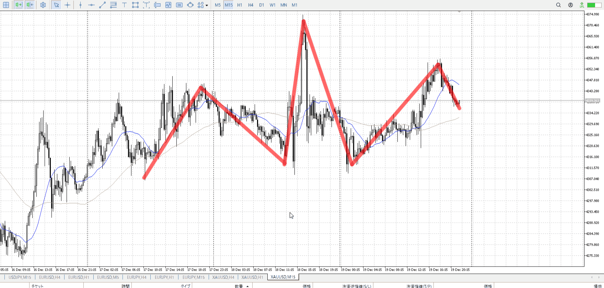

> [!note]
>- +1万 事前認識 **開始5分**

- [x] [my](obsidian://open?vault=Teino&file=FX/my)(見ないと増える)
- [x] 指標
    - 差し込まれる可能性有り、毎日

4h

＜ここに目線画像＞

- [x] トレーディングレンジ
    - u

方向：u

1h

＜ここに目線画像＞

方向：uR

15m

＜ここに目線画像＞

方向：u

全方向：uuRu

- [x] 使用足全ての目線確認


＜ここにシナリオ画像＞

4h上に抜くかどうか

b:1h安値
s:4h高値

上昇
その前に落ちたが、まだまだ

- [x] 1hシナリオ
- [x] ぶつかり
- [x] 日出日入、週出週入


目線・シナリオ・強弱・調整・横幅・PA後・平均線方向・波・**ひきつけ**
uuRu
上昇、途中折れてるようだがむしろ売り場抜きから上昇残した状態で買い場に下りて来てる
そして15mだと買い場の一つに来ている、月曜開幕で上がるまである

週としてはあまり動いていない、上昇はしてるが4h高値がつらめ
二つ入ってるとかでない限り4h高値以上は狙わない

どの売り場を抜いたかに注意

> [!check]
> - [x] +1万 事前認識 **開始5分**
> - [x] +1万 5枚

```meta-bind-button
style: default
label: Send
actions:
  - type: "replaceSelf"
    replacement: "OK!\nExchage Start.\n\n---"
```


---

- 1
- 2
- 3
現状把握、利確予想まで落ち耐え

---

```meta-bind-button
style: default
label: 明日分
actions:
  - type: "insertIntoNote"
    line: selfEnd+1
    value: "Temp/defFXEnvAnalysis.md"
    templater: true
  - type: "replaceSelf"
    replacement: ""
```
