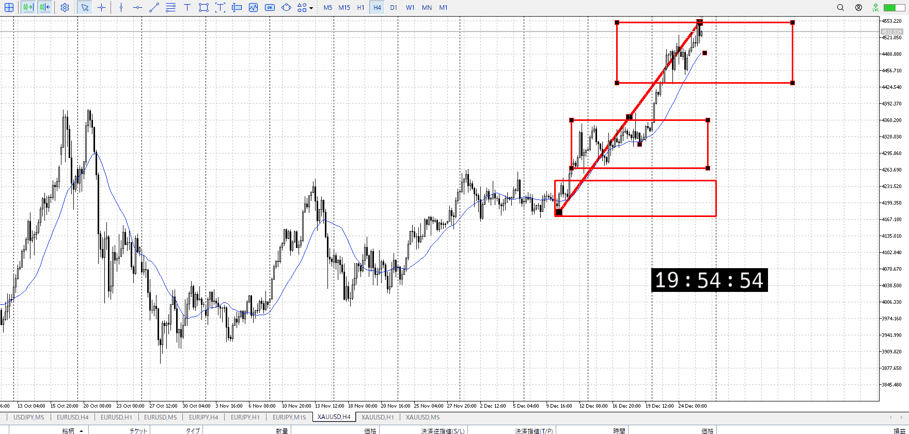
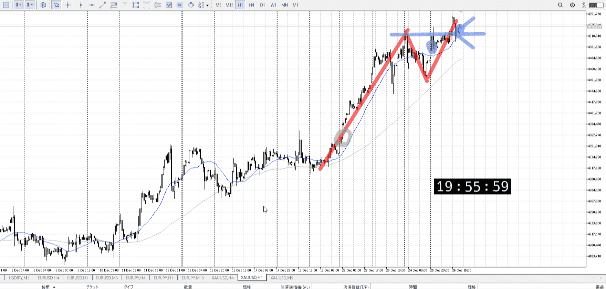
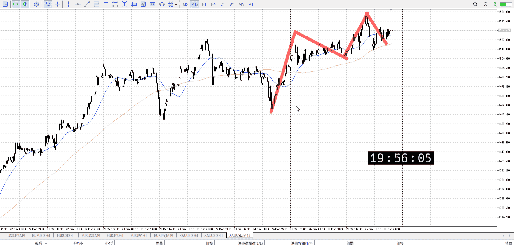

> [!note]
>- +1万 事前認識 **開始5分**

- [x] [my](obsidian://open?vault=Teino&file=FX/my)(見ないと増える)
- [ ] 指標
    - 差し込まれる可能性有り、毎日

火曜28:00FOMC要旨

4h

＜ここに目線画像＞

- [x] トレーディングレンジ
    - u

方向：u

1h

＜ここに目線画像＞

方向：u

15m

＜ここに目線画像＞

方向：u

全方向：uuu

- [x] 使用足全ての目線確認


＜ここにシナリオ画像＞

b:1h高値
s:1h前回上昇

- [x] 1hシナリオ
- [x] ぶつかり
- [x] 日出日入、週出週入


目線・シナリオ・強弱・調整・横幅・PA後・平均線方向・波・**ひきつけ**
uuu
上の抜けが心もとないが、一応トレンド
なら前回の高値近くで伸びるか落ちるかを見るべき

こういう心もとなさは上の足で見ると髭になりがちだから
4hを見ると前回が髭、今回が実線で抜けてるのでそこそこ信頼できる
やはり同じく、前回高値近くで伸びるか落ちるか


> [!check]
> - [x] +1万 事前認識 **開始5分**
> - [x] +1万 5枚

OK!
Exchage Start.

---

先週の反省点
最初以外通して上限の上昇
引きつけから買う意識が不十分だった

- 月曜
    - 抜き後押し
    - 売り場売り後、15m確定
    - 底までひきつけから上まで
        - もしくは損切位置に引きつけて抜け期待買い
- 火曜
    - 横幅証拠待ち
- 金曜
    - ひきつけと損切分待ち
    - 朝の利確
    - 実験は不必要

横幅、出た底へ引きつけ、もしくは一段下のつまり損切位置から抜け買い。
というわけで前回の金の上昇が出始めたところをテスト。

[my2025-12-27](<../FX/My_Test/my2025-12-27.md>)


---

- 1
- 2
- 3
現状把握、利確予想まで落ち耐え

---

```meta-bind-button
style: default
label: 明日分
actions:
  - type: "insertIntoNote"
    line: selfEnd+1
    value: "Temp/defFXEnvAnalysis.md"
    templater: true
  - type: "replaceSelf"
    replacement: ""
```
