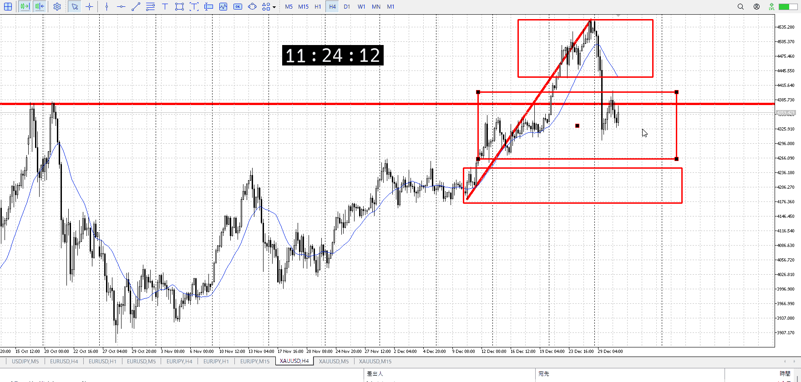
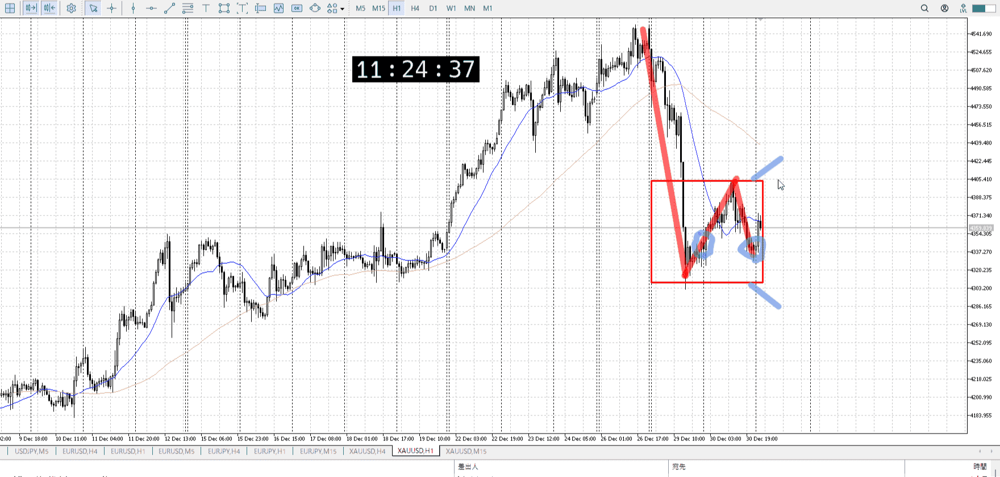
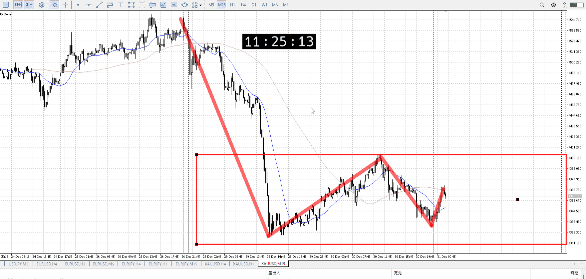
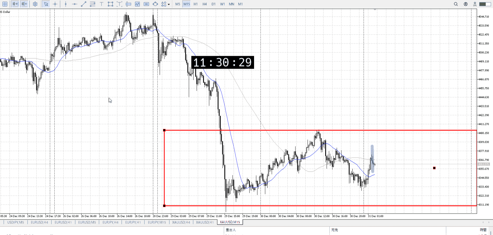
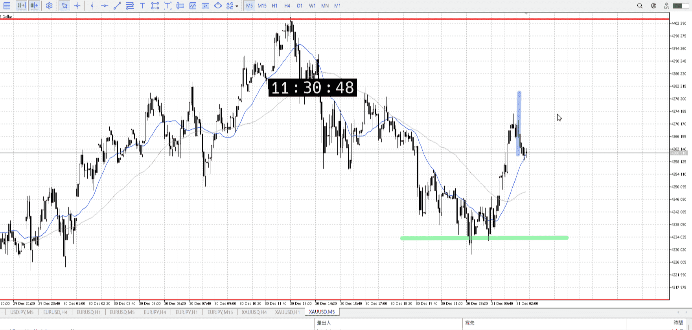

> [!note]
>- +1万 事前認識 **開始5分**

- [x] [my](obsidian://open?vault=Teino&file=FX/my)(見ないと増える)
- [x] 指標
    - 差し込まれる可能性有り、毎日

4h

＜ここに目線画像＞

- [x] トレーディングレンジ
    - c

方向：u

1h

＜ここに目線画像＞

方向：dR

15m

＜ここに目線画像＞

方向：dR

全方向：udRdR

- [x] 使用足全ての目線確認


＜ここにシナリオ画像＞

b:1h安値
s:1hネック

底を作って上昇、ネックで落ち

- [x] 1hシナリオ
- [x] ぶつかり
- [x] 日出日入、週出週入


目線・シナリオ・強弱・調整・横幅・PA後・平均線方向・波・**ひきつけ**
udRdR
レンジを作成、上から売りたいところ
早めに戻り出すなら完全な上でなく途中のレンジから売ることもできる
それも15ｍに従いたいとこだが


> [!check]
> - [x] +1万 事前認識 **開始5分**
> - [x] +1万 5枚

OK!
Exchage Start.

---





青線で売るのは1hからは分からない、15mの話
なので5mレンジを根拠に、上髭と15m一本待ってというのはできなくはない

もちろん利確は15mでわかる、緑横程度
完全に下に行った時の七割ともなるので結構合理

いや、でも入る場所やっぱ早くないか。
これをするならレンジの上まで、というかレンジというほどでもないような。
5mの上昇の上まで待っても良くないか。出ないと損切が大きい。
けど10000程度。

---

- 1
- 2
- 3
現状把握、利確予想まで落ち耐え

---

[my2025-12-31](<../FX/My_Test/my2025-12-31.md>)

---

```meta-bind-button
style: default
label: 明日分
actions:
  - type: "insertIntoNote"
    line: selfEnd+1
    value: "Temp/defFXEnvAnalysis.md"
    templater: true
  - type: "replaceSelf"
    replacement: ""
```
