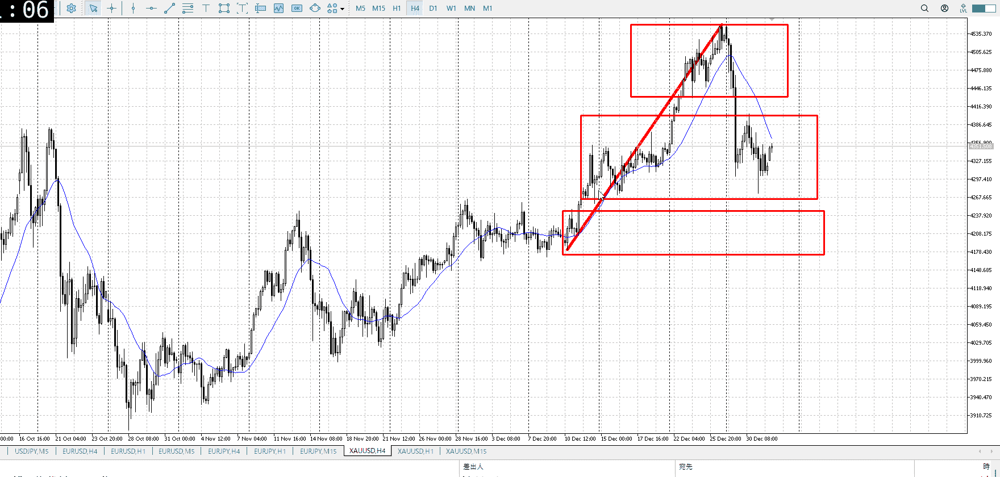
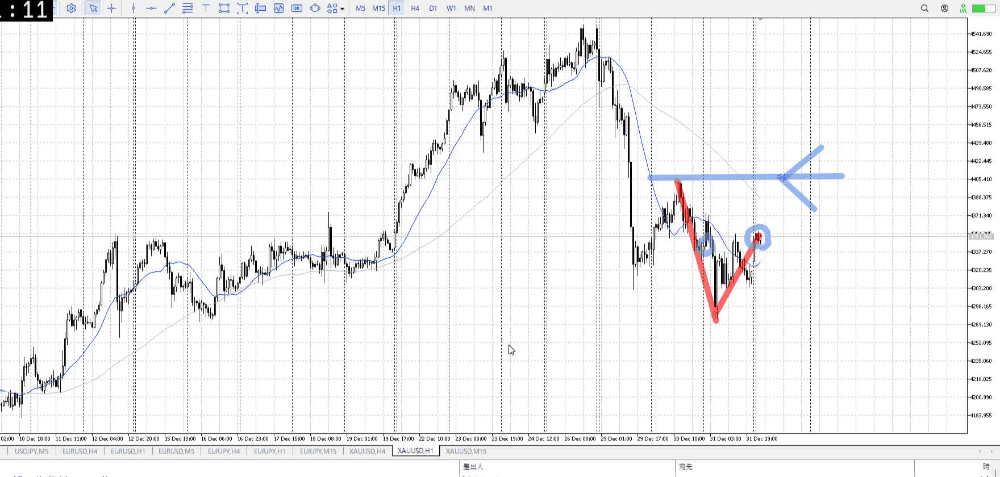
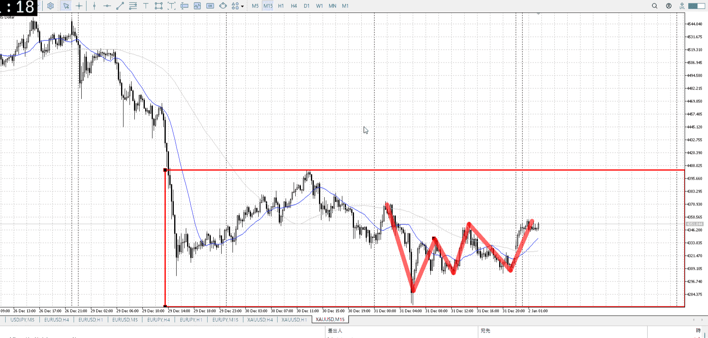

> [!note]
>- +1万 事前認識 **開始5分**

- [x] [my](obsidian://open?vault=Teino&file=FX/my)(見ないと増える)
- [x] 指標
    - 差し込まれる可能性有り、毎日

4h

＜ここに目線画像＞

- [x] トレーディングレンジ
    - c

方向：u

1h

＜ここに目線画像＞

方向：d

15m

＜ここに目線画像＞

方向：d

全方向：udd

- [x] 使用足全ての目線確認


＜ここにシナリオ画像＞

b:1h安値（1h前回レンジ下）
s:1h高値

下を破ったが戻ってきた、前回安値も抜け

- [x] 1hシナリオ
- [x] ぶつかり
- [x] 日出日入、週出週入


目線・シナリオ・強弱・調整・横幅・PA後・平均線方向・波・**ひきつけ**
udd
売りたいが前回分が抜きから返ってきてる形、これを否定されない限り売れない

ちな返ってきてるとこは4hの買い場、そこに大晦日で突っ込んだから当然
4h買いまでで売れる分はいなくなったので、ここから先は売るなら十分な引きつけが必要

もし1hの上を抜いた場合は、買えるように想定しておく

> [!check]
> - [x] +1万 事前認識 **開始5分**
> - [x] +1万 5枚

OK!
Exchage Start.

---

[my2026-01-02](../FX/My_Test/my2026-01-02.md)

---

- 1
- 2
- 3
現状把握、利確予想まで落ち耐え

---

```meta-bind-button
style: default
label: 明日分
actions:
  - type: "insertIntoNote"
    line: selfEnd+1
    value: "Temp/defFXEnvAnalysis.md"
    templater: true
  - type: "replaceSelf"
    replacement: ""
```
