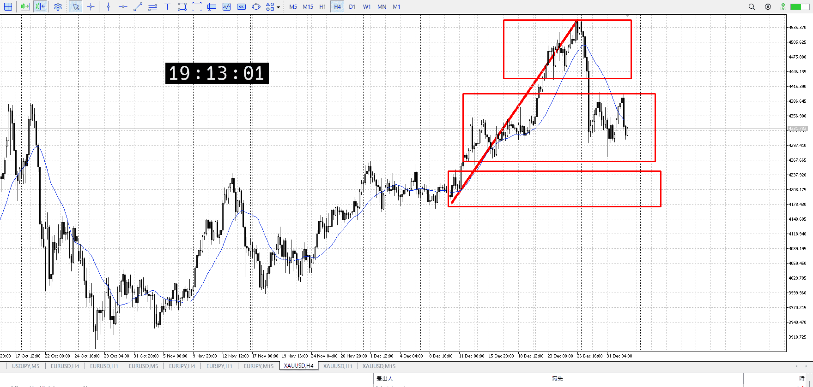
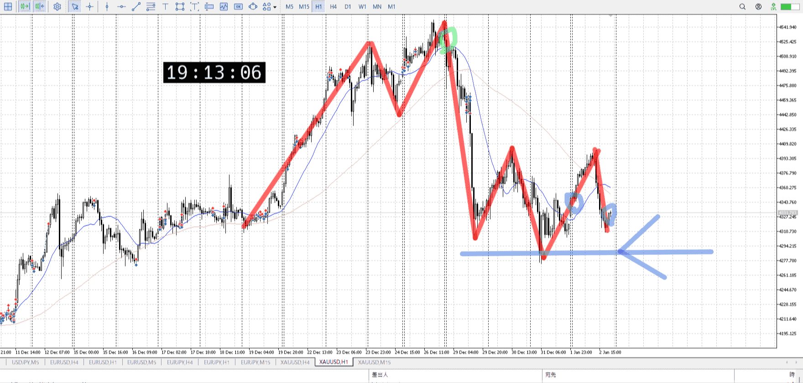
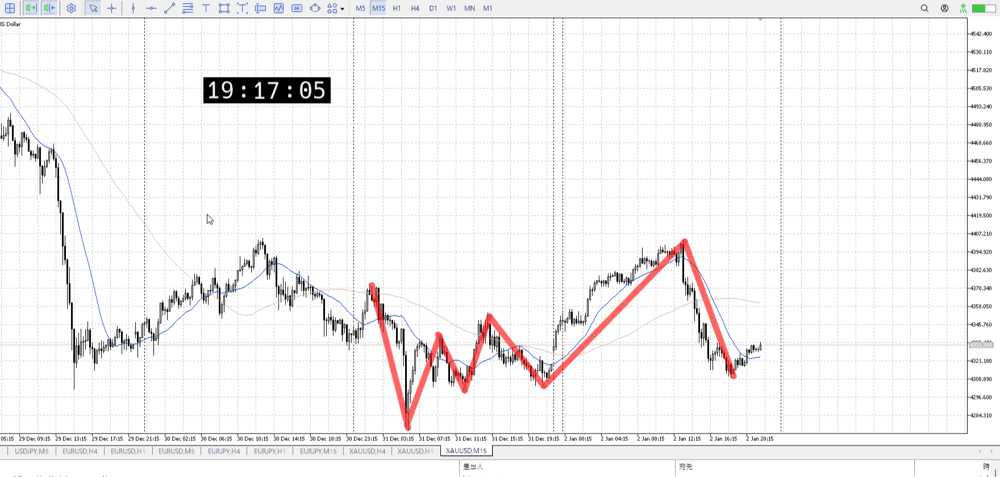

> [!note]
>- +1万 事前認識 **開始5分**

- [x] [my](obsidian://open?vault=Teino&file=FX/my)(見ないと増える)
- [x] 指標
    - 差し込まれる可能性有り、毎日

金曜22:30雇用統計

4h

＜ここに目線画像＞

- [x] トレーディングレンジ
    - c

方向：u

1h

＜ここに目線画像＞

方向：d

15m

＜ここに目線画像＞

方向：u

全方向：udu

- [x] 使用足全ての目線確認


＜ここにシナリオ画像＞

b:1h安値
s:1h高値

日は少し下へ。
週は落ちていった。

- [x] 1hシナリオ
- [x] ぶつかり
- [x] 日出日入、週出週入


目線・シナリオ・強弱・調整
横幅・PA後・平均線方向・波
**ひきつけ**・軸時間
udu
売りたい、15mは買いだが更新後二倍くらいで降下
かなり売りより

1hレンジの底にいるのでそれは売りにくい
抜きを売ることはできるにはできるはずだが。その場合は1h横幅程度を待ち、しっかり損切迄引きつけ。
1hレンジの上から売る方が普通であることには留意。


OK!
Exchage Start.

---


---

- 1
- 2
- 3
現状把握、利確予想まで落ち耐え

---

```meta-bind-button
style: default
label: 明日分
actions:
  - type: "insertIntoNote"
    line: selfEnd+1
    value: "Temp/defFXEnvAnalysis.md"
    templater: true
  - type: "replaceSelf"
    replacement: ""
```
