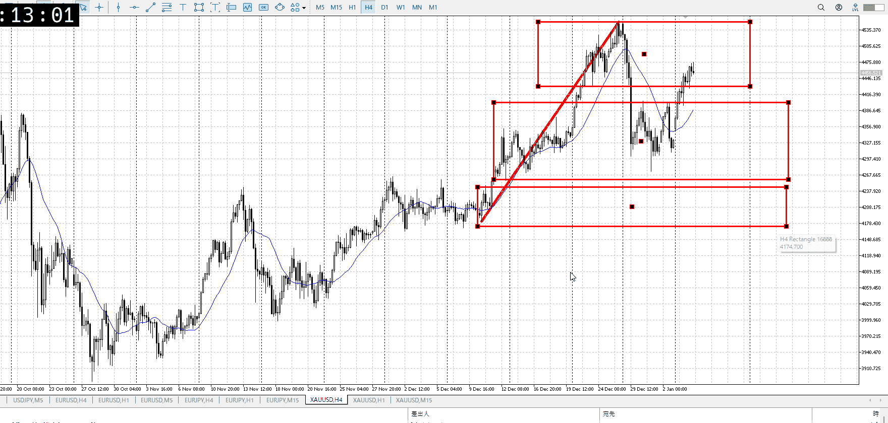
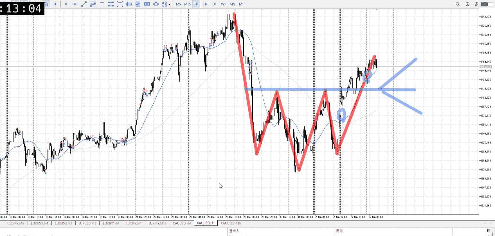
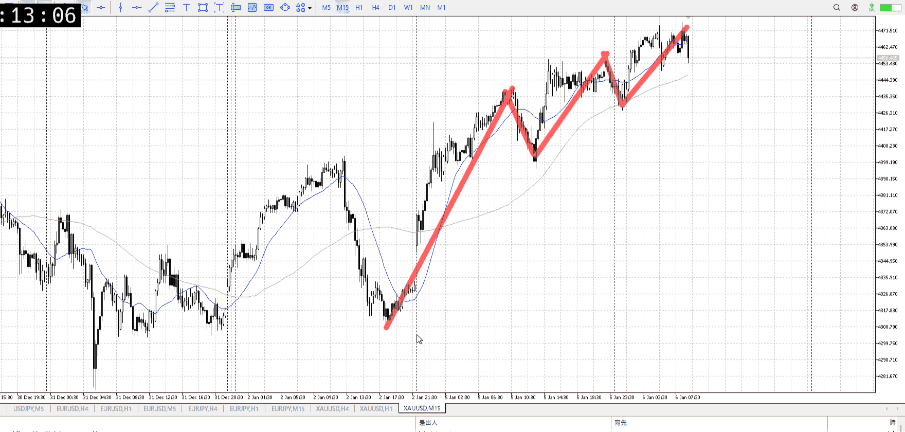

> [!note]
>- +1万 事前認識 **開始5分**

- [x] [my](obsidian://open?vault=Teino&file=FX/my)(見ないと増える)
- [x] 指標
    - 差し込まれる可能性有り、毎日

4h

＜ここに目線画像＞

- [x] トレーディングレンジ
    - u

方向：u

1h

＜ここに目線画像＞

方向：u

15m

＜ここに目線画像＞

方向：u

全方向：uuu

- [x] 使用足全ての目線確認


＜ここにシナリオ画像＞

1hレンジ上はまだ結果が出てない

b:1h安値
s:前回1hレンジ下？

- [x] 1hシナリオ
- [x] ぶつかり
- [x] 日出日入、週出週入

1hレンジ抜き上昇、1hレンジ下止まり？

目線・シナリオ・強弱・調整
横幅・PA後・平均線方向・波
**ひきつけ**・軸時間
uuu。1hの押し目を買いたいとこ。
昨日レンジを抜いたこともあり今日は調整を待つのが基本。そうでなくとも前回レンジ下なのでその様子も見ておきたい。
その後は1hレンジ上で買いたい。

OK!
Exchage Start.

---


---

- 1
- 2
- 3
現状把握、利確予想まで落ち耐え

---

```meta-bind-button
style: default
label: 明日分
actions:
  - type: "insertIntoNote"
    line: selfEnd+1
    value: "Temp/defFXEnvAnalysis.md"
    templater: true
  - type: "replaceSelf"
    replacement: ""
```
