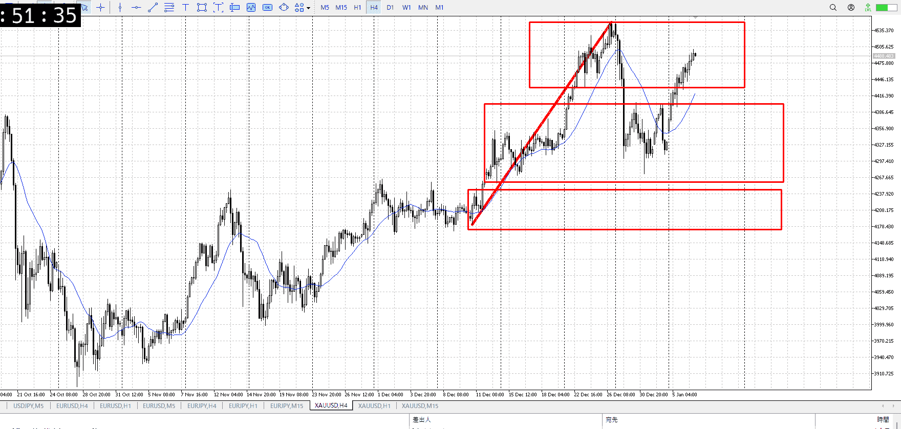
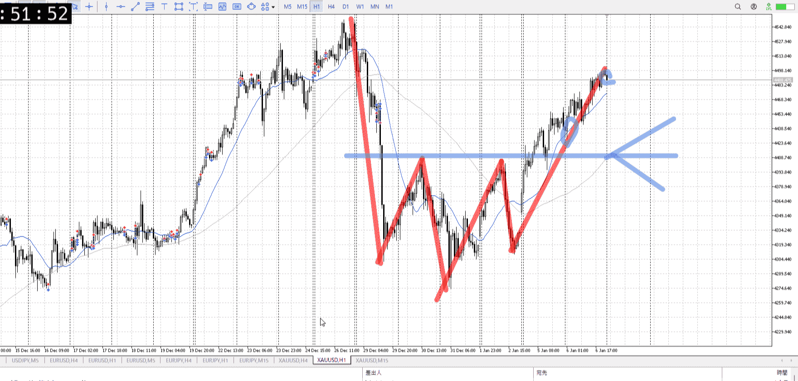
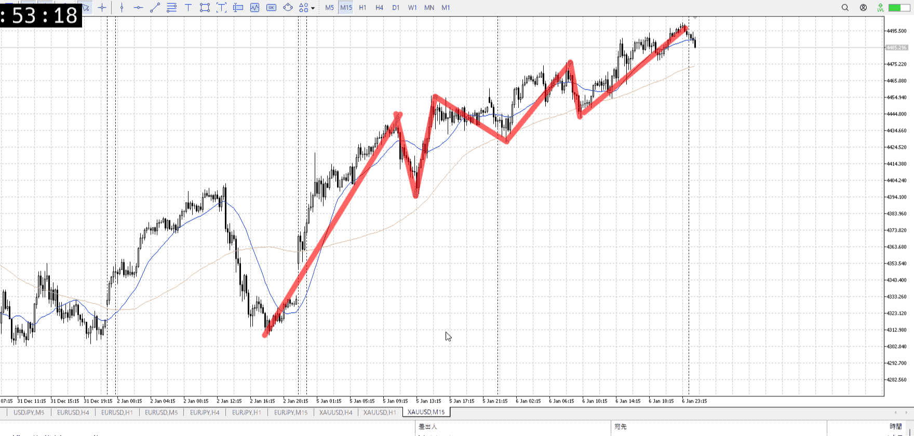
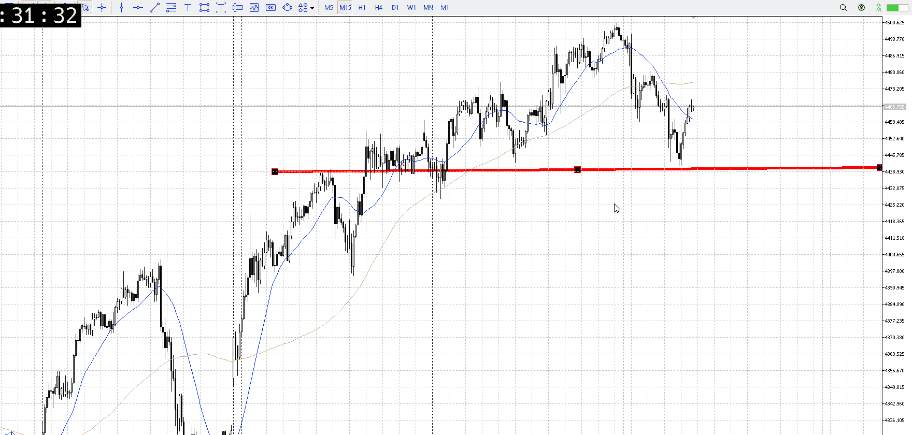

> [!note]
>- +1万 事前認識 **開始5分**

- [x] [my](obsidian://open?vault=Teino&file=FX/my)(見ないと増える)
- [x] 指標
    - 差し込まれる可能性有り、毎日

4h

＜ここに目線画像＞

- [x] トレーディングレンジ
    - u

方向：u

1h

＜ここに目線画像＞

方向：u

15m

＜ここに目線画像＞

方向：u

全方向：uuu

- [x] 使用足全ての目線確認


＜ここにシナリオ画像＞

b:1h安値
s:1hレンジ下？

上昇、直近のレンジというか下降始めた位置まで

- [x] 1hシナリオ
- [x] ぶつかり
- [x] 日出日入、週出週入


目線・シナリオ・強弱・調整
横幅・PA後・平均線方向・波
**ひきつけ**・軸時間
uuu
1hレンジに引きつけたいが、底まで落ちる前に下降の根に辿り着いた
むしろ売りたい場面に成っちゃってるので、買えるとこまで待ち


OK!
Exchage Start.

---



買える一つの根拠として、15m安値
そこで下髭が出てもう一度落ちるということをやってる、ここが買い

次にあるとしたら
高値から売られた後、レンジになる
そのあと底から買い

高値抜け
押しで前回高値から買い

早め折れ
上昇力を残してるとして、底から買い


損切を上げない

下に少しはみ出てから元に戻る買い
[上から買う](../FX/エントリー.md#上から買う)

15m一本二本ではなく、全体の流れを見る


---

- 1
- 2
- 3
現状把握、利確予想まで落ち耐え

---

```meta-bind-button
style: default
label: 明日分
actions:
  - type: "insertIntoNote"
    line: selfEnd+1
    value: "Temp/defFXEnvAnalysis.md"
    templater: true
  - type: "replaceSelf"
    replacement: ""
```
