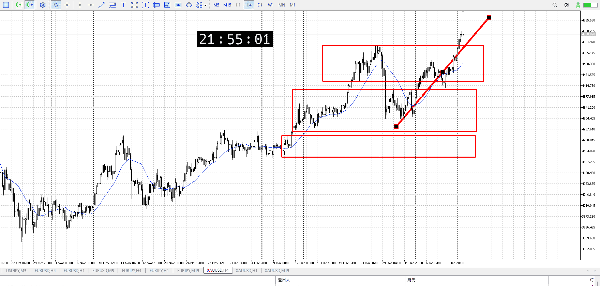
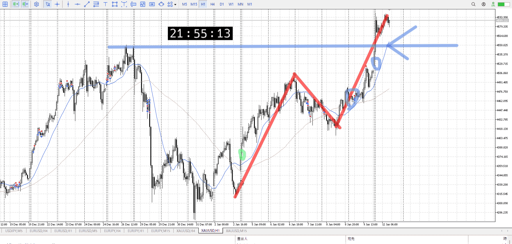
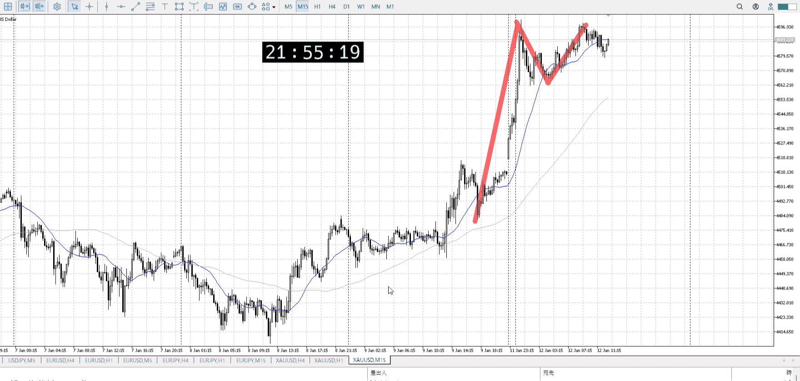
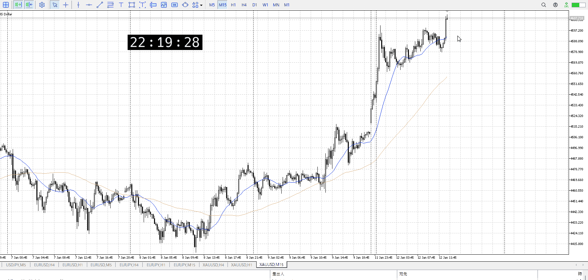
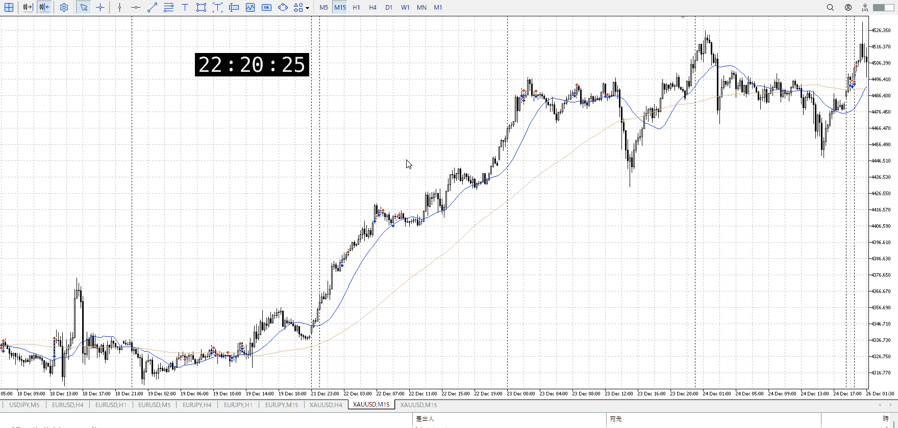
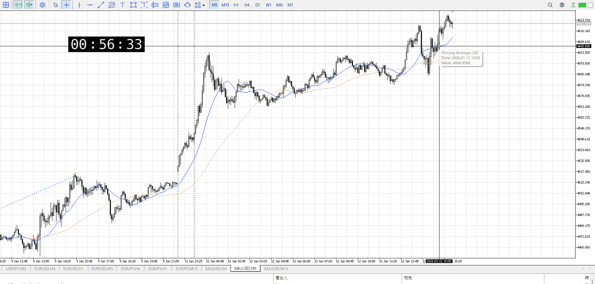

> [!note]
>- +1万 事前認識 **開始5分**

- [x] [my](obsidian://open?vault=Teino&file=FX/my)(見ないと増える)
- [x] 指標
    - 差し込まれる可能性有り、毎日

火曜10時半CPI

4h

＜ここに目線画像＞

- [x] トレーディングレンジ
    - u

方向：u

1h

＜ここに目線画像＞

方向：u

15m

＜ここに目線画像＞

方向：u

全方向：uuu

- [x] 使用足全ての目線確認


＜ここにシナリオ画像＞

b:1h高値？
s:不明

上昇

- [x] 1hシナリオ
- [x] ぶつかり
- [x] 日出日入、週出週入


目線・シナリオ・強弱・調整
横幅・PA後・平均線方向・波
**ひきつけ**・軸時間
uuu
買いしかない
1hAが追いついてない

買うなら短期で、15mで狙える範囲


OK!
Exchage Start.

---



だからこれは……
難しいか？



以前伸びた時はこう
それと比べると伸びるのが早く、15mの一本が出てからでも間に合わない
前の15mから買ってて持ち続けてれば、という感じ

ただ上昇を続けてるところで、15mAの上まで来て買いを……
やっぱ厳しいな。ここから押し待ったほうがいいや。

押し待つにしても7万動いてるので、さらに動くかは分からない
今日が動きすぎなので明日に回すのも難しい
このまま明日で調整居て1hA及び1h天井押しに来るのがセオリー



この位置が出来るんならありではあるが。
1hが下髭。
ただ早すぎる。1hを注意すれば出来なくはなかった。


---

- 1
- 2
- 3
現状把握、利確予想まで落ち耐え

---

```meta-bind-button
style: default
label: 明日分
actions:
  - type: "insertIntoNote"
    line: selfEnd+1
    value: "Temp/defFXEnvAnalysis.md"
    templater: true
  - type: "replaceSelf"
    replacement: ""
```
