> [!note]
>- +1万 事前認識 **開始5分**

- [x] [my](obsidian://open?vault=Teino&file=FX/my)(見ないと増える)
- [x] 指標
    - 差し込まれる可能性有り、毎日

水曜22:30小売売上高

4h
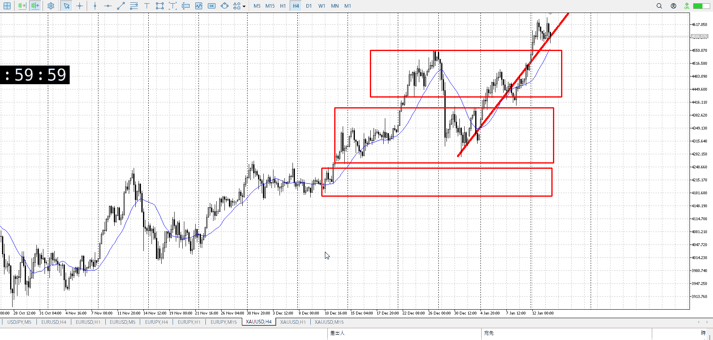
＜ここに目線画像＞

- [x] トレーディングレンジ
    - u

方向：u

1h
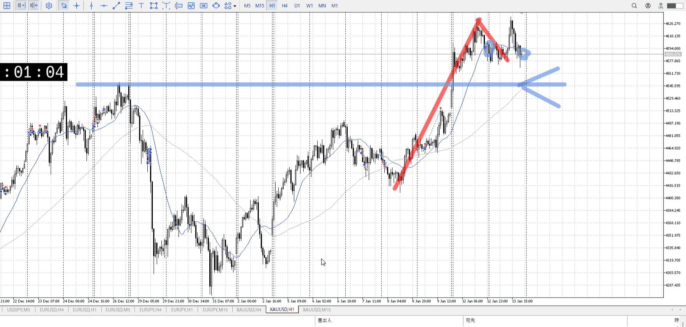
＜ここに目線画像＞

方向：u

15m
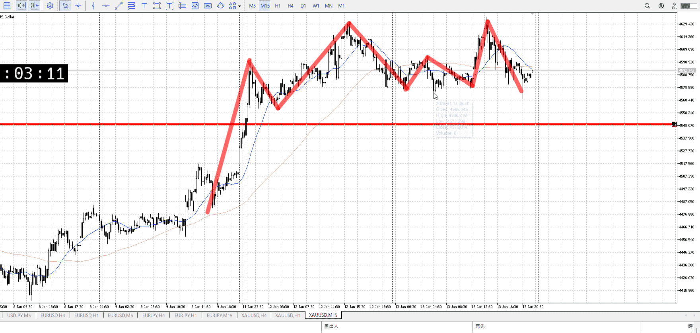
＜ここに目線画像＞

方向：uR

全方向：uuuR

- [x] 使用足全ての目線確認


＜ここにシナリオ画像＞

b:1h安値
s:1h高値

今は少し下だが、少し上で確定するかも

- [x] 1hシナリオ
- [x] ぶつかり
- [x] 日出日入、週出週入


目線・シナリオ・強弱・調整
横幅・PA後・平均線方向・波
**ひきつけ**・軸時間
uuuR
買い
しかも15mだと上昇に対して二倍以上かけて落ちていて買いやすい
後はタイミング

OK!
Exchage Start.

---

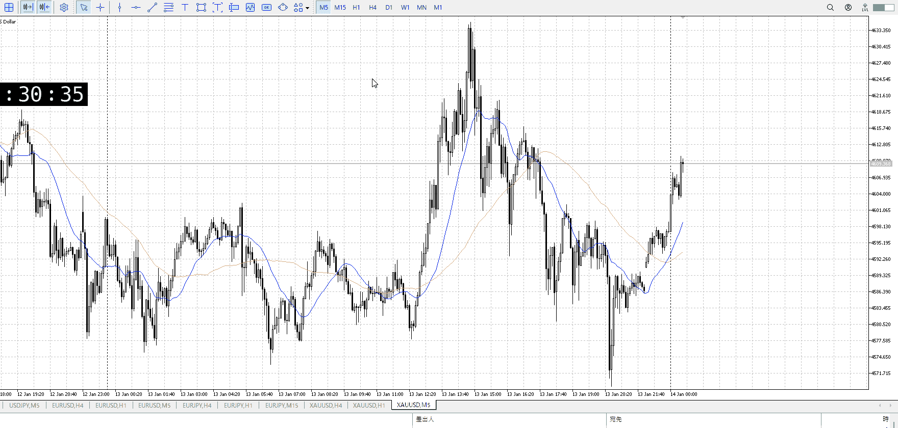

買いやすすぎてことごとくおいていかれてる
買いやすい判断ならラフに買う？

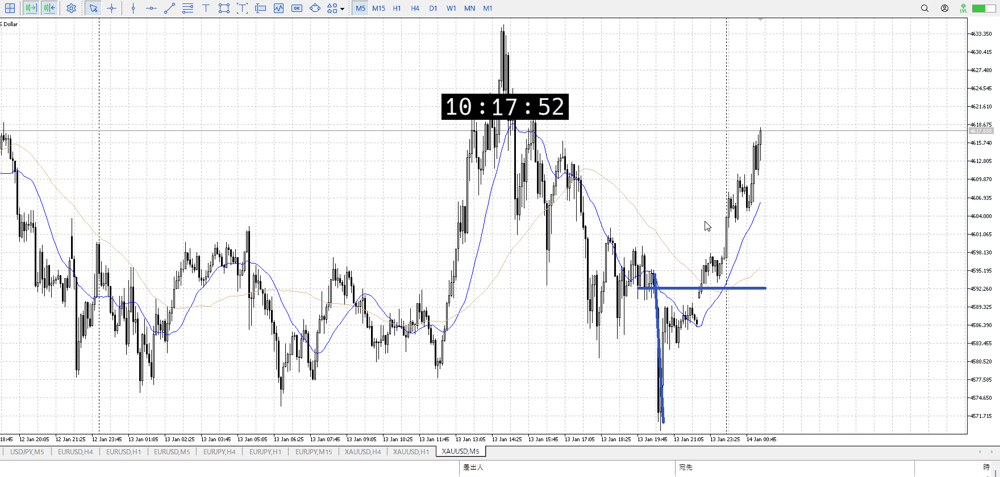

売りの損切場所ではあるので、買いが強いならできたかも
レンジ上は損切の一つ、売りの損切で買い

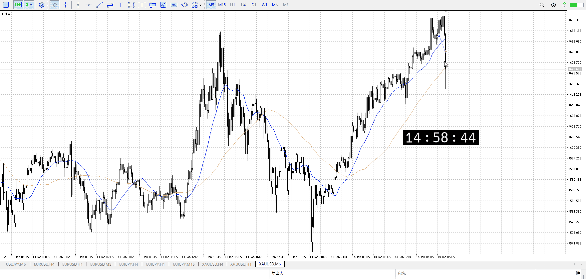

しっかり駄目であることを覚えろ
ここからは横幅を取ってる


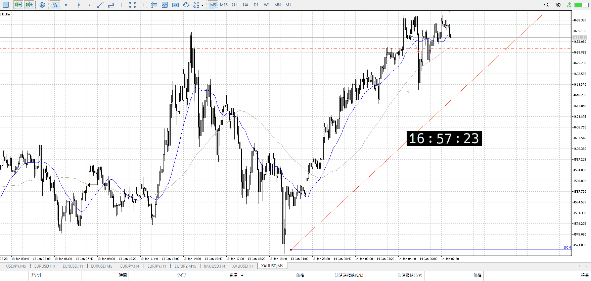

遅い
上昇の勢いが無くなっていってるのは目に見えてる、悪いエントリー

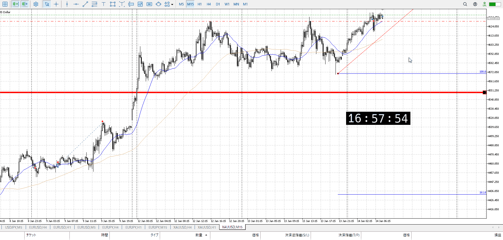

15mとしても近場を大きく抜いてるわけでもない、ここからは買えない
考え無し過ぎ

だんだん勢いが無くなっていく中でやってるのも駄目だし、そもそも5mを根拠にしてるのも駄目
引きつけも出来てない

ちゃんと15m折れ始めから数えてその次から、くらい横幅取る
そこからワンアクションの基本を忠実に

伸びの勢い任せにしない
落ちの勢いを待てるなら、当然伸びの勢いも待つ

確かに伸びの途中から、という方法はあるが
それにしても横幅は必要なはずで。

こういうのはデータにならない
そもそもが駄目なのでスタートに立ててない

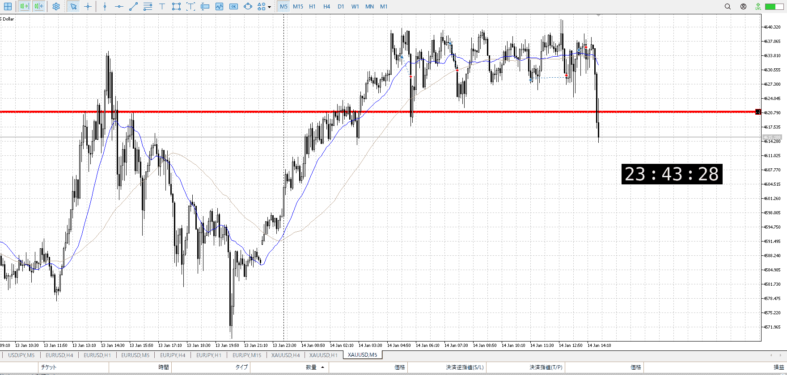

そういうのはデータにならねえって
やるなら下まで引きつけろ


---

- 1
- 2
- 3
現状把握、利確予想まで落ち耐え

---


> [!note]
>- +1万 事前認識 **開始5分**

- [x] [my](obsidian://open?vault=Teino&file=FX/my)(見ないと増える)
- [x] 指標
    - 差し込まれる可能性有り、毎日

4h
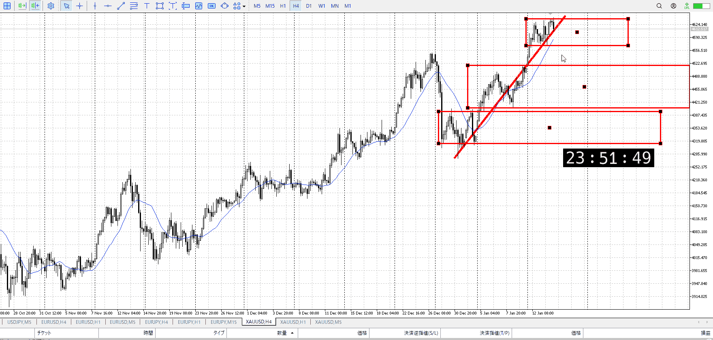
＜ここに目線画像＞

- [ ] トレーディングレンジ
    - 

方向：

1h
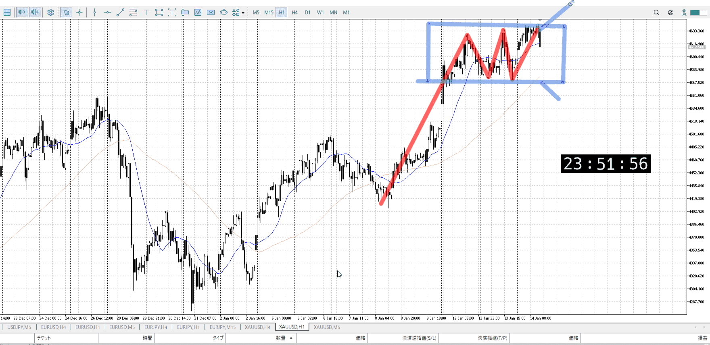
＜ここに目線画像＞

方向：

15m
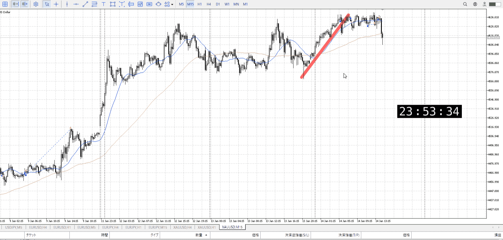
＜ここに目線画像＞

方向：

全方向：

- [ ] 使用足全ての目線確認


＜ここにシナリオ画像＞

b:
s:

- [ ] 1hシナリオ
- [ ] ぶつかり
- [ ] 日出日入、週出週入


目線・シナリオ・強弱・調整
横幅・PA後・平均線方向・波
**ひきつけ**・軸時間


```meta-bind-button
style: default
label: Send
actions:
  - type: "replaceSelf"
    replacement: "OK!\nExchage Start.\n\n---"
```


---

- 1
- 2
- 3
