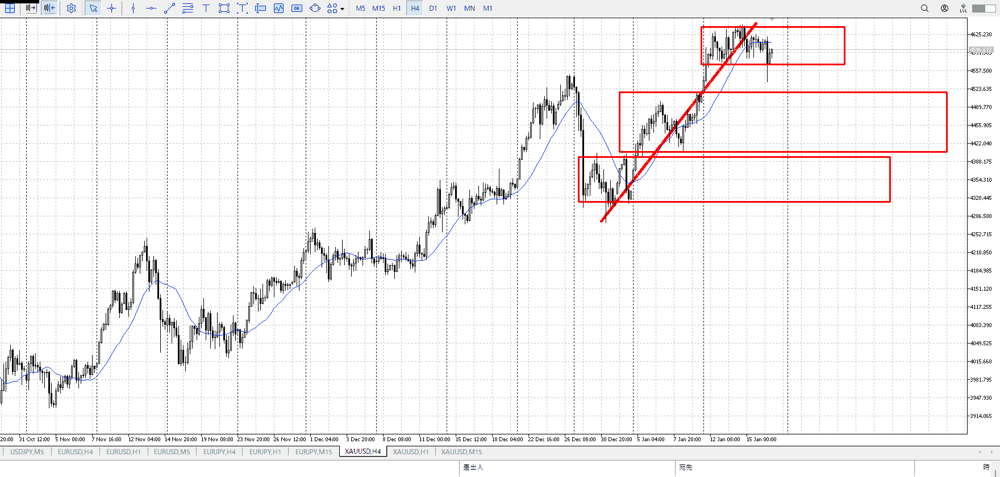
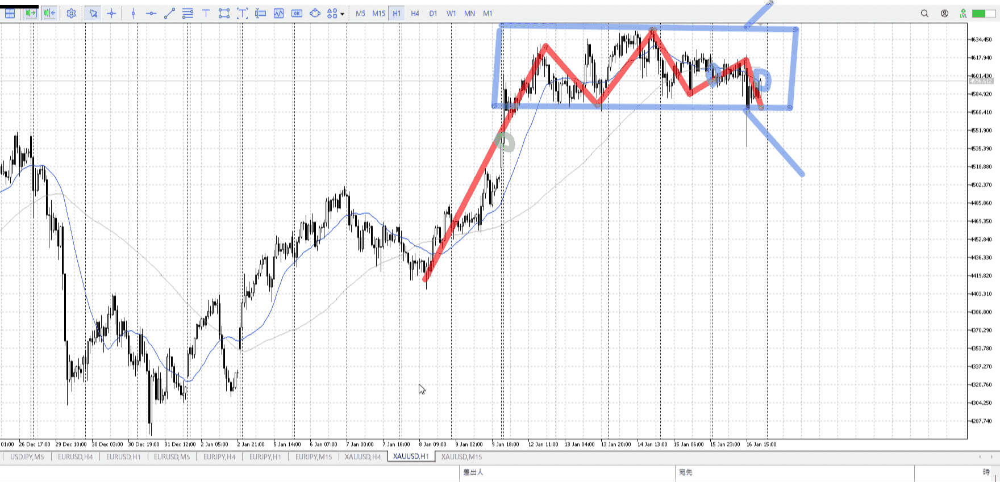
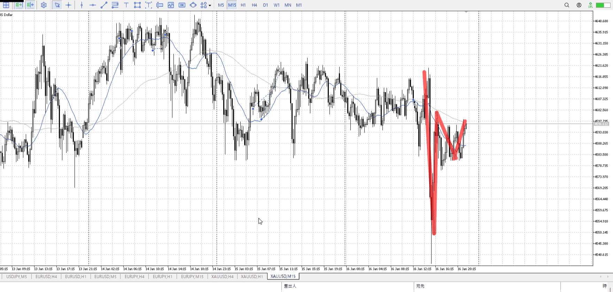

> [!note]
>- +1万 事前認識 **開始5分**

- [x] [my](obsidian://open?vault=Teino&file=FX/my)(見ないと増える)
- [x] 指標
    - 差し込まれる可能性有り、毎日

月曜休場

4h

＜ここに目線画像＞

- [x] トレーディングレンジ
    - u

方向：u

1h

＜ここに目線画像＞

方向：dR

15m

＜ここに目線画像＞

方向：d

全方向：udRd

- [x] 使用足全ての目線確認

＜ここにシナリオ画像＞

b:1hレンジ下
s:1hレンジ上

下がったが耐え。
週でレンジ突入。

- [x] 1hシナリオ
- [x] ぶつかり
- [x] 日出日入、週出週入

目線・シナリオ・強弱・調整
横幅・PA後・平均線方向・波
**ひきつけ**・軸時間
udRd
流石に売れない、レンジ内に戻ってるだけ
ドレンジかつ中ごろからの落ち目線。この中ごろを超えてから下がってきて、落ち始めを売り損切として買い入れて昇がセオリーか。

[my2026-01-19](../FX/My_Test/my2026-01-19.md)