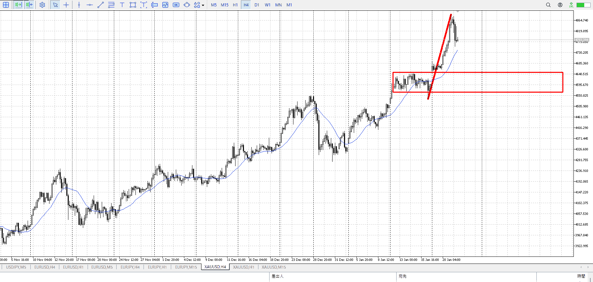
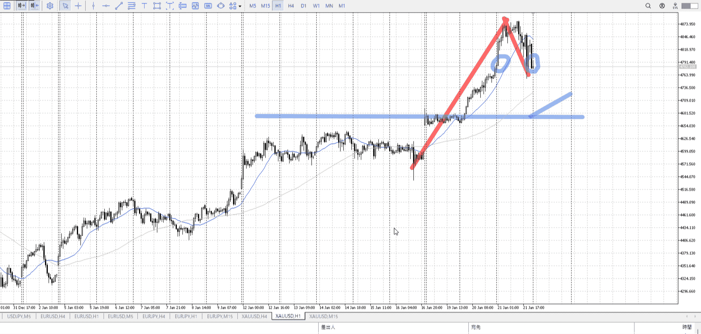
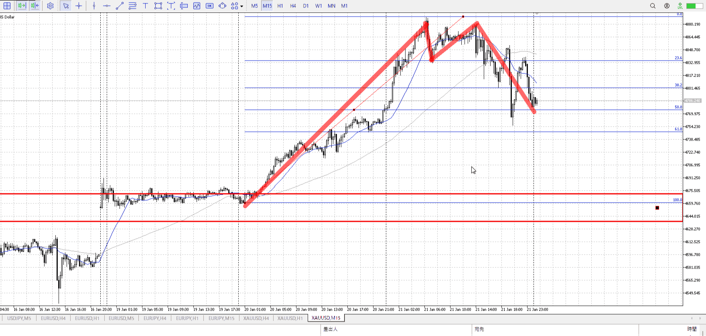
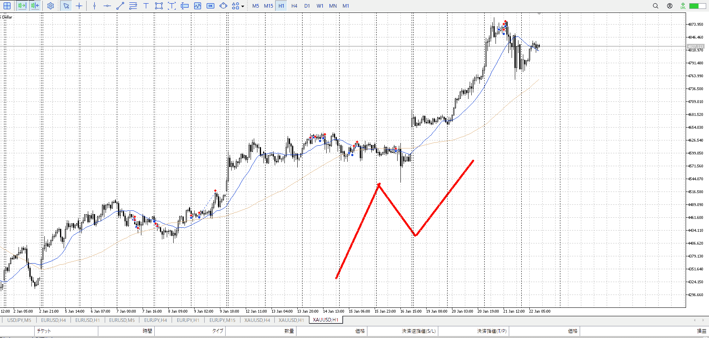
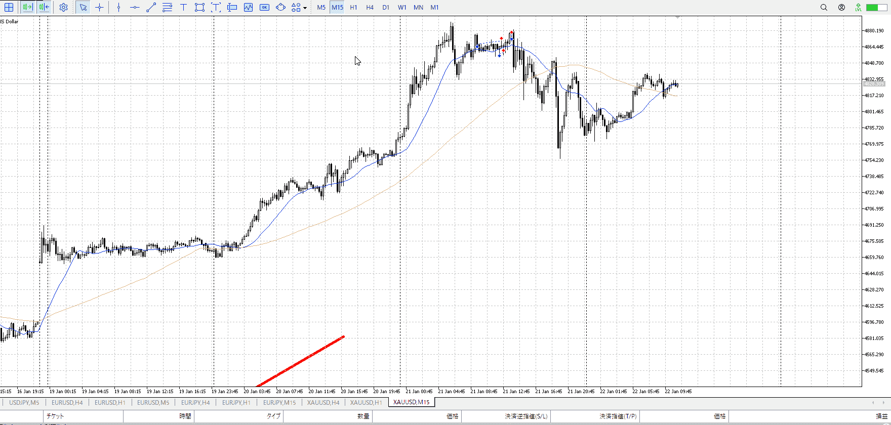
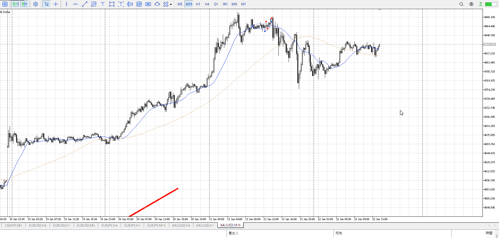

> [!note]
>- +1万 事前認識 **開始5分**

- [x] [my](obsidian://open?vault=Teino&file=FX/my)(見ないと増える)
- [x] 指標
    - 差し込まれる可能性有り、毎日

22:30GFP
24:00個人消費支出

4h

＜ここに目線画像＞

- [x] トレーディングレンジ
    - u

方向：u

1h

＜ここに目線画像＞

方向：u

15m

＜ここに目線画像＞

方向：uT

全方向：uuuT

- [x] 使用足全ての目線確認


＜ここにシナリオ画像＞

b:1hレンジ
s:1h高値

同値

- [x] 1hシナリオ
- [x] ぶつかり
- [x] 日出日入、週出週入


目線・シナリオ・強弱・調整
横幅・PA後・平均線方向・波
**ひきつけ**・軸時間
uuuT
同値なので上髭

これを受けてどうするか
底固めるなら下から買いたい
落ちていくならそれを止める証拠出るまで待ちたい

底固めてレンジになった場合、かなり幅が出る
これで上抜けを狙うととても上寄り？->4h半値のサポートと被らない。

とにかく調整からの抜けはじめを底から狩る、忙しい奴
待つけど警戒は持つ、指標待ちも忘れず

[[天井圏と底値圏]]

OK!
Exchage Start.

---




下がらない、下がらない、ちょっと上で留まる
下落の力がどんどん弱まってる

底を叩いたり、MAの観点でいうとそのうえ留まりから一度下に振ってほしかったところ
それからなら分かりやすく買えたが

ただとどまりの時点から買いはできた
バイトしてたが

この後はこのままレンジになるか、上がるか
レンジだと上下幅が大きくなり、抜けが出来るほどの圧力は無いので底からの買いのみ
上がる場合はまあ、しゃーない
今買うのは違うので無し



下に振って浅押し
正解だったのか？あまりに損切大きかったけど
超近いとこで少しでも下がったらアウト的なセットしとけばいけたか

![[../images/2026-01-22 2026-01-23 01.05.09.excalidraw]]

レンジで入ったならレンジ下になるので、損切はそれほど大きくない
その後でもここを損切に利確を直近高値にでRRよく入れた
調整の抜けはじめを底から取るはこれでいい

留まりの時点ではレンジではない
底はともかく天井が分かりにくい、綺麗な物でなく信頼性が低いレンジ
なのでその一部を抜けたからと言って買えるわけではない
波の頭と尻尾は取れない、今回取れなかったのは平均線及びレンジが綺麗でなかったせい

上の方でレンジになるから、MAと被って根拠が増える
下の方だとMAと被るためより長く時間が要る

---

- 1
- 2
- 3
現状把握、利確予想まで落ち耐え

---

```meta-bind-button
style: default
label: 明日分
actions:
  - type: "insertIntoNote"
    line: selfEnd+1
    value: "Temp/defFXEnvAnalysis.md"
    templater: true
  - type: "replaceSelf"
    replacement: ""
```
