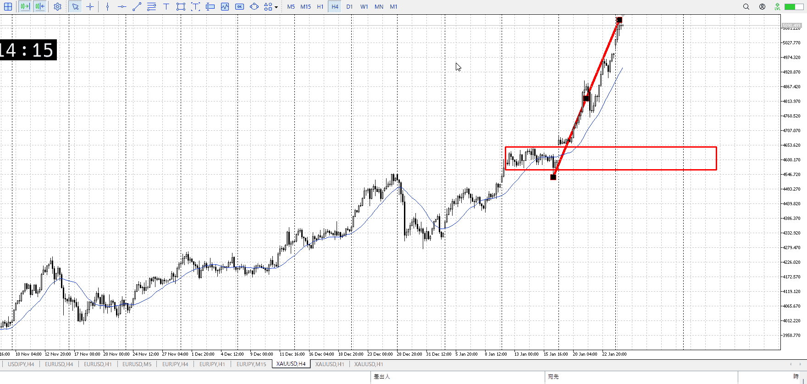
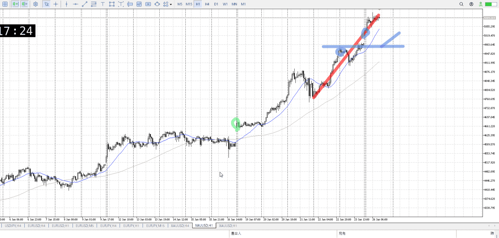
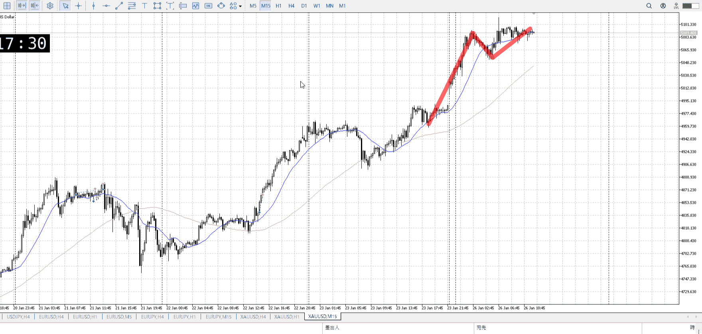
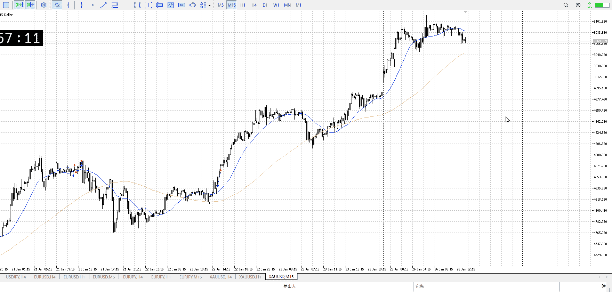
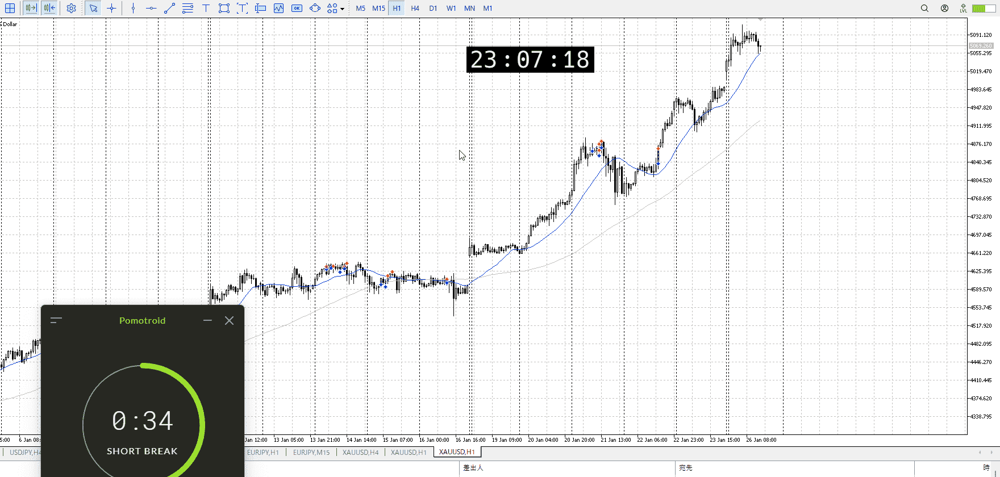
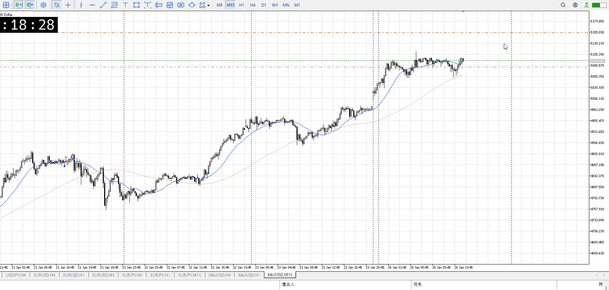
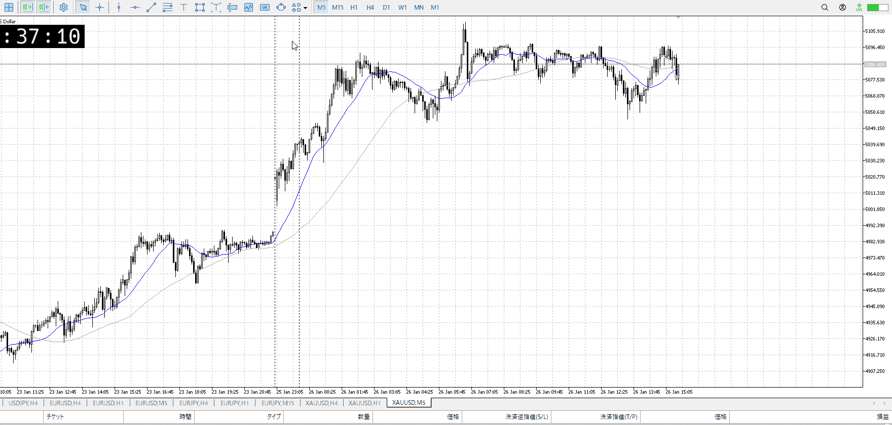

> [!note]
>- +1万 事前認識 **開始5分**

- [x] [my](obsidian://open?vault=Teino&file=FX/my)(見ないと増える)
- [x] 指標
    - 差し込まれる可能性有り、毎日

火曜28:00FOMC

## 4h

＜ここに目線画像＞

- [x] トレーディングレンジ
    - u

方向：u

## 1h

＜ここに目線画像＞ ^4bb92f

方向：u

## 15m

＜ここに目線画像＞

方向：u

全方向：uuu

- [x] 使用足全ての目線確認

## シナリオ

＜ここにシナリオ画像＞

b:1h安値
s:？

上昇

- [x] 1hシナリオ
- [x] ぶつかり
- [x] 日出日入、週出週入

## 位置、値

- [ ] 推進
- [ ] 調整
- [x] 間

- [x] 前移動値
    - 100k
    - 現在84k

## 方針
目線・シナリオ・強弱・調整
横幅・PA後・平均線方向・波
**ひきつけ**・軸時間
uuu
MAが遠く15mでは間にいるのでここでは取引できない
ただし上に抜く場合はその限りでない

直近で上髭があるため、抜くならこれを抜くこと
15mで小レンジ、そのうえで上髭出してて強く意識されてる
その分抜いたら大きいが、抜いたらな

大きい足の調整も視野に入れつつ、1h調整ありきで考える


OK!
Exchage Start.

---

## メモ

底で下髭
ここから上がるのがイメージとしてはあるが、上髭どうなるかな
あと16kくらいはどうかなりそうだけど



1hでも下髭
底を確かめてる雰囲気、これ上がるのでは
レンジ下という売り場を抜いたら考える



さて
ここで調整されない限りは大丈夫だが。

上から入ってるんだからひきつけを、という思いもあるが
抜けたら抜けでやっとかないと



いや、そもそも抜けじゃないわ
冷静になって見てみると全然抜けじゃない


入ってはいけない理由
1. 調整
    調整が入ってない。
    レンジからの抜けか押しを狙う以上、調整は必須。
    上昇から上張り付きレンジ、というのはあるがそれはレンジが調整になる
    どのみちレンジが形成されてないのでアウト
    ![[../images/2026-01-26 2026-01-27 01.34.13.excalidraw]]
    これは調整に使う縦軸横軸の話と一致する。
    [調整](../Info/調整.md)
2. レンジ形成
    レンジにはトレンド以外、つまり高値安値の更新失敗が最低限必要
    （本当は切り上げ切り下げ失敗もいるが、それは置いといて）
    その高値安値を決めるのは、平均線の折れ曲がりを基本としている
    今回MAは全く折れておらず、したがって高値安値は生まれず、つまりレンジが出来てない
    なので調整にならずにアウト
    ![[../images/2026-01-26 2026-01-27 01.35.15.excalidraw]]
3. 時間
    1hに対抗して伸びるんだから、1hに根拠が必要
    レンジが出来てないのでアウト
    1h前回伸びと比較しても既に伸びきってるのでアウト
4. 4hMA
    平均に触れた瞬間に伸びるというのがある
    [急上下](../FX/急上下.md)
    しかしそれは大抵伸びてすぐの話、今回は伸びてから大分後
    おまけに4h平均と乖離しているため、4hのサポートを受けられず伸びない

20日は19日以前の調整レンジを受けつつ、1hにレンジを取り、4hAと近づいて伸びた
調整、時間、4hMA、エントリーどこをとっても良いタイミング

今回は要するに調整とレンジの関係、伸びの対抗の時間足、一つ上の時間足の平均との乖離の三つが問題。
特にレンジが調整を担う部分、レンジの形成に平均線が必要な部分、根拠の伸びの時間足でのレンジ把握部分の三つを重点に。


---

- 1
- 2
- 3
現状把握、利確予想まで落ち耐え

---

```meta-bind-button
style: default
label: 明日分
actions:
  - type: "insertIntoNote"
    line: selfEnd+1
    value: "Temp/defFXEnvAnalysis.md"
    templater: true
  - type: "replaceSelf"
    replacement: ""
```
