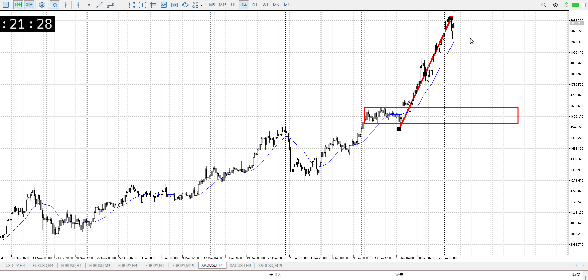
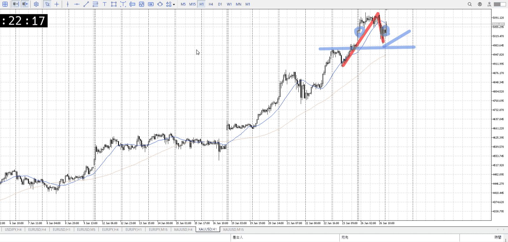
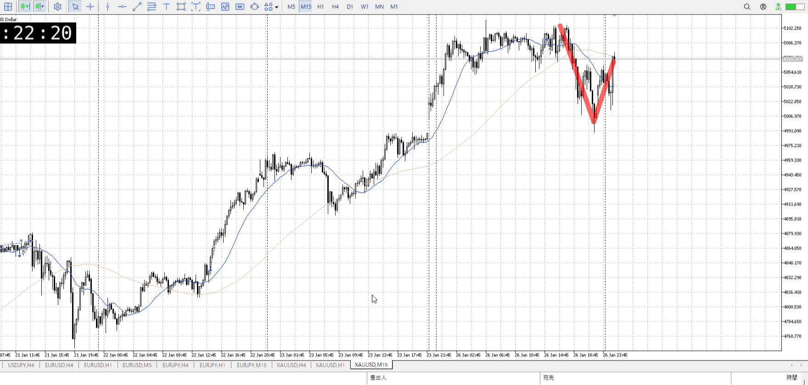
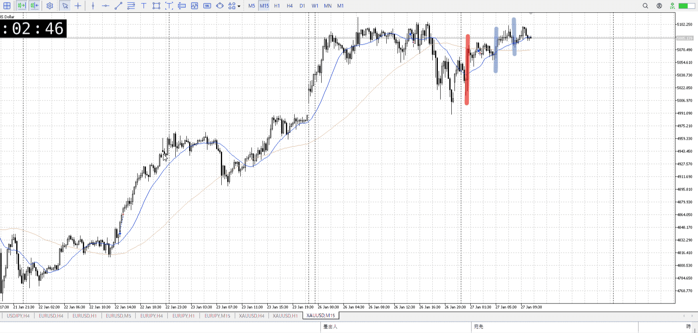
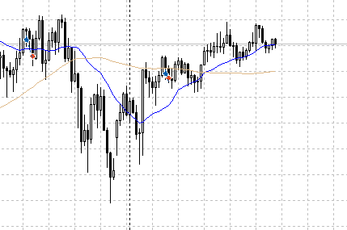
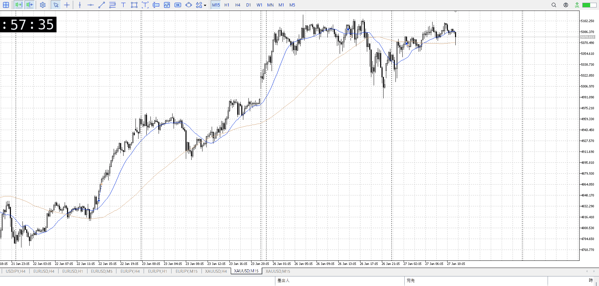
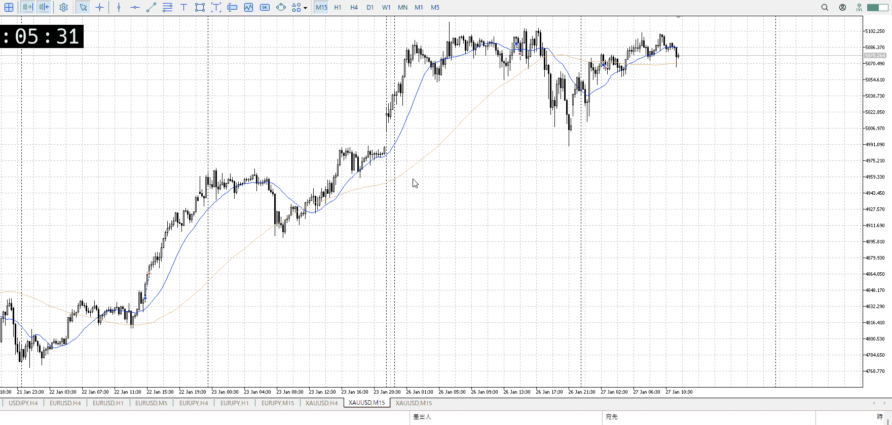

> [!note]
>- +1万 事前認識 **開始5分**

- [x] [my](obsidian://open?vault=Teino&file=FX/my)(見ないと増える)
- [x] 指標
    - 差し込まれる可能性有り、毎日
28:00FOMC
## 4h

＜ここに目線画像＞

- [x] トレーディングレンジ
    - u

方向：u

## 1h

＜ここに目線画像＞ ^4bb92f

方向：u

## 15m

＜ここに目線画像＞

方向：d

全方向：uud

- [x] 使用足全ての目線確認

## シナリオ

＜ここにシナリオ画像＞

b:1h前回高値
s:？

同値

- [x] 1hシナリオ
- [x] ぶつかり
- [x] 日出日入、週出週入

## 位置、値

- [ ] 推進
- [x] 調整
- [ ] 間

- [x] 前移動値
    - 120k
    - 現在60k

## 方針
目線・シナリオ・強弱・調整
横幅・PA後・平均線方向・波
**ひきつけ**・軸時間
uud
昨日は動いてないので調整
これを元に買っていきたい

13mは直近の売り場を抜いてるが、これにさらに場抜きが欲しいところだが
今買うと損切40kなのでちょっと


OK!
Exchage Start.

---

## メモ

まず赤のとこは無理。上昇の尻尾。

青一つ目でMAが追いつき、レンジになる。
この時点から上がると確信していれば下から買える。

現実的には青二つ目だが、ここの前に天井に触れてるっぽい動きをしている
その点は問題ないかは、下から持ち続けて耐えてないと辛くね


それはともかく今回の場所。

15mでレンジも出てない。早い。

5m15mで短期を狙うには場所が高い。短期は大きな足の方向の一部を取るもののはず。
ここは頂上で4hAも追いついてない。なし。


ところで天井に貼りつき、MAに追いつかれレンジを形成してる件について
でもここでレンジ内上張り付き抜けというのもあるような。

それを期待する場合は本当に上に貼りつくのかの証明、落ちないという証拠が必要
急上昇直後ならそれなしで上がることもあるけど、それは直後の時。これはない。


前日の落ちからして緩やかな上昇。それで天井を抜けない。
4hとの乖離、前回上昇との幅比較もありここで落ちる要素が揃って来てるように見える。



だからこれが失敗したらどっかで買えそうだけど。



失敗したか？
安値更新は5mのみ。5mではネック割れになるので下の圧力。
15m1hの今の貧弱な下支えにそれが耐えられるか。耐えたならその証拠として再度天井に向かうはず。それが抜くかレンジ継続かは別として。

そこまで待たなくても売り場抜けばいいけど、今そういう売り場ない。


4h上で売りが懸念される高さ、前回高さから
[前回高さ](../FX/前回高さ.md)

平均線による高値安値の測り、単純に一番高い低いの目印
上昇降下の比率、入りは推進の途中で調整と比率比較で大体同じ
[調整](../FX/調整.md)

1hでも15mでも平均線が横になっておらず、レンジでない
高値の根拠が薄いためそれを元に下抜きも根拠が薄い
[レンジ](../FX/レンジ.md)

4h売り懸念に対して、根拠が薄く上下比率もズレがある
無理


こっちが分からないところをすぐに特定して質問できれば終わった
そっちが分からないところを想定して説明すれば終わった

躓いているところに対し、それ自体を見ることより一から手順を確認することに終始する
個人で悪いところを考えるという点では有効で、確かに発想力やその後の記憶の定着はできるかも
けどその分時間がかかる

躓いていることに対し、何に躓いてるのか分からず一から手順を確認することに終始する
分からないなら入力から一つずつたどればいい、必ず治る
けどその分時間がかかる

何にせよ、他に手が無い

---

- 1
- 2
- 3
現状把握、利確予想まで落ち耐え

---

```meta-bind-button
style: default
label: 明日分
actions:
  - type: "insertIntoNote"
    line: selfEnd+1
    value: "Temp/defFXEnvAnalysis.md"
    templater: true
  - type: "replaceSelf"
    replacement: ""
```
