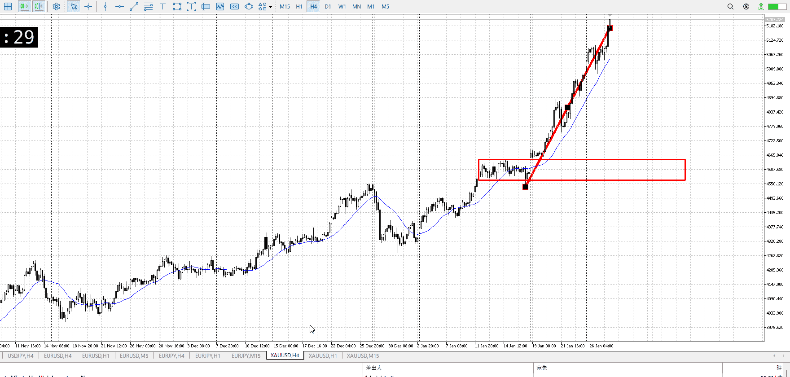
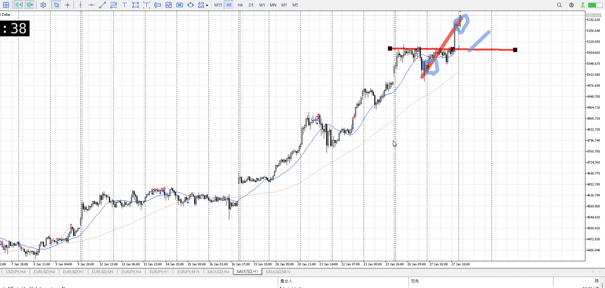
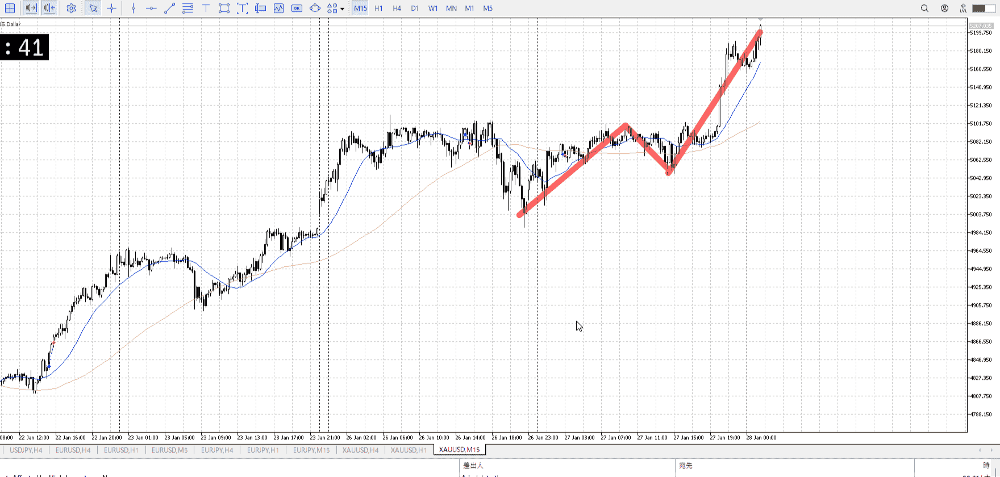

> [!note]
>- +1万 事前認識 **開始5分**

- [x] [my](obsidian://open?vault=Teino&file=FX/my)(見ないと増える)
- [x] 指標
    - 差し込まれる可能性有り、毎日
28:00FOMC
## 4h

＜ここに目線画像＞

- [x] トレーディングレンジ
    - u

方向：u

## 1h

＜ここに目線画像＞ ^4bb92f

方向：u

## 15m

＜ここに目線画像＞

方向：u

全方向：uuu

- [x] 使用足全ての目線確認

## シナリオ

＜ここにシナリオ画像＞

b:1h安値
s:？

上昇
1hでの一つの上昇幅は既に終了している


- [x] 1hシナリオ
- [x] ぶつかり
- [x] 日出日入、週出週入

## 位置、値

- [x] 推進
- [ ] 調整

- [x] 前移動値
    - 170k

## 方針
目線・シナリオ・強弱・調整
横幅・PA後・平均線方向・波
**ひきつけ**・軸時間
uuu
調整待って買い

その前に、短期で買う手はあった
上昇に対して短期で即ついていくやつ
急上下のパターンC
[パターンC](../FX/急上下.md#パターンC)

これ以降は何も出来ないので大人しく調整待ち


OK!
Exchage Start.

---

## メモ
[my2026-01-28](../FX/My_Test/my2026-01-28.md)

---

- 1
- 2
- 3
現状把握、利確予想まで落ち耐え

---

```meta-bind-button
style: default
label: 明日分
actions:
  - type: "insertIntoNote"
    line: selfEnd+1
    value: "Temp/defFXEnvAnalysis.md"
    templater: true
  - type: "replaceSelf"
    replacement: ""
```
