> [!note]
>- +1万 事前認識 **開始5分**

- [x] [my](obsidian://open?vault=Teino&file=FX/my)(見ないと増える)
- [x] 指標
    - 差し込まれる可能性有り、毎日
金曜22:30雇用統計
## 4h
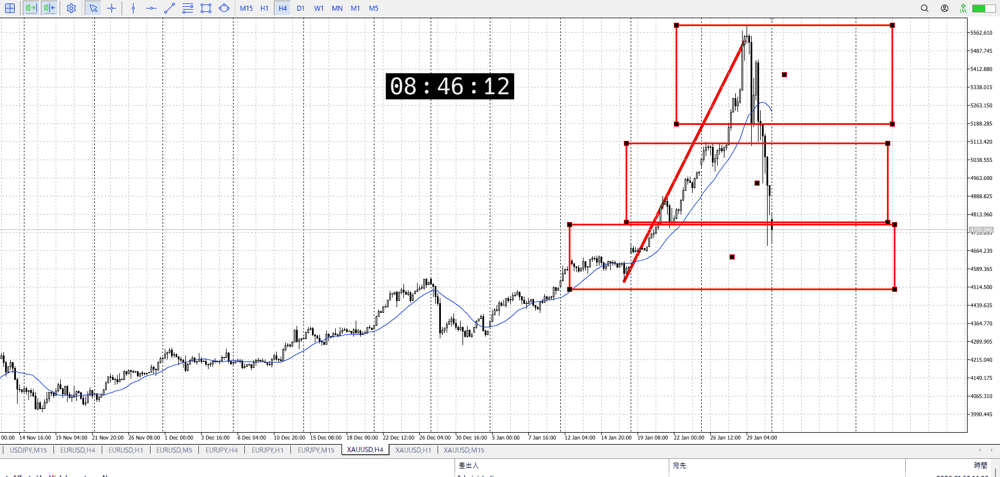
＜ここに目線画像＞

- [x] トレーディングレンジ
    - md

方向：u

## 1h
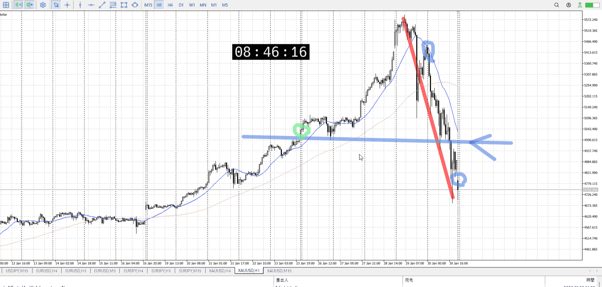
＜ここに目線画像＞ ^4bb92f

方向：d

## 15m
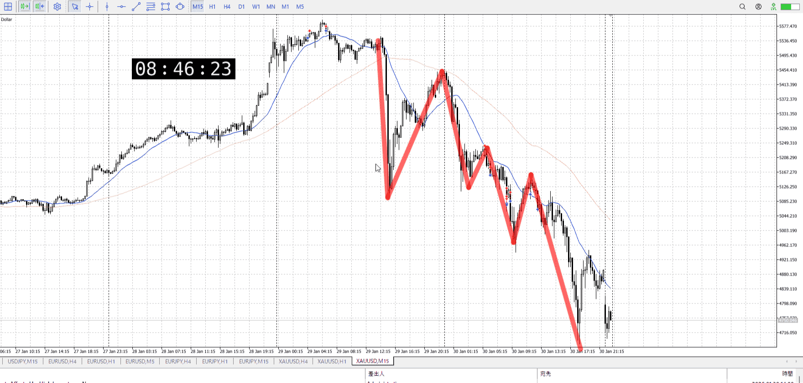
＜ここに目線画像＞

方向：d

全方向：udd

- [x] 使用足全ての目線確認

## シナリオ

＜ここにシナリオ画像＞

b:4hレンジ
s:？

まだ明確に上昇はしてないが、15mで意識した場は見えてくる。
ただし平均が動いてないので完全でない。

引っかかってる部分は4hで前回上昇を超えていった場面
そうでなくとも一日休場で固くなってるはずなので、気にする理由はある
4hとしても買えるか

下降、下降

これに対抗するなら、やはりシナリオ通り1hのサポートを受けたい
なので1h平均受けるまでは怖いとこ

- [x] 1hシナリオ
    - [x] 明確か ? 続行 : 確定後考え直し
- [x] 時間足ぶつかり
- [x] 日出日入、週出週入

- [x] 前移動値
    - ７５０ｋ
- [x] 前回上昇・下降値
    - 作成中

## 位置

- [x] 推進
- [ ] 調整


## 方針
目線・シナリオ・強弱・調整
横幅・PA後・平均線方向・波
**ひきつけ**・軸時間
udd
下髭出始めで、勢いが失われ始め
1h平均が追いつくまでは止めておきたい


OK!
Exchage Start.

---

## メモ
一応短期の売りも見て置く
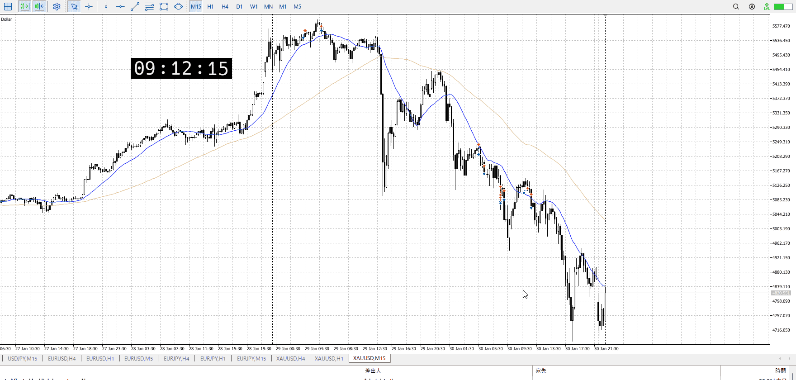

レンジの下抜けから戻り売りは、現在の上昇が成功すればもう終わりのはず
もう一度戻り売りは小レンジと下抜けがほしいとこ

オバシュ買いはすでに一回失敗してるので無し
そもそもそれだけの勢いがないとダメだし

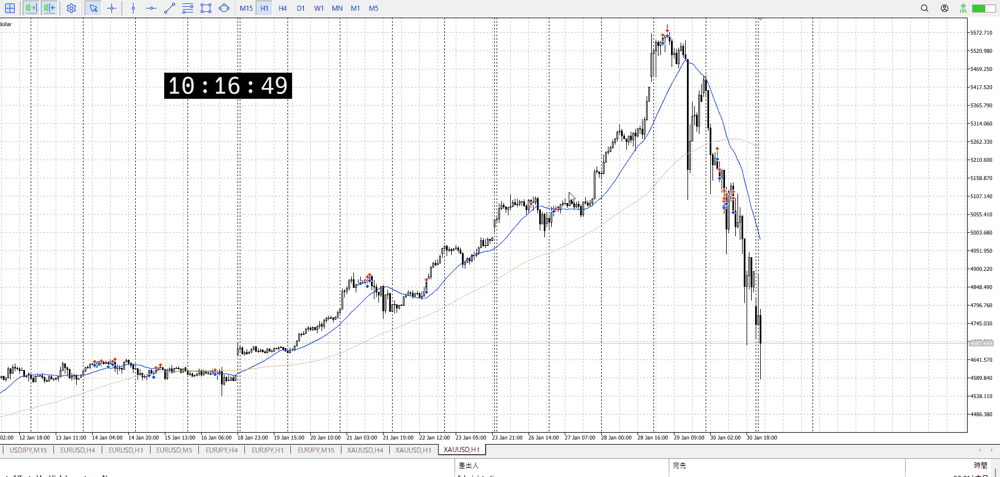

もっと落ちてる
急激な上昇にいきなり上髭ストップかけたのが原因か。
横幅が無いから15mでしか売れない、オバシュ買い失敗がそんなに大きいのか。

4hはまだもう少しある。これをスパッと抜くのは1hが必要だが、その間に短期でいくつか取れる。

下髭に上昇に一切の高値を割らず上髭はきつかったか？
それに加え一応上に波打ってる15mA。
でも1hの先かもしれないとこでそれだけで売れるもんか？

この下の反発は4hなので、これに対して15mで売るのは早計
何処まで行くかを見る

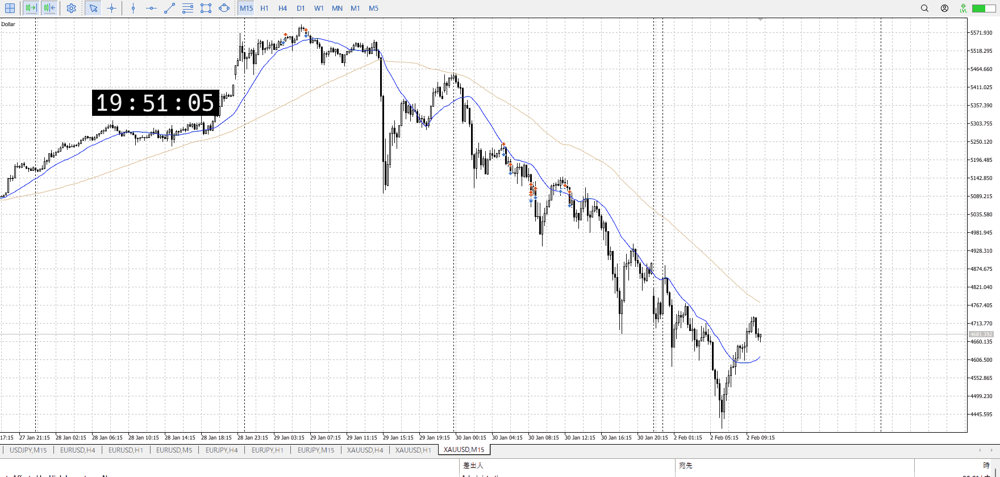

15m
ようやく1hに近づく気がありそう。直近高値というには不安がある部分を超えて。

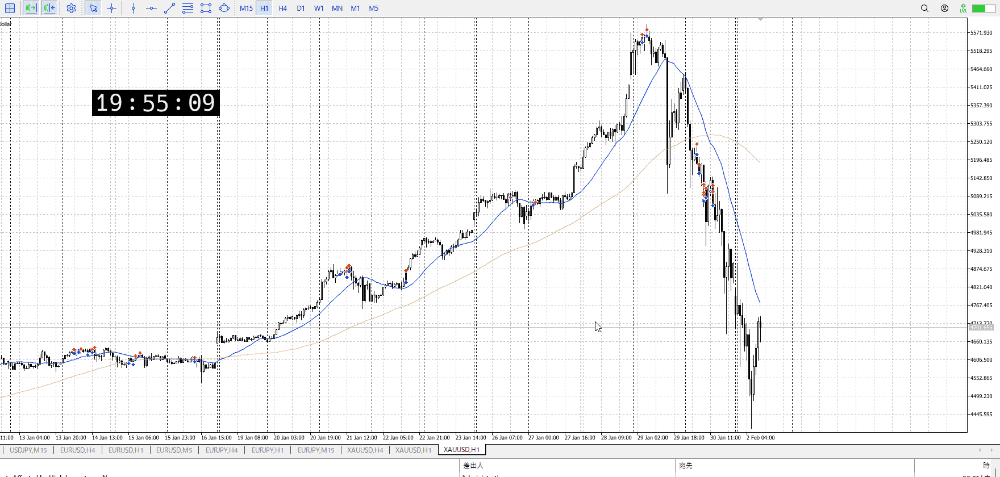

直近1h超えくらいか。
一応オバシュ買いが出来たかも。
この買い失敗を見て短期売りたい。

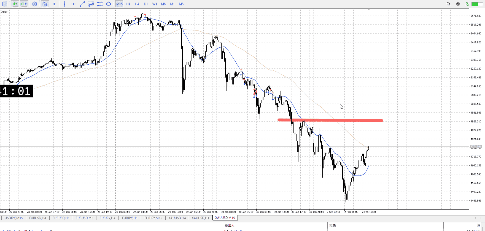

朝、オーバーシュートが失敗し迷ったところで降下
この時点で売り、短期で上髭売り

現在、4h買いのオーバーシュート買い

この後、これを調整としてどう売るかというとこ
1hには追いつき1h調整が出れば4hを抜くこともできる

15mを目線ごと上にするには、赤横を超える必要がある
ここは1hの前レンジ下でもあり売り場

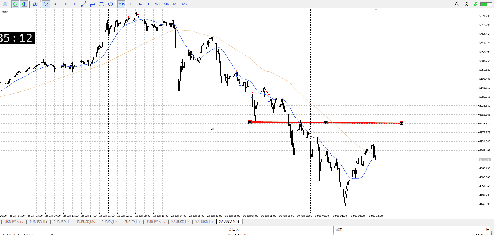

15mの天井見えてきた
床と天井あれば、後は天井から売るなりここからレンジ作ってその中で不審なものを売ったり

この天井をいきなり売るのは普通に無理だと思う
溜めも振りもない

今日の開始の売りは分析出来てたらいけてそう  
Vからの買いはかなり出来たはず  
Vの折れ始めは無理だと思う、溜めが無い

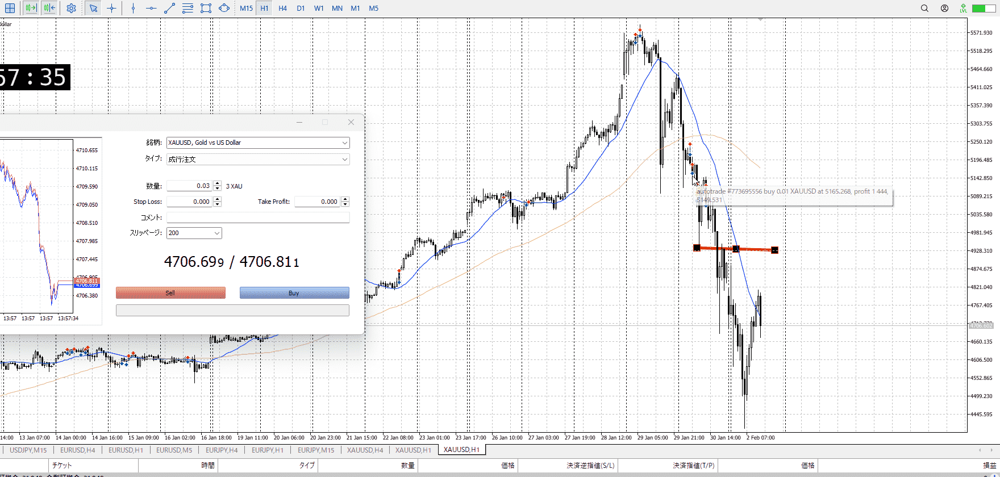

かといってここを売るのも、1hが下髭になりそうで難しめ
普通にレンジを待った方がいいか。

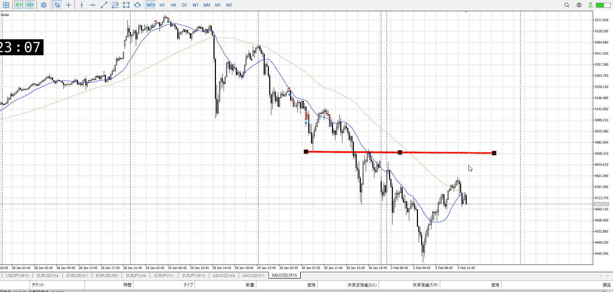

1h下髭に対して15mが伸びない。
これで売れるのか、これ

いや、いくら何でも1h上髭とか必要だろう


今日もっともよくなかったと思うのは、最初の上昇に対して「この上昇が成功すれば終わり」という前提を置いたこと。
これをそのまま見てしまっていた。そもそもこれは1h買い場を完全に抜いた後、戻り売りを試していた部分。ここで窓分の大きな売りが入り、もう戻りがほぼ確定的な場所。その最期の上昇を上髭で止められたので売り優勢。

1hの先が怖いが、売りの条件で上げてる小レンジも下抜けも既に過ぎてるとこなので売りたい。短気だから先が怖くても直近安値で済ませればいいとこだし。もう少し前日の分析、及び窓分の急落を考察すべきだった。


オバシュ買いはまだ考えが甘い部分がある。意識。


---

- 1
- 2
- 3
現状把握、利確予想まで落ち耐え

---

```meta-bind-button
style: default
label: 明日分
actions:
  - type: "insertIntoNote"
    line: selfEnd+1
    value: "Temp/defFXEnvAnalysis.md"
    templater: true
  - type: "replaceSelf"
    replacement: ""
```
