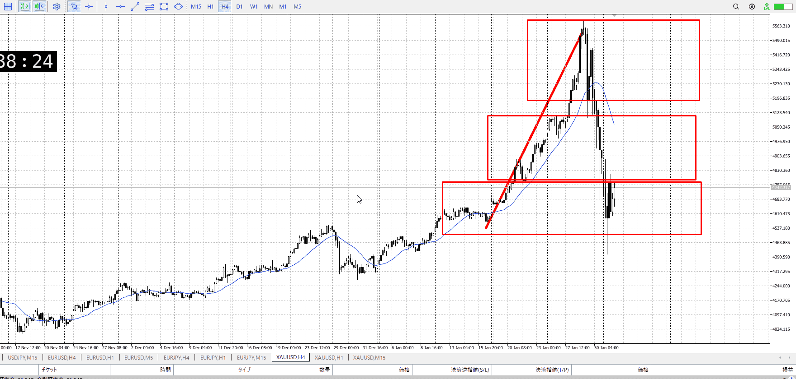
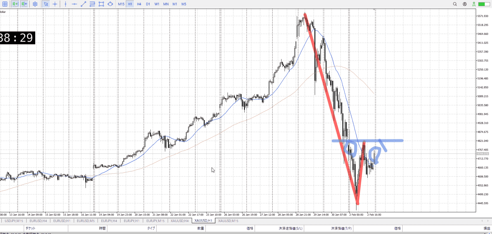
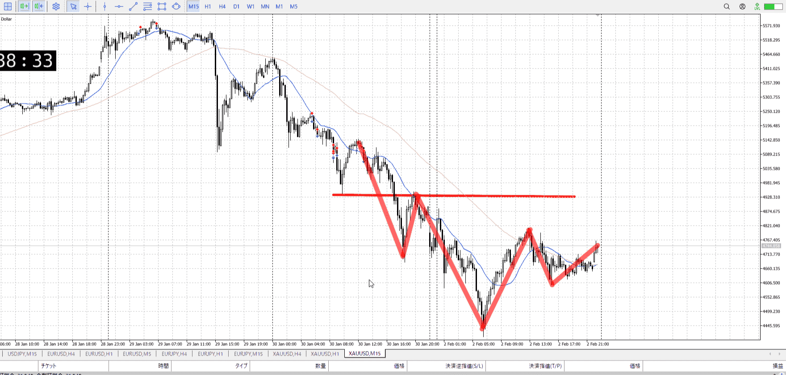
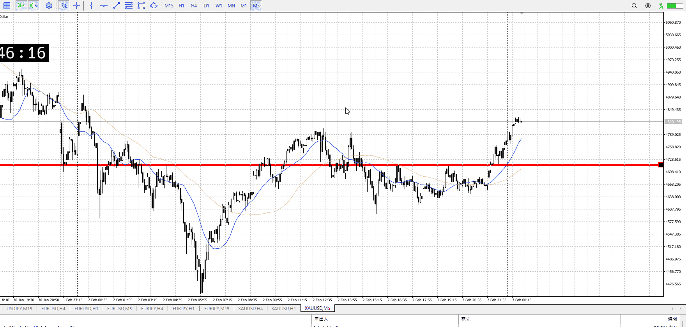
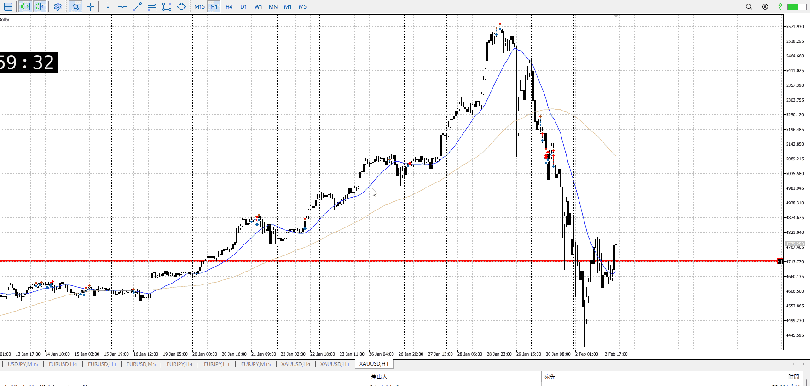
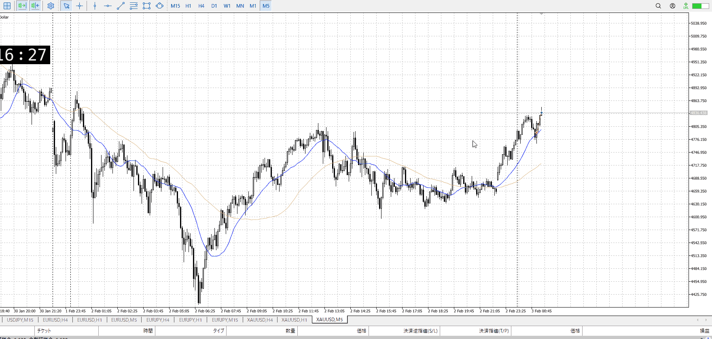
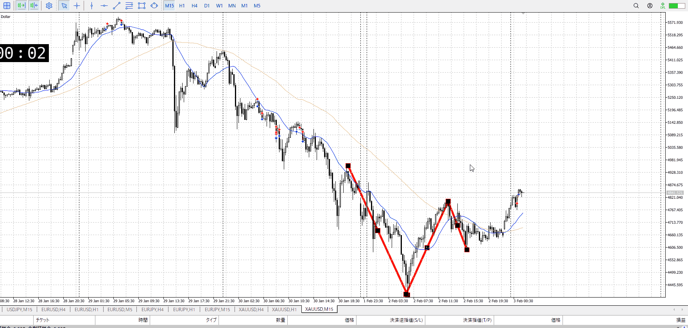
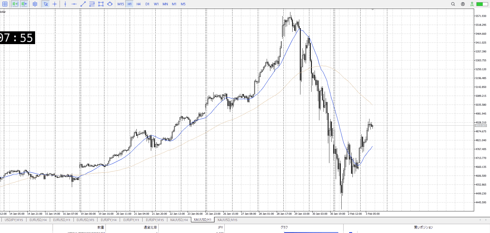
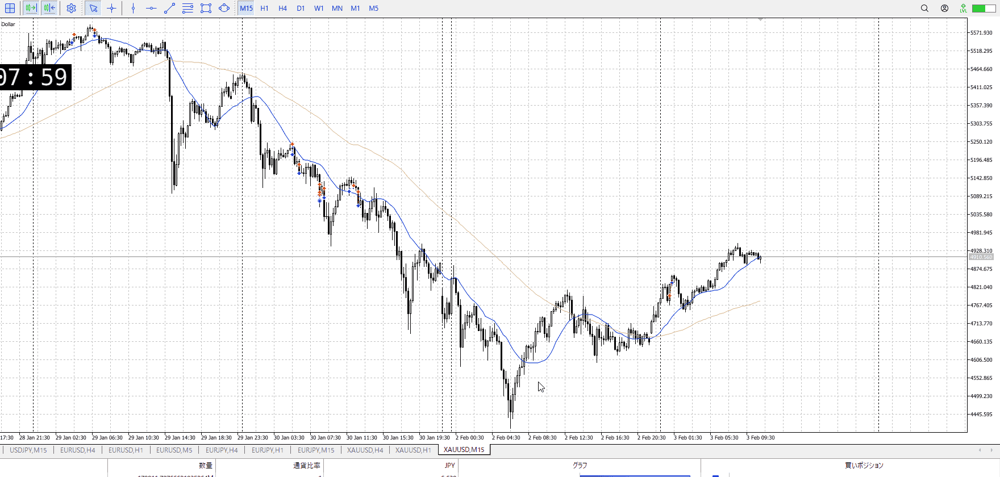
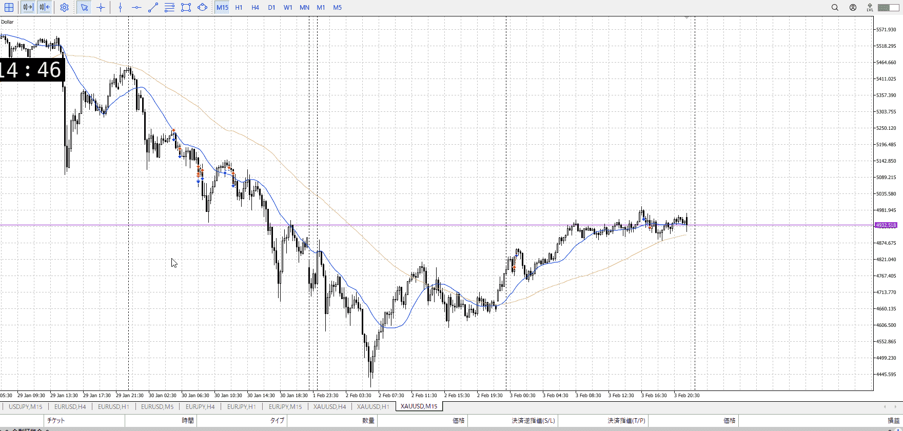

> [!note]
>- +1万 事前認識 **開始5分**

- [x] [my](obsidian://open?vault=Teino&file=FX/my)(見ないと増える)
- [ ] 指標
    - 差し込まれる可能性有り、毎日

## 4h

＜ここに目線画像＞

- [x] トレーディングレンジ
    - d

方向：u

## 1h

＜ここに目線画像＞ ^4bb92f

方向：d

## 15m

＜ここに目線画像＞

方向：d

全方向：udd

- [x] 使用足全ての目線確認

## シナリオ

＜ここにシナリオ画像＞

b:4h安値
s:1h高値

完全にここが天井になるかはまだ分からない、候補の一つ
4hと1hのぶつかり、相手は4hなので1hでレンジ欲しい
傾きとしては買いの勢いはある

レンジ

- [x] 1hシナリオ
    - [x] 明確か ? 続行 : 確定後考え直し
- [x] 時間足ぶつかり
- [x] 日出日入、週出週入

- [x] 前移動値
    - 460k
- [x] 前回上昇・下降値
    - 1.2M

## 位置

- [ ] 推進
- [x] 調整


## 方針
目線・シナリオ・強弱・調整
横幅・PA後・平均線方向・波
**ひきつけ**・軸時間
udd
買いが優勢にも見えるが、15mで目線が上になったわけではないので買いにくい
天井からの売りの方がやりたいが、15mがしっかり横取って下げ止まっててキツイ
相手4h買いだからそれはそう

直近抜いて15m上になってから深押しを買うのがいいかな


OK!
Exchage Start.

---

## メモ


抜いたっていえるかなこれ
言えるなら深押しを買っていき体が



がっつり上髭になってしまった
これは難しい



前の動きは買い優勢、根拠に使える15mは抜け疑惑
この状況で売れるわけない、1h上髭でも
直近に惑わされすぎ、1h一本なら15mの動きだけど15mは買い優勢

買いは分析の上にできてない
売りは分析の上にいた
**考えてない物をいきなりやっても無理**


一番まずかったのは、高値でもないものを高値と思っていたこと
**安値を更新してないので高値ではない**、したがってここを抜いたところで上トレンド程度でそれを抜きミスしたところであまり意味はない

次にまずかったのは上髭の扱い
1hで確かに上髭は出たが、15mでは出てない
今**エントリーしてるのは15mなので15mで出てないといけない**、オーバーシュートならここで止まる理由がない
買わない理由にはなるけど

最後に横幅
切り上げとレンジから上抜け、これを止めるなら相応の長さの横幅が必要
15mでの上髭も複数ほしい、この横幅を稼ぐため
売りたいなら止まってから考える

オーバーシュート云々は、そこで止まる明確な理由が上位足にある時
ここは明確にないので無理





緩やかに上昇中
1h追いつきからレンジ戻り売りをかけたい
15mは上になったっぽい

これ買えるかについてだが、それなら急激な上昇を一度は作っておきたい
後は大きい下髭とかもいる、なので買えはしない



前よりはマシな位置だが、資金力が足りず
資金力が危ういなら、より安定な1h調整を待つ一手が出来たはず
というかいろいろ欲しいって言いながら買えないって結論付けたのに、いや抜けは十分か？

エントリーは5mなので5mで下髭出てから買えばベスト。

---

- 1
- 2
- 3
現状把握、利確予想まで落ち耐え

---

```meta-bind-button
style: default
label: 明日分
actions:
  - type: "insertIntoNote"
    line: selfEnd+1
    value: "Temp/defFXEnvAnalysis.md"
    templater: true
  - type: "replaceSelf"
    replacement: ""
```
