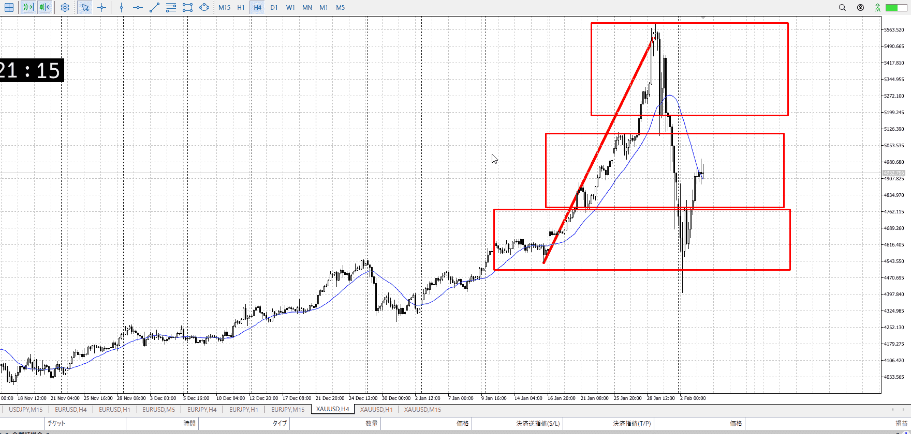
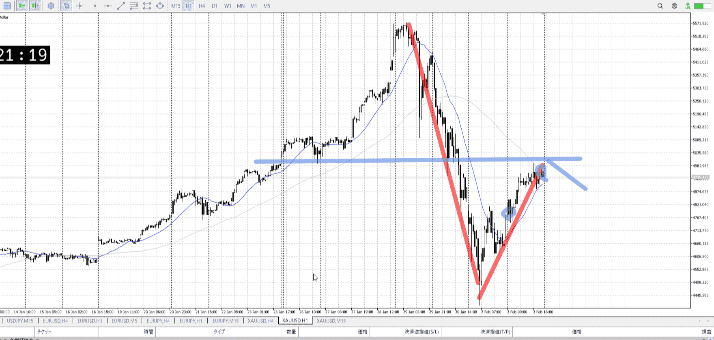
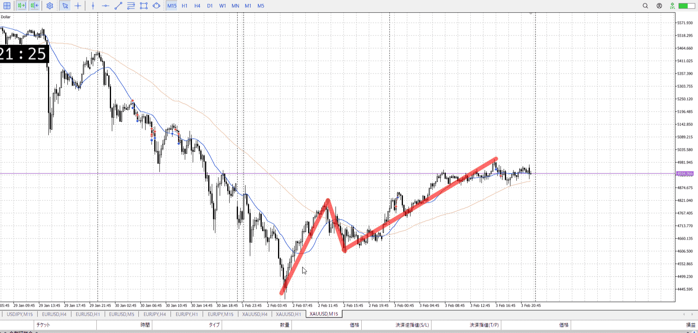
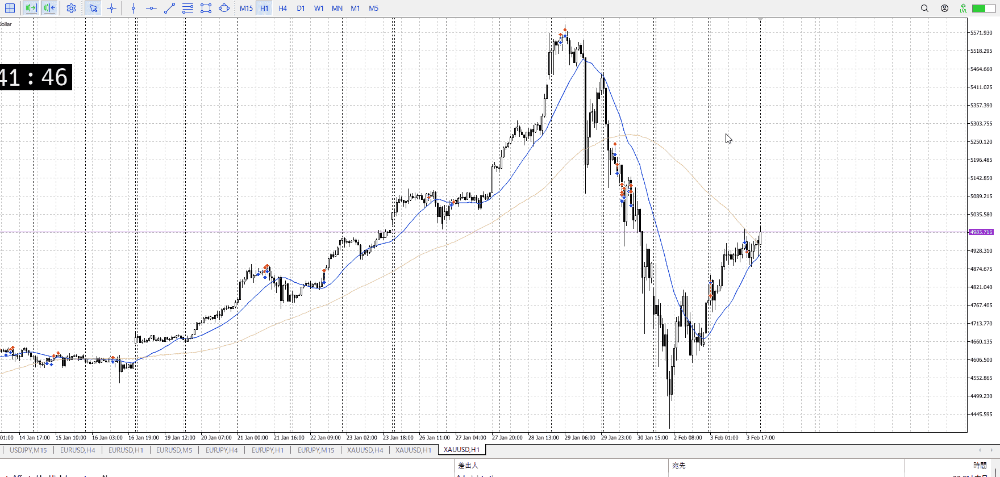
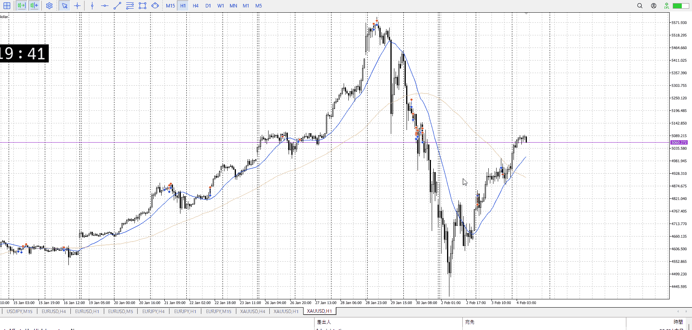

> [!note]
>- +1万 事前認識 **開始5分**

- [x] [my](obsidian://open?vault=Teino&file=FX/my)(見ないと増える)
- [x] 指標
    - 差し込まれる可能性有り、毎日
22:15ADP
24:00非製造
## 4h

＜ここに目線画像＞

- [x] トレーディングレンジ
    - m

方向：u

## 1h

＜ここに目線画像＞ ^4bb92f

方向：d

## 15m

＜ここに目線画像＞

方向：u

全方向：udu

- [x] 使用足全ての目線確認

## シナリオ

＜ここにシナリオ画像＞

b:4h底
s:？

売りは1h半値の可能性有り。
これから調整明け

上昇止め

- [x] 1hシナリオ
    - [x] 明確か ? 続行 : 確定後考え直し
- [x] 時間足ぶつかり
- [x] 日出日入、週出週入

- [x] 前移動値
    - 240k
- [x] 前回上昇・下降値
    - 1.2M

## 位置

- [ ] 推進
- [x] 調整


## 方針
目線・シナリオ・強弱・調整
横幅・PA後・平均線方向・波
**ひきつけ**・軸時間
udu
この15mのuが終わるころに売れば、1.2M規模を手に入れられる
ただし金は上がる物なので、現実的には直近安値までだろう、十分だけど

なので終わり際の15mレンジ下抜けを狙いたい
もちろん15mが勝つ可能性も考慮する


OK!
Exchage Start.

---

## メモ




今ぐらいの下髭、あるいは上髭降下から下髭止まりを見て買う
この方が確実、資金がないなら焦らなくていい



ここは1hAより離れてるので、調整として売っていくなら追いついてから
買っていくのもそろそろ調整としてエネルギーが切れてきたのでつらみ


よくあるやつ
今までの分析に対して相場の僅かな情報を重く見すぎ
つまり目先に囚われてる、考えてないものは入れない

全体の動き、傾き比率などを見てない

自分が立てた予想と現実がたまにごっちゃになる
1h抜けたら終わりだなを必ず抜けると勘違いしたり

エントリー用の髭、環境認識用の複数髭をごっちゃにしてる
環境認識用なら複数本で天井・底をはっきりさせる必要がある
エントリーはそこで止まった印でいい

[2026-02-04-mayohare](2026-02-04-mayohare.md)

mayohareと比較
[2026-02-04-mayohare](../FX/2026-02-04-mayohare.md)
現在値の把握

[[初心者脱却メソッド！エントリーの精度を極上げする方法 - YouTube](https://youtu.be/bZFVbgxvUMo?si=nywW63yLq_l9ZQim)](../FX/2026-02-04-mayohare.md#[初心者脱却メソッド！エントリーの精度を極上げする方法%20-%20YouTube](https%20//youtu.be/bZFVbgxvUMo?si=nywW63yLq_l9ZQim))
エントリー付近の優位性、プライスアクション

[[【迷ボ76】ぜひマスターしたい、認知バイアス逆ねじ手法。 - YouTube](https://youtu.be/mJbHU6vlsio?si=GKSpPdtJ28wP0c9-)](../FX/2026-02-04-mayohare.md#[【迷ボ76】ぜひマスターしたい、認知バイアス逆ねじ手法。%20-%20YouTube](https%20//youtu.be/mJbHU6vlsio?si=GKSpPdtJ28wP0c9-))
認知バイアス、片側に寄らず両側を見る

[[【完全解説】FXの波が見えるようになる！正しく捉えて機械的に描く方法を全公開 - YouTube](https://youtu.be/dGxoSwxEBCs?si=mCEnpAxJ3umM4X4j)](../FX/2026-02-04-mayohare.md#[【完全解説】FXの波が見えるようになる！正しく捉えて機械的に描く方法を全公開%20-%20YouTube](https%20//youtu.be/dGxoSwxEBCs?si=mCEnpAxJ3umM4X4j))
自分都合のエントリーではなく、全体流れからタイミングを計る

[my2026-02-04](../FX/My_Test/my2026-02-04.md)

朝深夜のやり方やデータを集めてない可能性

---

- 1
- 2
- 3
現状把握、利確予想まで落ち耐え

---

```meta-bind-button
style: default
label: 明日分
actions:
  - type: "insertIntoNote"
    line: selfEnd+1
    value: "Temp/defFXEnvAnalysis.md"
    templater: true
  - type: "replaceSelf"
    replacement: ""
```
