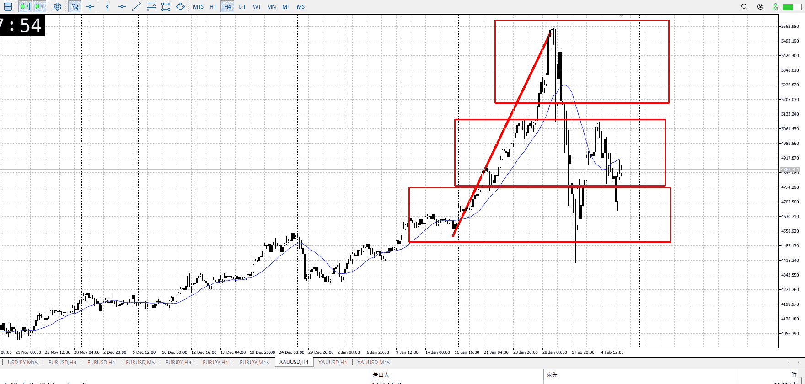
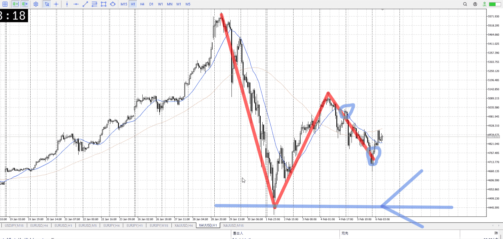
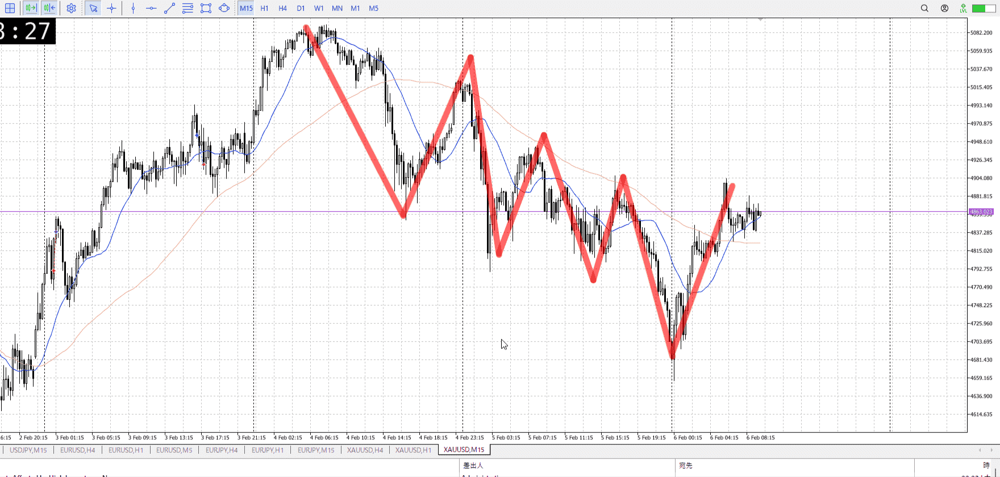
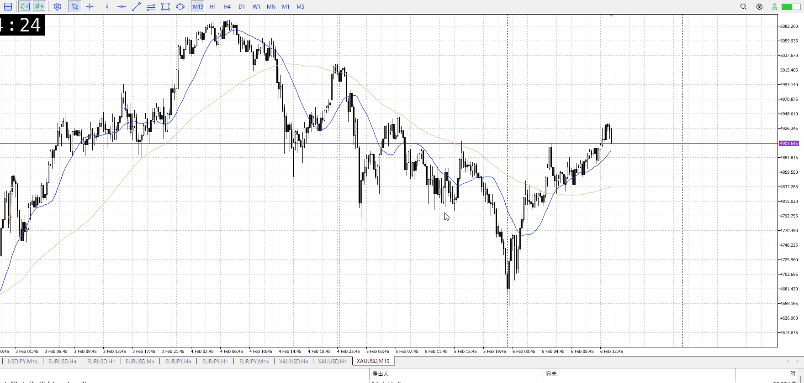

> [!note]
>- +1万 事前認識 **開始5分**

- [ ] [my](my.md)(見ないと増える)
- [ ] 指標
    - 差し込まれる可能性有り、毎日

## 4h

＜ここに目線画像＞

- [x] トレーディングレンジ
    - m

方向：u

## 1h

＜ここに目線画像＞ ^4bb92f

方向：d

## 15m

＜ここに目線画像＞

方向：d

全方向：uud
^1d4903

- [x] 使用足全ての目線確認

## シナリオ


b:4h底
s:1h半値
- [x] 時間足ぶつかり

売りで見てるから売り
4h底に触れるまでいったん売る
- [x] 1hシナリオ
    - [x] 明確か ? 続行 : 確定後考え直し

下降
- [x] 日出日入、週出週入

下りなら三波に当たりそうな部分なのに妙に遅い
- [x] 傾き比率

- [x] 前移動値
    - 340k
- [x] 前回上昇・下降値
    - 1.2m

## 位置

- [ ] 推進
- [x] 調整

## 方針
目線・シナリオ・強弱・調整
横幅・PA後・平均線方向・波
**ひきつけ**・軸時間・傾き比率

傾きが妙に甘い
4h底支えで上がる可能性を考え、シナリオに上昇を予想しておく
1h半値下降に15m何かの上昇で勝つ、そんな可能性を考える
直近なら直近高値で買ってから一気に上昇とか、いま高値抜けてないのに注意

もちろん売られる方向も、ここでレンジやって下抜けとか上昇失敗とか
どのみち4h底までで、一旦止まりたいが

つまりいうとだんだん方向感が薄れてる感じ
どっち行くか明確になってからでいい

```meta-bind-button
style: default
label: Send
actions:
  - type: "replaceSelf"
    replacement: "\n\nOK!\nExchage Start.\n\n---"
```

## メモ


ここ買いてえ～
15mで高値を抜き、その押し。4hの波に乗って登れるかもしれない。
その前の15m下髭下髭で止まってる三回目で買えそうな感じもあるが。

---

再検証