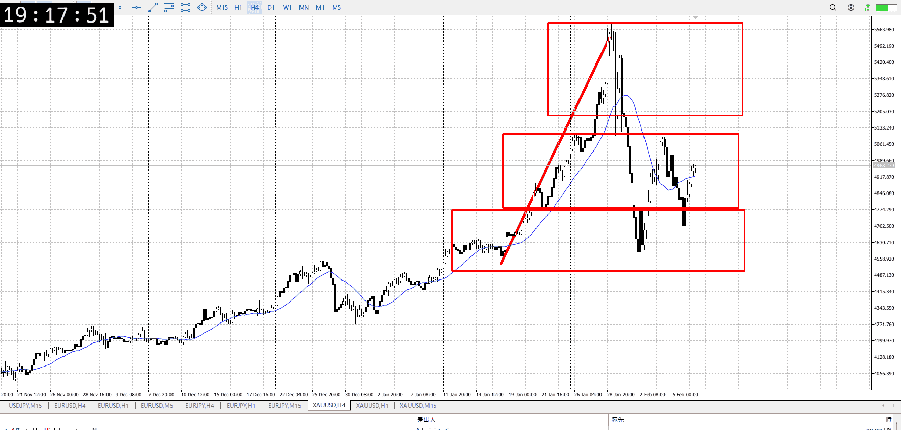
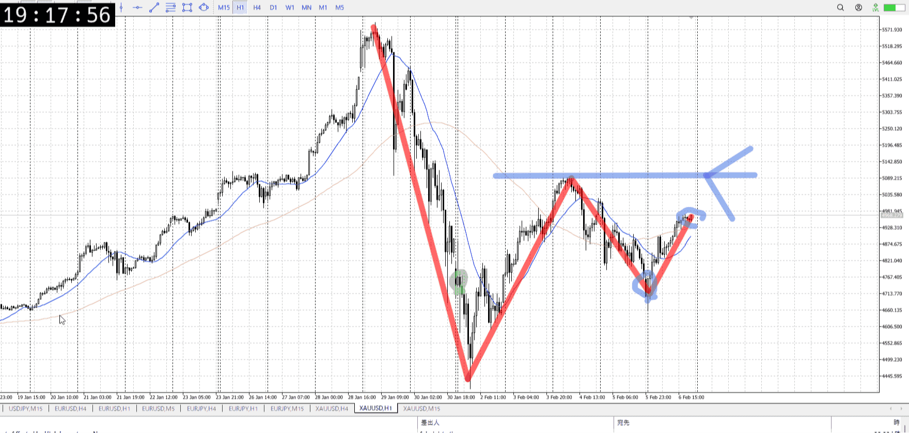
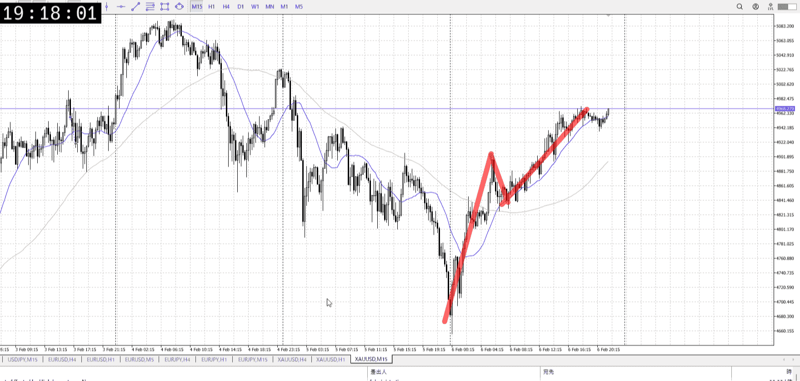
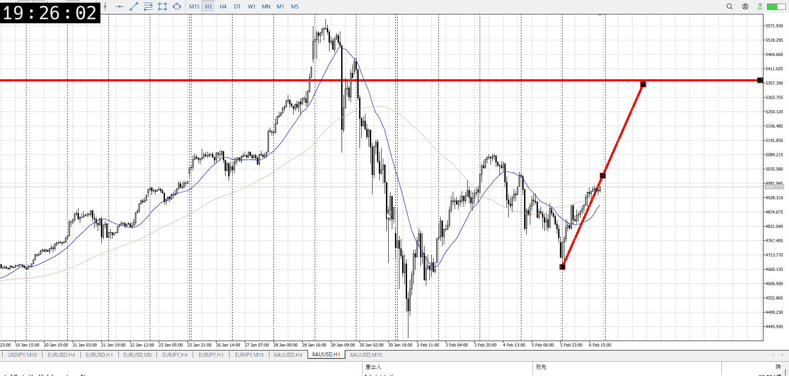

> [!note]
>- +1万 事前認識 **開始5分**

- [x] [my](my.md)(見ないと増える)
- [x] 指標
    - 差し込まれる可能性有り、毎日
水曜10:30雇用統計
金曜10:30CPI
## 4h

＜ここに目線画像＞

- [x] トレーディングレンジ
    - m

方向：u

## 1h

＜ここに目線画像＞ ^4bb92f

方向：d

## 15m

＜ここに目線画像＞

方向：u

全方向：udu
^1d4903

- [x] 使用足全ての目線確認

## シナリオ

b:4h底
s:1h高値
- [x] 時間足ぶつかり

1h高値で目線は売り、切り上げの流れは買いなので
どっちも予想
ついてからもみ合い見る
- [x] 1hシナリオ
    - [x] 明確か ? 続行 : 確定後考え直し

どっちも上昇
- [x] 日出日入、週出週入

同じ時間かけて1/2高さ、からの売りだが降下が甘く押し
押し自体は売りと同じ程度で伸びている
- [x] 傾き比率

- [x] 前移動値
    - 320k
- [x] 前回上昇・下降値
    - 680k
    - ちなみに現在上昇で680k上はまだ1h目線変更できない
    - 

## 位置

- [ ] 推進
- [ ] 調整
- [x] レンジ

## 方針
目線・シナリオ・強弱・調整
横幅・PA後・平均線方向・波
**ひきつけ**・軸時間・傾き比率

売りの推進のはずだったが、下まで行かずに上昇
まだ高値を割ってないので確定ではないが、4h買いが強い
買いたいが1h売りを懸念し1h高値まで、1h高値割ったら4h高値

1hは扱い的にはレンジ
1h高値を割ってトレンドで買いを入れる手もある、手堅い

- [ ] 買いたいなら
    - 高値割りで押しを待ち買い
    - 15mで割った高値の高さに再度来たとこで買い
- [ ] 売りたいなら
    - 高値圏で上髭複数など、上昇が止まったのを見て売り

OK!
Exchage Start.

---

## メモ
[my2026-02-07](../FX/My_Test/my2026-02-07.md)
[my2026-02-09](../FX/My_Test/my2026-02-09.md)
---

再検証