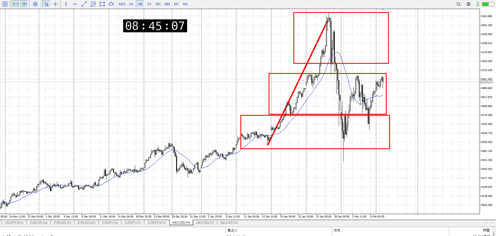
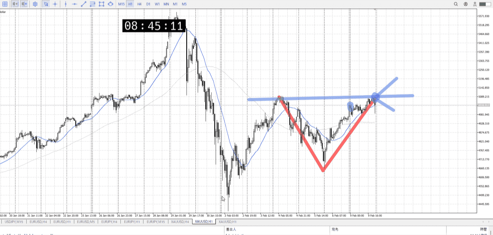
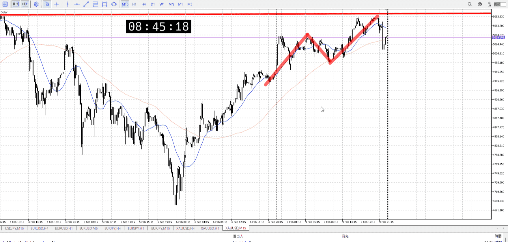
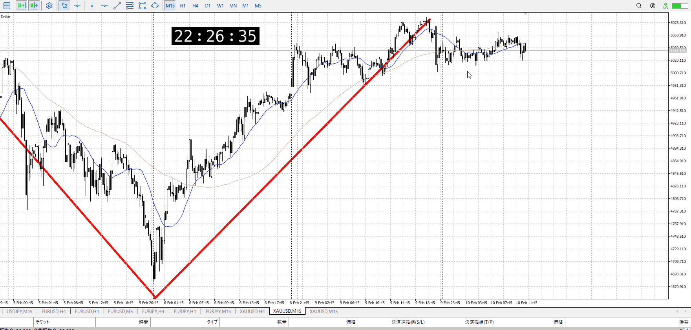
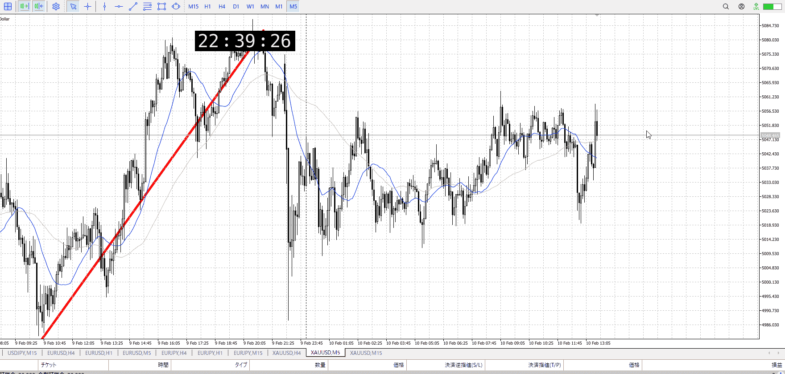
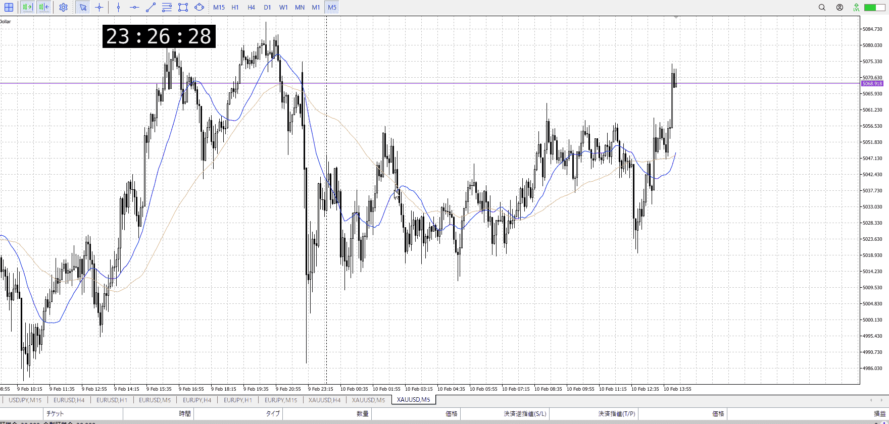
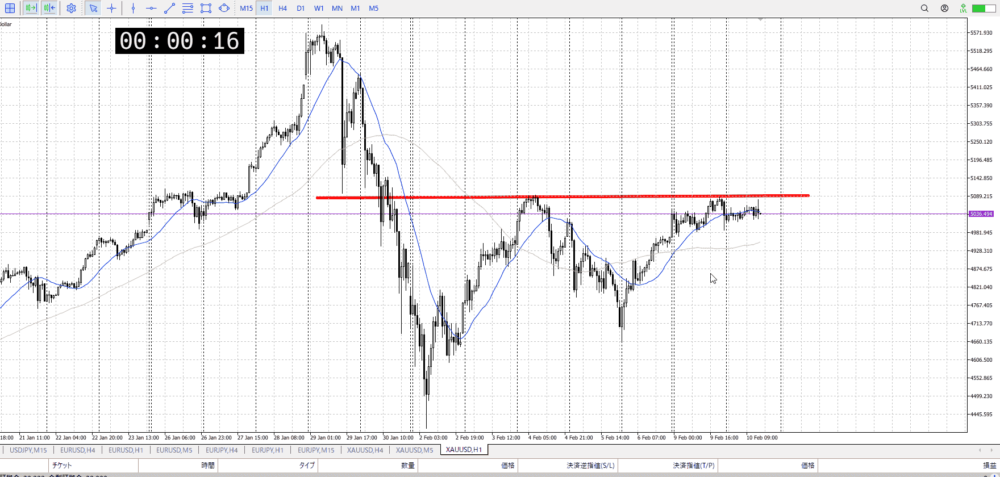
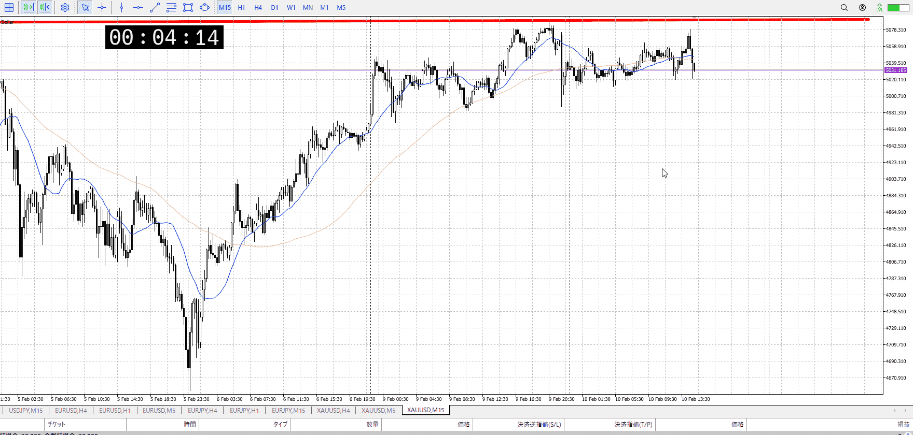

> [!note]
>- +1万 事前認識 **開始5分**

- [x] [my](my.md)(見ないと増える)
- [x] 指標
    - 差し込まれる可能性有り、毎日

水曜雇用統計
## 4h

＜ここに目線画像＞

- [x] トレーディングレンジ
    - m

方向：u

## 1h

＜ここに目線画像＞ ^4bb92f

方向：d

## 15m

＜ここに目線画像＞

方向：u

全方向：udu
^1d4903

- [x] 使用足全ての目線確認

## シナリオ

b:4h底
s:1h高値
- [x] 時間足ぶつかり

今ぶつかりの頂点
ここでどっちに決着つくか、1hで下髭付きそうなので上かも
- [x] 1hシナリオ
    - [x] 明確か ? 続行 : 確定後考え直し

ちょい上昇
- [x] 日出日入、週出週入

大体前下降と同程度
- [x] 傾き比率

- [x] 前移動値
    - 120k
- [x] 前回上昇・下降値
    - 682k

## 位置

- [ ] 推進
- [x] 調整

## 方針
目線・シナリオ・強弱・調整
横幅・PA後・平均線方向・波
**ひきつけ**・軸時間・傾き比率

ついに売りの根
比率的には前回下降と同じくらいで落ちており、拮抗予想
ただ前回と同じなら、下降の元になったやつより緩やかということ
それを破るからこそ買いが強くなるのだが、破る時の話で合って今はそうでないので

短期的には買われそうな動き
15mでレンジ地点で深押し1h下髭
上抜けを予想して買うことはあり得る、勝率は低めだが下がりませんを見てるので結構あり
1hに合わせ15m下髭お見かけたら買ってもいいかなって感じ

- [x] 買いたいなら
    - 15m買い、今の位置
- [x] 売りたいなら
    - 1h売り、15m安値抜け

OK!
Exchage Start.

---

## メモ

15m
下髭から横に伸びていってる、拮抗
そのうえでちょっとだけ上に出てから下に振って、下髭
買うのならこれの根、下で買わないと損切で狩られる

上昇の上にいるので、これを抜ける場合は抜けじゃないと間に合わない

5mの下髭で入れたか？

全体にどんどん値幅が狭まっており、明日の雇用統計に備えてるんだろうか

現在50k程度

手元にあるのが二万円、これだとpips x 100 x 0.0001 = 20000 / 154.5より12944pips程度が耐え限界。
最近はpointsばっか使ってるのでこの十倍耐える。ただ0.02lotだとその半分。

今回のに乗れてたら35000points,よって5000円ほど

その後落ちて止まって上下髭
まだ迷ってる最中という感じ
15mが下髭で止まったので買いたくなるが1hこれなので買えない

天井から落ちでは買えない
売り場から落ちて来たならどこまで行くかを確認する必要がある

売りさしたいけど、15mの安値も割ってないので。
もう深夜だし、深夜でこれだと動かないんじゃないか。保留。

---

再検証