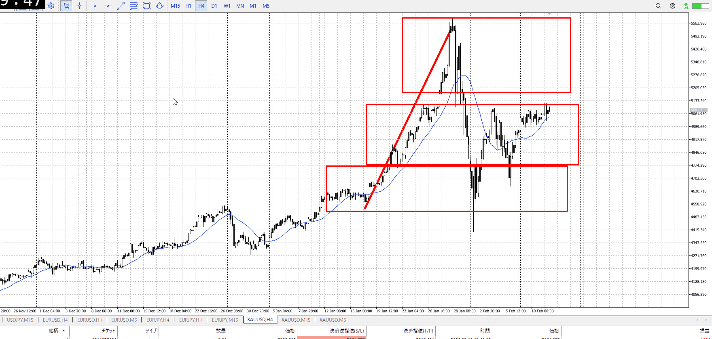
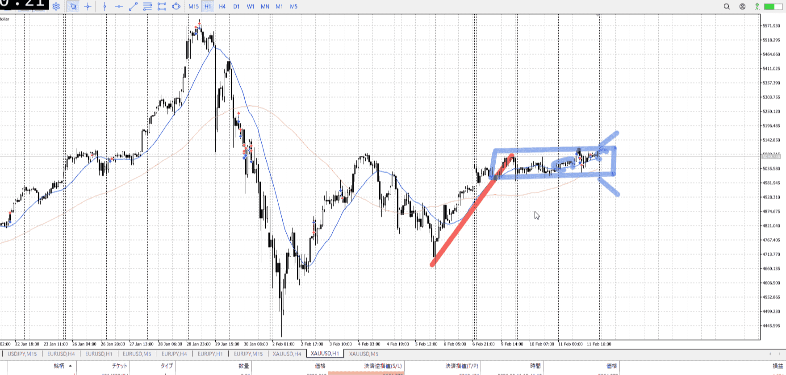
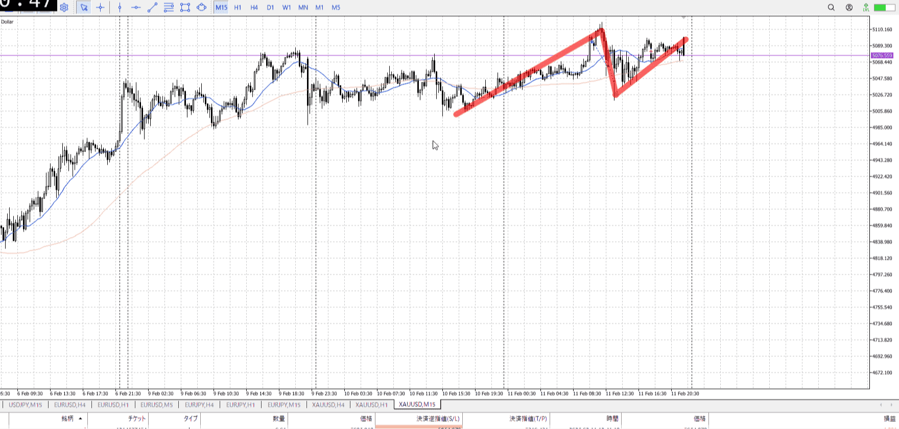
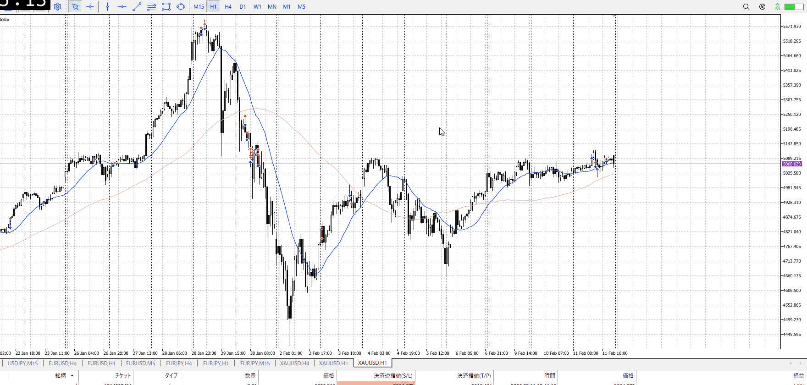

> [!note]
>- +1万 事前認識 **開始5分**

- [x] [my](my.md)(見ないと増える)
- [x] 指標
    - 差し込まれる可能性有り、毎日

## 4h

＜ここに目線画像＞

- [x] トレーディングレンジ
    - m

方向：u

## 1h

＜ここに目線画像＞ ^4bb92f

方向：d

## 15m

＜ここに目線画像＞

方向：u

全方向：udu
^1d4903

- [x] 使用足全ての目線確認

## シナリオ

b:4h底
s:1h高値
- [x] 時間足ぶつかり

レンジ
ワンチャン明日のCPIまでかかる
- [x] 1hシナリオ
    - [x] 明確か ? 続行 : 確定後考え直し

ちょい上昇
- [x] 日出日入、週出週入

拮抗
- [x] 傾き比率

- [x] 前移動値
    - 97k
- [x] 前回上昇・下降値
    - 680K

## 位置

- [ ] 推進
- [x] 調整

## 方針
目線・シナリオ・強弱・調整
横幅・PA後・平均線方向・波
**ひきつけ**・軸時間・傾き比率

三日分レンジ
雇用統計でも抜けなかったので、ワンチャンCPIまでかかるかも
しっかりとした固めで入るか、抜け後を待つかの二択
中途半端では入らない

- [x] 買いたいなら
    - レンジ上張り付き抜け、レンジ下張り付き否定、抜け押し
- [x] 売りたいなら
    - レンジ下張り付き抜け、レンジ上張り付き否定、抜け戻り

OK!
Exchage Start.

---

## メモ

その想定で見ると、昨日の分の間が悪い
損切後の下固めを下から入るレンジ用戦略もあり得たくらい
あとお試しやめろ

下固めというのはある動きに対してその逆が無いことの確認
何もないとこでは分からない

[my2026-02-12](../FX/My_Test/my2026-02-12.md)

---

再検証