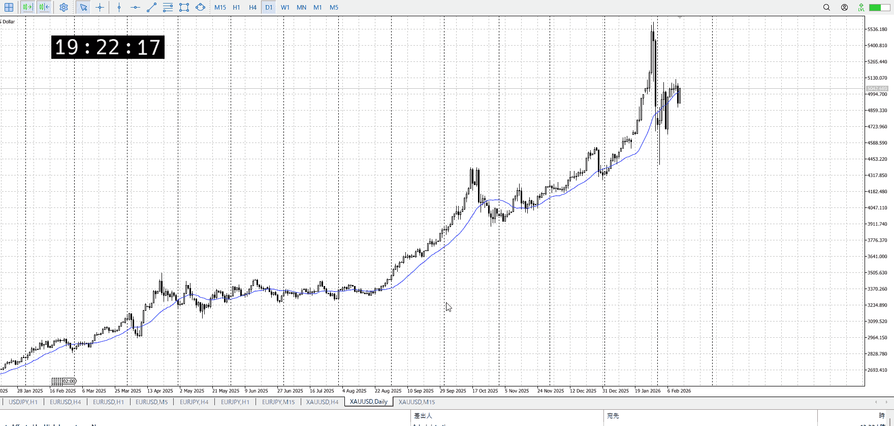
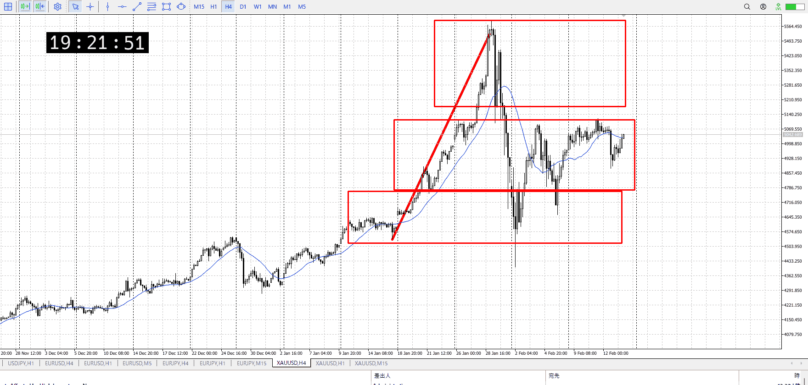
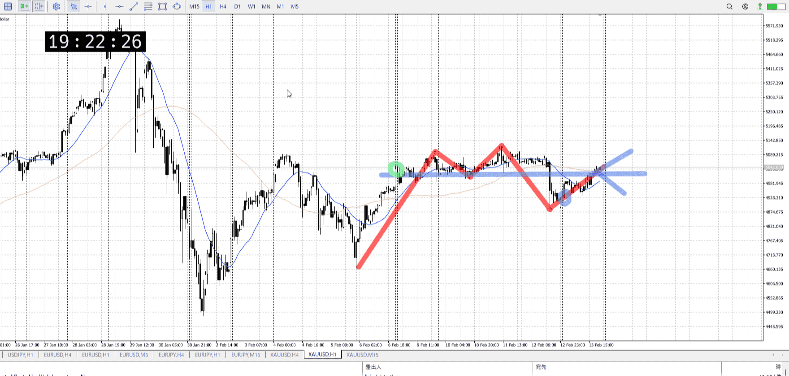
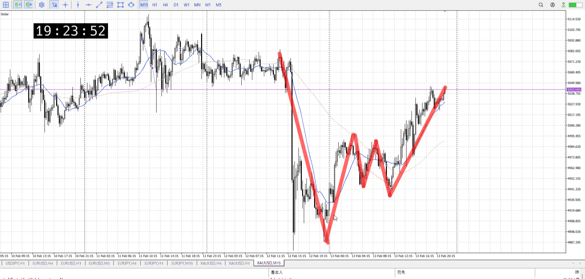

## 1d

＜ここに目線画像＞

落ちてそれに届かない位上がっている
つい先週も見た足、合わせて買いがまだいる想定

> [!note]
>- +1万 事前認識 **開始5分**

- [x] [my](my.md)(見ないと増える)
- [x] 指標
    - 差し込まれる可能性有り、毎日

月曜休場
水曜28:00FOMC
金曜22:30個人消費支出
## 4h

＜ここに目線画像＞

- [x] トレーディングレンジ
    - m

方向：u

## 1h

＜ここに目線画像＞ ^4bb92f

方向：d

## 15m

＜ここに目線画像＞

方向：dT

全方向：uddT
^1d4903

- [x] 使用足全ての目線確認

## シナリオ

b:1h半値？
s:1h前回レンジ下
- [x] 時間足ぶつかり

売りメイン、売りの方が根拠明確
切り上げのこともあり一応買いは考えてるけど、売りメイン
- [x] 1hシナリオ
    - [x] 明確か ? 続行 : 確定後考え直し
買いが分かりにくいのであまり明確ではない
といって確定後ってそれは売りが確定してるだろうから、売りだろうし

下降
- [x] 日出日入、週出週入

若干売り優勢
足の勢いを含めると結構売り
- [x] 傾き比率

125k
- [x] 前移動値

240k
- [x] 前回上昇・下降値

## 位置

- [ ] 推進
- [x] 調整

## 方針
目線・シナリオ・強弱・調整
横幅・PA後・平均線方向・波
**ひきつけ**・軸時間・傾き比率

指標貰って抜けるかどうか分からないとこ
止まり気味、1h目線と4h揃い天井で売りっぽさがあるが、買いも指標と15m目線と切り上げがある

とはいえ売りの方が大きい足なので、そっちをメインに考える

月曜休場なのでレンジするかも、その後売りメインで見つつ買いなら損切巻き込むので抜けあり
抜けの時は前と同じく変な動きをするかも、その場合は覚悟決めてついてけ

- [x] 買いたいなら
    - 売りの否定
- [x] 売りたいなら
    - 1hレンジ下から上髭などで固め、そこから落ち
    - 落ちの戻り

OK!
Exchage Start.

---

## メモ

---

再検証