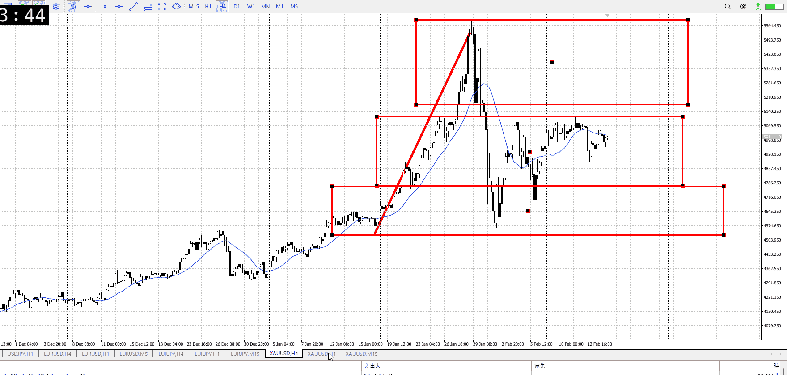
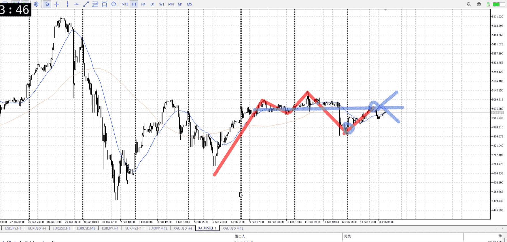
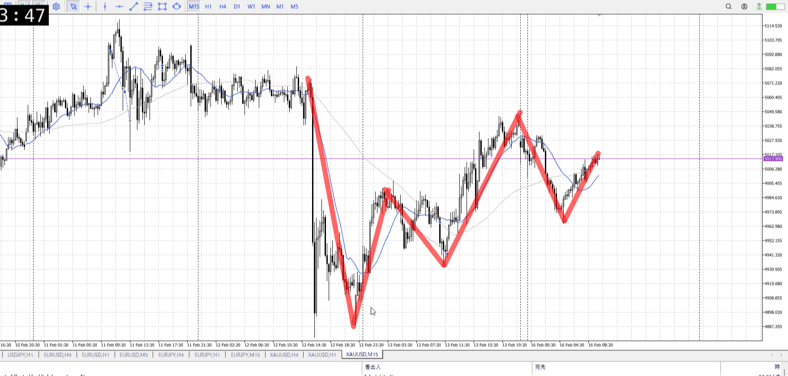

> [!note]
>- +1万 事前認識 **開始5分**

- [x] [my](my.md)(見ないと増える)
- [x] 指標
    - 差し込まれる可能性有り、毎日

水曜28:00FOMC
## 4h

＜ここに目線画像＞

- [x] トレーディングレンジ
    - m

方向：u

## 1h

＜ここに目線画像＞ ^4bb92f

方向：d

## 15m

＜ここに目線画像＞

方向：d

全方向：udd
^1d4903

- [x] 使用足全ての目線確認

## シナリオ

b:1h半値？
s:1hレンジ下
- [x] 時間足ぶつかり

落ちてるが、1h上昇がこれだけで受け止められるとは思いにくい。
なのでシナリオ続行。もう一度上がってぶつかったとこを見る。
- [x] 1hシナリオ
    - [x] 明確か ? 続行 : 確定後考え直し

上昇
- [x] 日出日入、週出週入

そろそろ下降と同じ分くらいの横幅を取る
それで半分くらいしか上がってないので売りっぽさはある
- [x] 傾き比率

125k
- [x] 前移動値

240k
- [x] 前回上昇・下降値

## 位置

- [ ] 推進
- [x] 調整

## 方針
目線・シナリオ・強弱・調整
横幅・PA後・平均線方向・波
**ひきつけ**・軸時間・傾き比率

下がる中で上がってきてて、それを下降と同じ時間かけて半分上がる
かなり売りっぽさがあるし、ぶつかりを見ても売りの方が明確
指標だったのに1hレンジ下に勝ててないし
1h目線としても売りたいので、しっかり上昇が受け止められたのを見て売りたいとこ

買うなら1hレンジ下の安値をまず抜く必要がある。
それまで考えなくていいくらいには売り。じゃあシナリオ売りだけにしとけばよかったかな。

- [x] 買いたいなら
    - 1hレンジ下安値を抜いてから
- [x] 売りたいなら
    - 上昇がレンジなどで止められた後、上振って上髭下勢いとか
    - 下張り付きとか
    - 半分エントリーの話、それが近づいてるから

根拠になるレンジも出来てないけど、前回下降と同じくらい横幅かかってて落ちることはできそう  
とはいえ一回拮抗挟むか落ちたのを確認した後でないと売るのは厳しそう

OK!
Exchage Start.

---

## メモ
[my2026-02-16](../FX/My_Test/my2026-02-16.md)

---

再検証