> [!note]
>- +1万 事前認識 **開始5分**

- [x] [my](my.md)(見ないと増える)
- [x] 指標
    - 差し込まれる可能性有り、毎日

## 4h
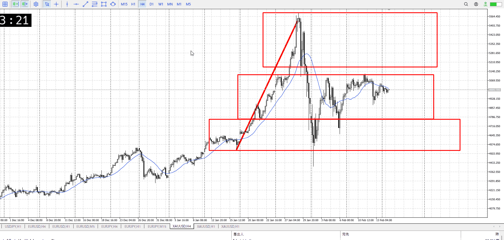
＜ここに目線画像＞

- [x] トレーディングレンジ
    - m

方向：u

## 1h
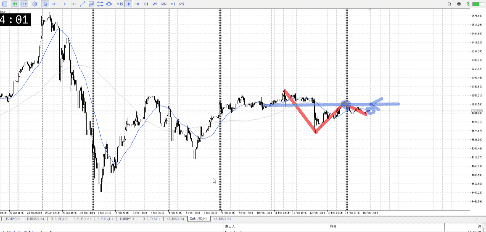
＜ここに目線画像＞ ^4bb92f

方向：d

## 15m
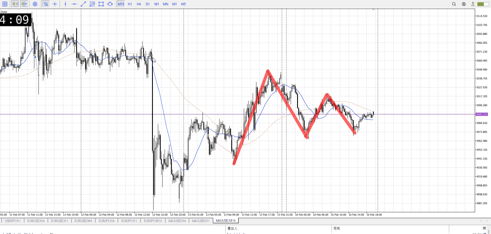
＜ここに目線画像＞

方向：d

全方向：udd
^1d4903

- [x] 使用足全ての目線確認

## シナリオ

b:1h半値？
s:1hレンジ下
- [x] 時間足ぶつかり

前回同様落ち狙い
- [x] 1hシナリオ
    - [x] 明確か ? 続行 : 確定後考え直し

落ち
- [x] 日出日入、週出週入

落ちも上昇分の時間かけてる
- [x] 傾き比率

66k
- [x] 前移動値

240k
- [x] 前回上昇・下降値

## 位置

- [x] 推進
- [ ] 調整

## 方針
目線・シナリオ・強弱・調整
横幅・PA後・平均線方向・波
**ひきつけ**・軸時間・傾き比率

売りの推進が始まってるかもなのだが、売るのは難しい
売るなら昨日の休場で作ったレンジを下抜きの戻りを狙いたい

前回の上昇に対して同じ時間をかけて半分という、買いが優勢になりそうな情報もある
切り上げと合わせて警戒

- [x] 買いたいなら
    - レンジ上抜け
- [x] 売りたいなら
    - レンジ下戻り

OK!
Exchage Start.

---

## メモ
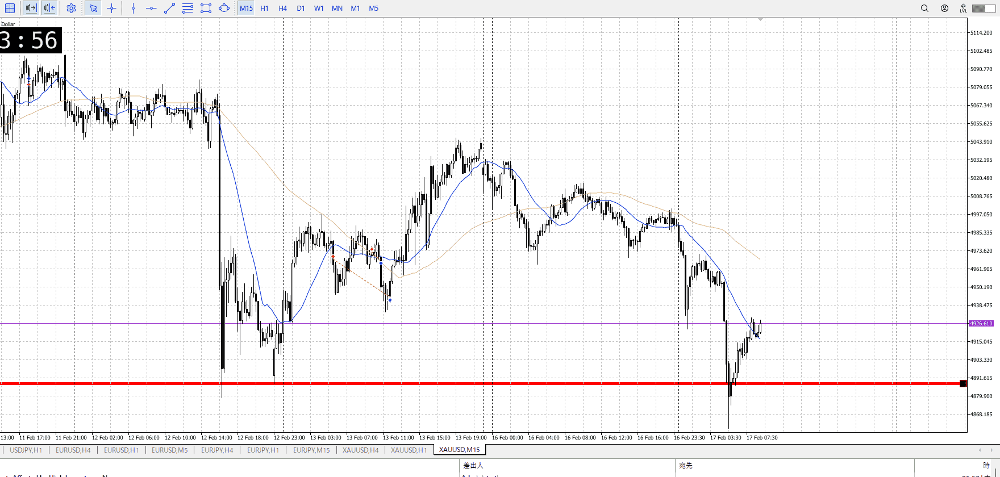
一回レンジを抜いて、で最初の戻り売りはいなかったからできなくて
今ここで二回目戻り売りなら、もう少し抜けた部分に横幅欲しくないか
高さはあり得るだろうけど

前の1hのレンジも含めた安値を抜いてて、充分意識されてるとこ抜いてる
だから売れる、的なので行くなら一回1h底ついてる分の上昇の動向見てからかな

上昇の動向を見るなら、レンジで止めて上向き始め見てそれから上髭では？

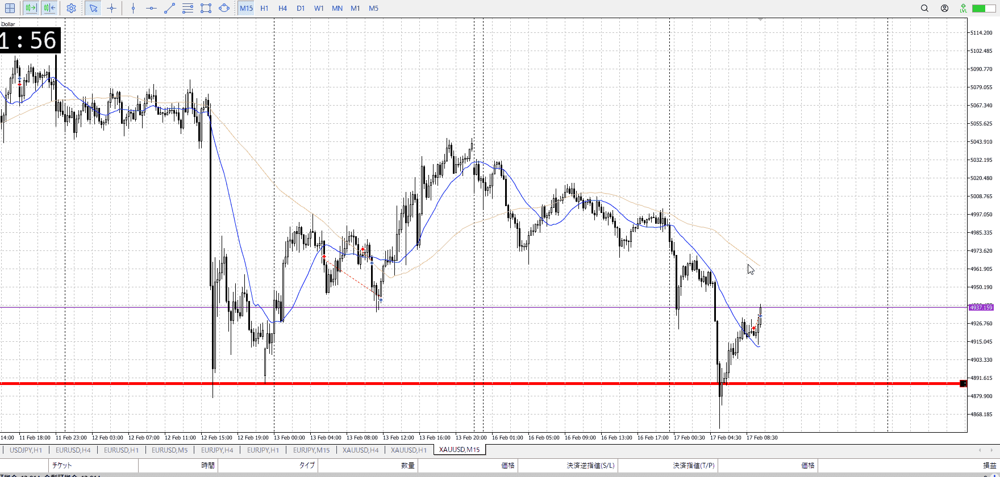

1hAが遠いので、1hで自信を持って売るには早すぎた
![[../FX/Entry/en20260217T071217.md]]

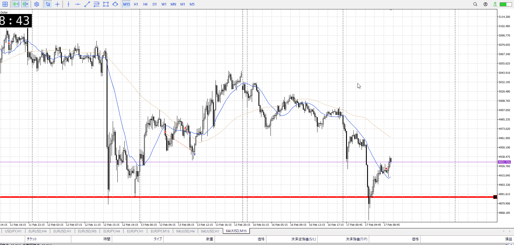

![[../FX/Entry/en20260217T110734.md]]

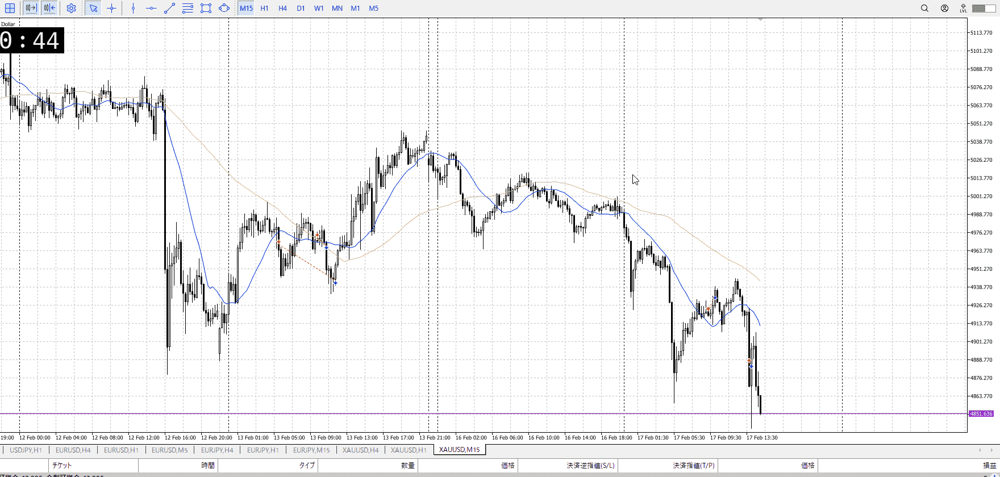

下髭付きに対して一本上下足、売るポイントにしてたもみ合い下で売れたか
レンジではないし、難しかったんでは
![[../FX/Entry/en20260218T011826.md]]

---

再検証
先週終わりについて
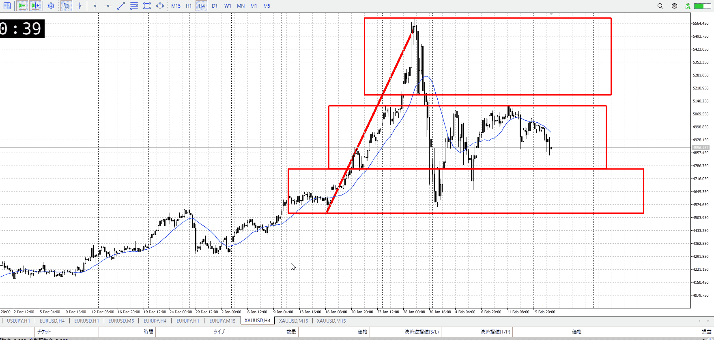
4hで天井が揃っており、ここから売りたい

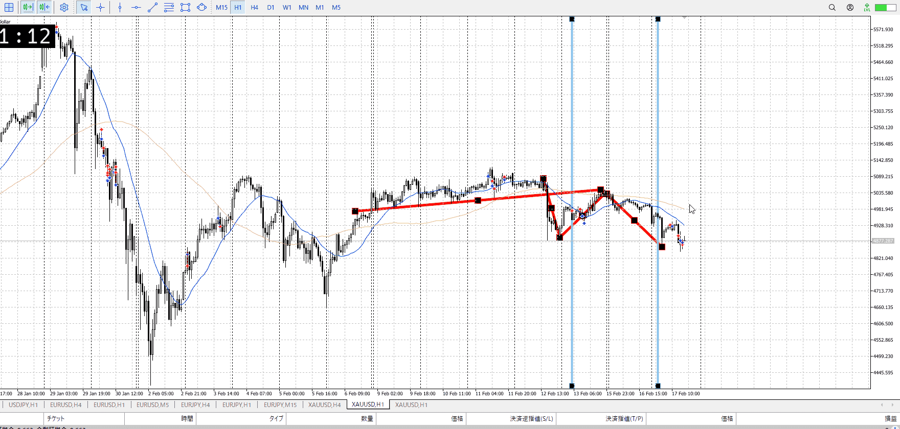
1hで底が揃っており、ここへの戻りで売りたい
波に注目

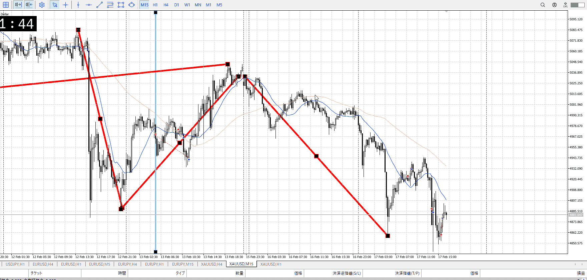
実際に自分が売った分は、1hでの調整**途中**
売るのは調整の**終わり**、波の移り変わりを狙う必要がある
なのでレンジでしっかり止まった後、余裕を持って上から上髭で売るのがtの方

これで止まったのは15mの方
1hの推進がそのまま落ちていく想定、それに乗る
利確は15mが最低で伸びたら1h

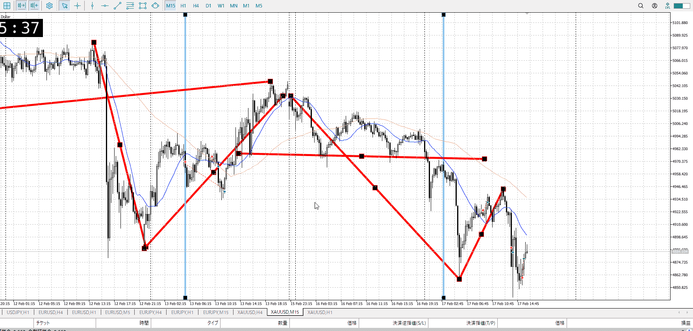
それを踏まえ今回のベスポジ
1h底が揃い抜け、これで1hの調整が終わったことを示せる
つまり1hの推進に乗れる
これに5mで戻し、利確は5m最低、伸びたら15m1h
**4h1hの後押しがあるので、5mでも自信もって入れる**

このベスポジはいなかったので入れない
なら15mで戻りの方を狙う

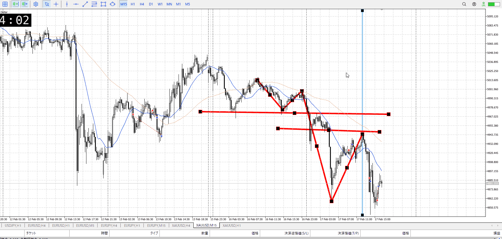
さっきのは4h1hベストに対し5mでのベスポジだったが、4h1hベストなら15mベスポジでも入れる
それがここ

15mベスポジは1hへの戻りと売り
戻りで気にされるであろう場所として、1hの底に加え**15mで急激に落ちていった場所**がある
ここも考慮し、上髭が出始めたら売り

下髭について
これを気にするのは4h1hなど上位時間足で気になっている高さでこれが出た時。
オーバーシュートの定義には**上位足で明確に根拠があること**とあり、そもそも何で上がったかいまいち分からないこの高さで下髭が出てもオバシュとして扱いにくい。

また、この売りは4h1hの流れをきっちり汲んでいる
4h1hでこれが出たならともかく、15mのこれ一本では4h1hの流れを止めるには至らない。
**流れを止めるなら、その流れと同じ時間足で。**

そして髭が出たにせよ、直前の下降が強力
この作用が続くので売り可能

以上より、下髭があっても示したベスポジで戻り売りが出来る。

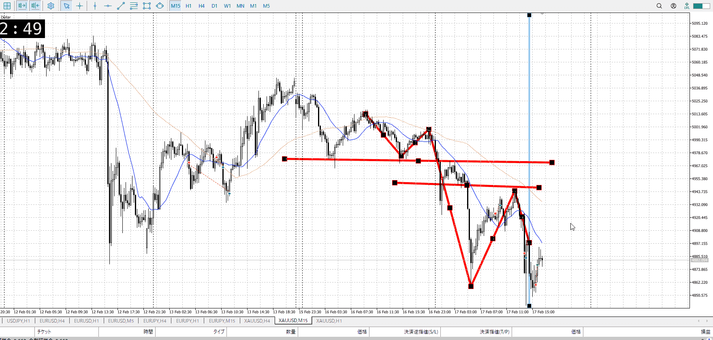
二度目の戻り売りも同様の理由で売りが可能
上位足で不明瞭、上位足の流れを汲んでいる、しっかり直前の売りが強い

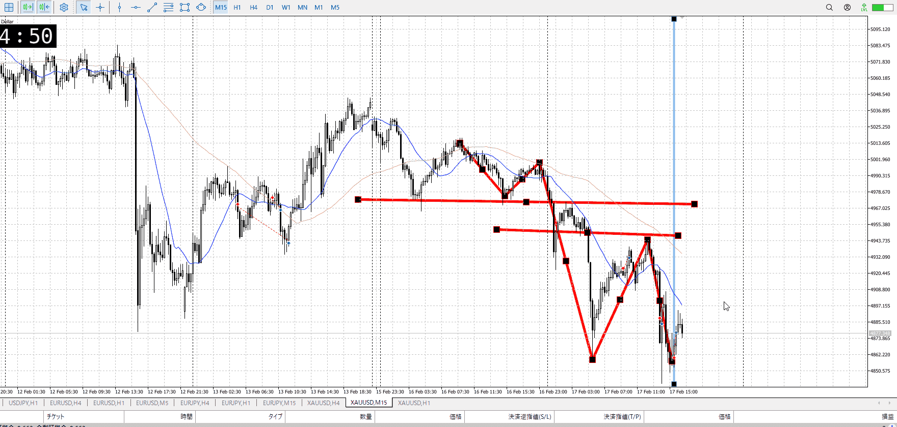
自分がやったポイントについて
さっきの三点は下髭を売り控えの理由にしない理由
これはそれらが揃っていようと、そもそも売りの場所にいない

1hの底を抜けたと主張するなら、もっと明確に
というか1hの足で抜けた分の戻りを売る必要がある

前の落ち途中での入りは、一旦スキップ
そのあとの戻り売りに集中したほうがいい
前の長レンジからの落ちは備えてれば入れるという話があったが、それはレンジ出てることとか4h天井とかがあったからだろうと。ここは上位足の力の根では無いので。
t
長レンジがあるのが大きい

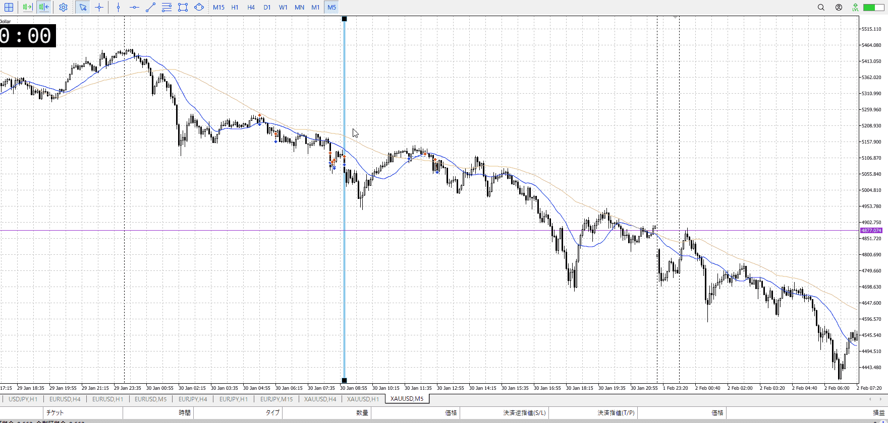
前の戻り売りも、その5mのもの
4h1hの流れを汲み、エントリー足の上昇に上位足の根拠が無く、直前の下降が大きい。

- まず波を見て、調整の終わりを狙う意識
    - 上位足の後押しをもって、下位足で自信を持って入る
- エントリー足の髭ではなく、環境認識を行った上位足での髭を考慮
    - その移動に上位足の根拠はあるか
        - あれば様子見
        - なければ上位足の流れに沿う
        - [オーバーシュート](../FX/オーバーシュート.md)
- 直前の下降や上昇で、明確に環境認識の足で抜けていて、方向性は出ているか
- 入りたい場所と、その場所での髭

波、ローソクに対する上位足根拠、明確な抜けによる方向性
あとは入りたい場所と髭
それらが揃っていれば、損切値は減るし、プラスがあるために多少の値動きでの動揺も無くなる

調整終わり入り場所に備え波
調整終わりの方向性に備え明確な環境足抜け
方向性に対する疑いに備えローソクに対する上位足根拠、これはエントリー前後で両方該当
早めの押し戻りに備え入りたい場所と髭
ついでに新情報に備え落ち着いて考え直し

[my2026-02-18](../FX/My_Test/my2026-02-18.md)