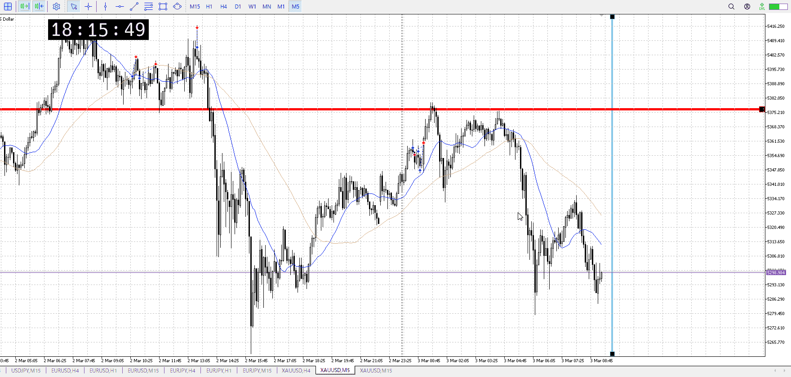
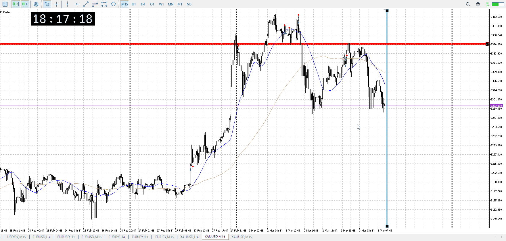

<画像>

`INPUT[inlineSelect(option(Range), option(Trend)):type]`

ルールに沿っていた
```meta-bind
INPUT[toggle:rule]
```

勝った
```meta-bind
INPUT[toggle:OK]
```


tの

m
4h1hに乗って短期
5mレンジ抜けを押し目待って前回レンジまで買い


15mこれなので本当に5mしかないはず


