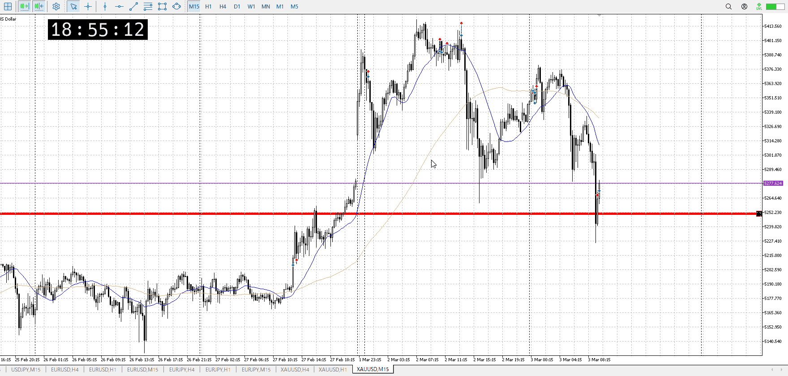
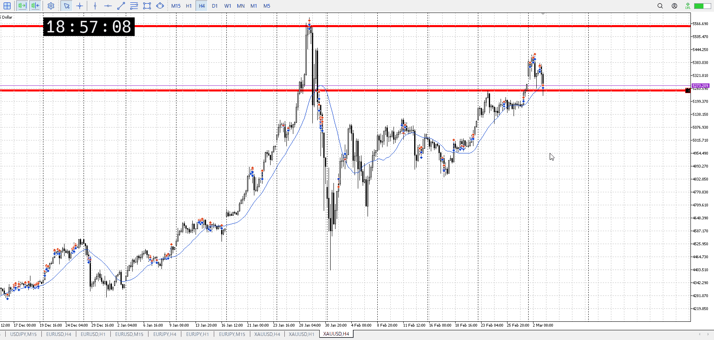

<画像>

`INPUT[inlineSelect(option(Range), option(Trend)):type]`

1hの押し目買いあり得たのでは？
そもそも1h押し目と15m売りの拮抗


1h15mだけならまだしも、ここは4hも買う場所
なので1hのサポートが必要だったか？


ルールに沿っていた
```meta-bind
INPUT[toggle:rule]
```

勝った
```meta-bind
INPUT[toggle:OK]
```
